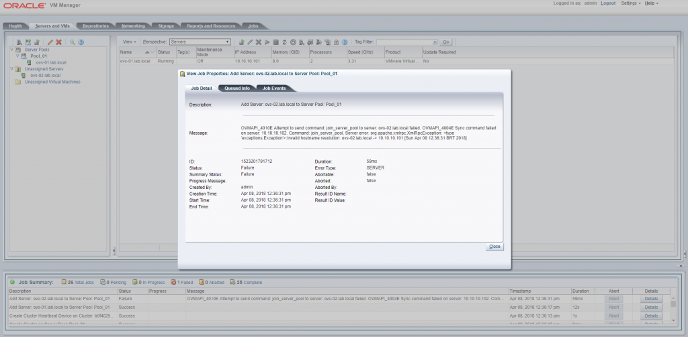
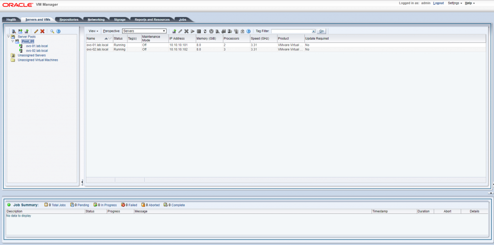

Salve Salve Pessoal!

Um dos possíveis erros que podemos cometer na hora da instalação de um sistema operacional, é realizar as configurações de rede da forma incorreta. Pós instalação nós podemos resolver isso sem problemas, indo no arquivo de configuração e corrigindo o que for necessário.

O mesmo procedimento pode ser feito no Oracle VM Server, porém na hora de adicionar o host ao Pool pode acontecer o seguinte erro: **invalid hostname resolution**

Isso acontece porque alteramos apenas o endereço ip, e esquecemos do arquivo **/etc/hosts**, ou seja, além de corrigir o endereço ip, é necessário a correção do mapeamento de **IP - HOSTNAME** no **/etc/host**.

Depois disso o host é adicionado normalmente ao Pool.

Até a próxima :D
