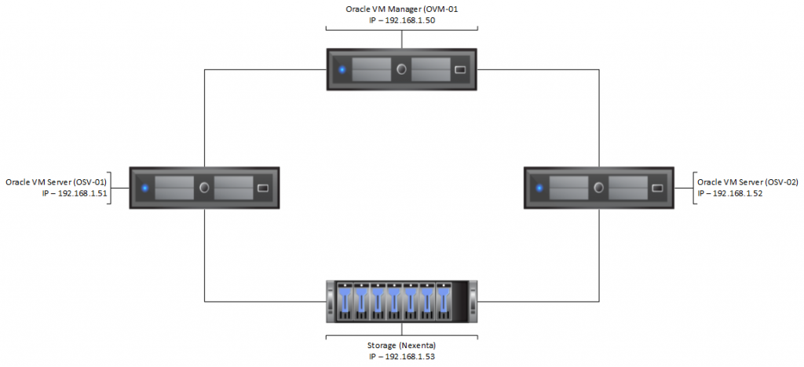
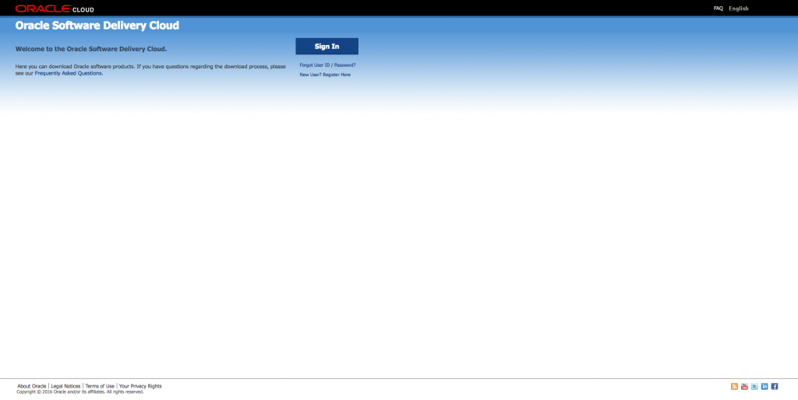
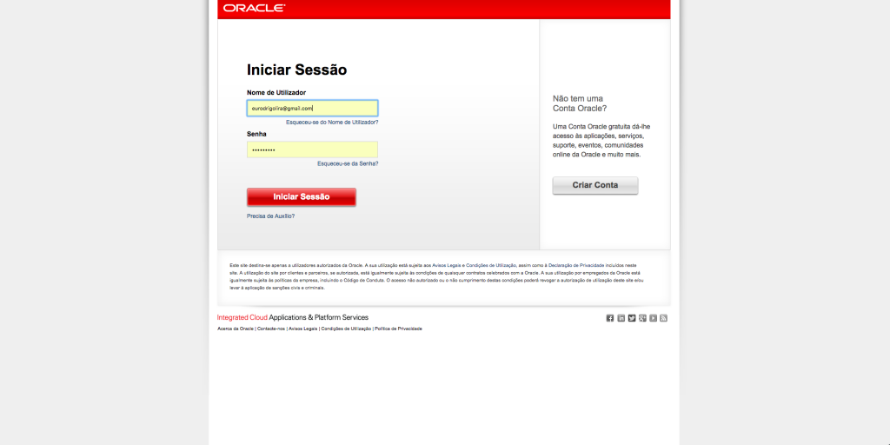
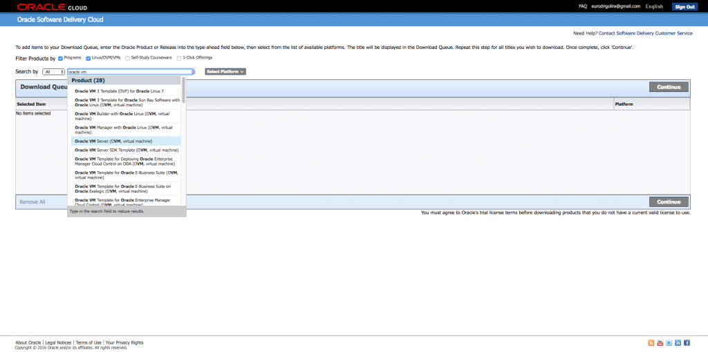
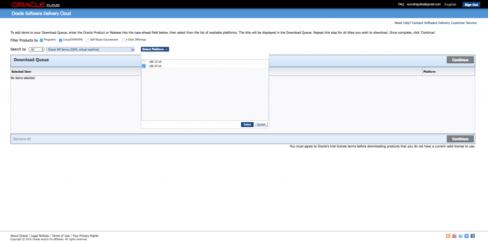
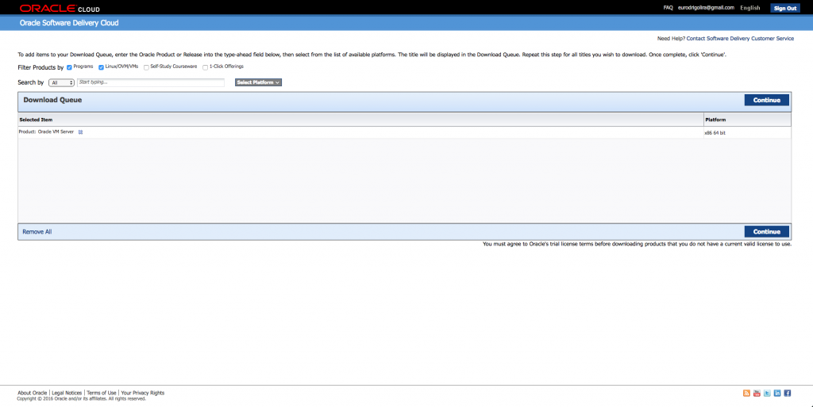
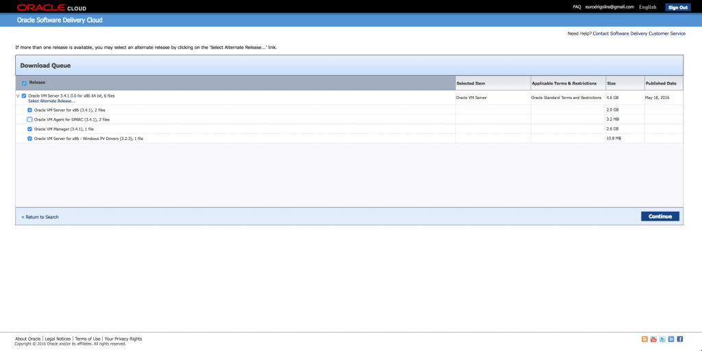
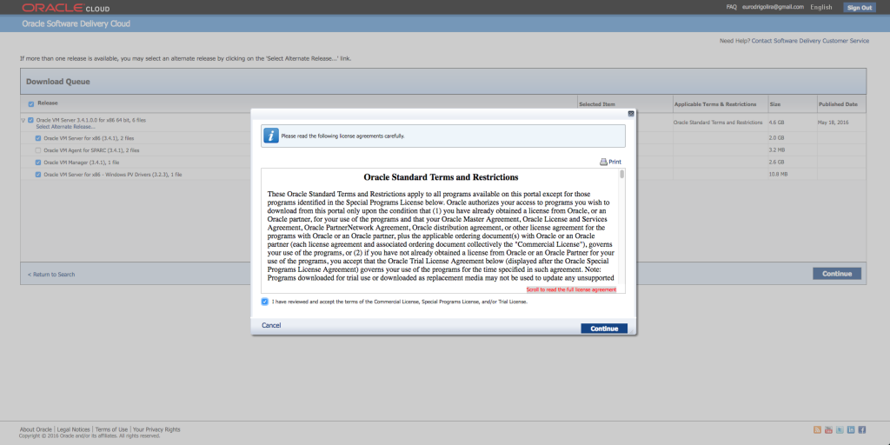
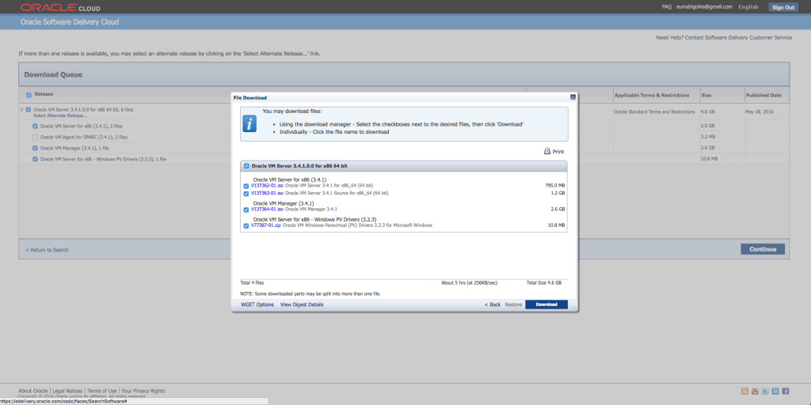
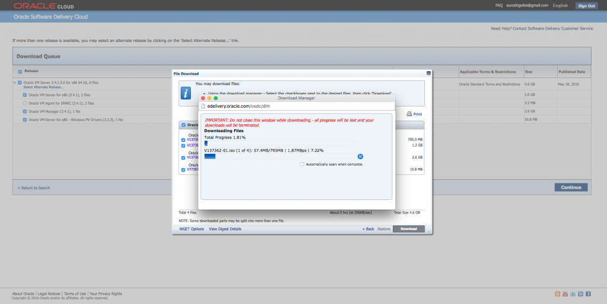

Salve Salve Pessoal!

Bem, depois de um bom tempo sem realizar nenhum post sobre laboratórios, venho iniciar uma nova serie, desta vez vamos montar um lab sobre o Oracle VM Server.

O Oracle VM Server é a solução de virtualização da Oracle, é uma plataforma totalmente gratuita, ou seja, custo zero, e desenvolvida e mantida por uma das maiores empresas de TI do mundo, a gigante **Oracle**.<!--more-->

Não vou me aprofundar em falar sobre a solução, abaixo alguns links para conhecer um pouco mais sobre a plataforma:

Visão Geral :

[http://www.oracle.com/us/technologies/virtualization/oraclevm/overview/index.html](http://www.oracle.com/us/technologies/virtualization/oraclevm/overview/index.html)

Recursos:

[http://www.oracle.com/us/technologies/virtualization/oraclevm/resources/index.html](http://www.oracle.com/us/technologies/virtualization/oraclevm/resources/index.html)

Especificações e Requerimentos:

[http://www.oracle.com/us/technologies/virtualization/oraclevm/specifications/index.html](http://www.oracle.com/us/technologies/virtualization/oraclevm/specifications/index.html)

Documentação completa:

[http://www.oracle.com/technetwork/server-storage/vm/documentation/index.html](http://www.oracle.com/technetwork/server-storage/vm/documentation/index.html)

A Oracle também disponibiliza um lab pronto para você testar a solução, são arquivos OVA que você pode fazer o deploy no VirtualBox, você pode baixar no link abaixo:

[http://www.oracle.com/technetwork/server-storage/vm/downloads/hol-oraclevm-2368799.html](http://www.oracle.com/technetwork/server-storage/vm/downloads/hol-oraclevm-2368799.html)

Para o nosso lab nós vamos fazer a instalação do zero, criar toda a parte de rede, pool, storage, repositórios e etc.

No meu caso vou utilizar o vSphere como virtualizador para o lab, mas você pode usar o próprio VirtualBox da Oracle ou o VMware Workstation.

Abaixo um pequeno esborço da arquitetura do lab:

[](http://rodrigolira.eti.br/wp-content/uploads/2016/05/Lab-Oracle.png)

Imagino que nesse momento você já tinha dado uma olhada nos requerimentos para a instalação da solução, no caso do meu lab vou utilizar a seguinte configuração de hardware para cada VM.

Oracle VM Server - OVS-01 / OVS-02

```
4GB de RAM

2  Processadores

1 Disco de 40GB

4 Placas de Rede
```

Oracle VM Manager - OVM

```
4GB de RAM

2  Processadores

1 Disco de 40GB

1 Placa de Rede
```

Storage (Nexenta)

```
1GB de RAM

1  Processador

1 Disco de 5GB para o Sistema Operacional

1 Disco de 50GB para NFS

1 Disco de 100GB para iSCSI

1 Placa de Rede
```

Para maiores detalhes sobre a instalação e configuração do Nexenta, acesse os links abaixo:

http://rodrigolira.eti.br/meu-lab-vmware-parte-02-storage-com-nexenta/

http://rodrigolira.eti.br/lab-vcp6-dcv-parte-3/

Antes de mais nada, precisamos baixar todas as ISOs para fazer a instalação do lab, abaixo segue um passo-a-passo do procedimento para download:

1 - Acesso o link abaixo:

[https://edelivery.oracle.com/osdc/faces/SearchSoftware](https://edelivery.oracle.com/osdc/faces/SearchSoftware)

[](http://rodrigolira.eti.br/wp-content/uploads/2016/05/oracle-01.png)

2 - Entre com seu usuário e senha, caso não tenha, faço o registro:

[](http://rodrigolira.eti.br/wp-content/uploads/2016/05/oracle-02.png)

3 - Pesquise e selecione **Oracle VM Server**:

[](http://rodrigolira.eti.br/wp-content/uploads/2016/05/oracle-03.png)

4 - Selecione a arquitetura **x86 64 bit** e clique em **Select**:

[](http://rodrigolira.eti.br/wp-content/uploads/2016/05/oracle-06.png)

 

5 - Clique em **Continue**:

[](http://rodrigolira.eti.br/wp-content/uploads/2016/05/oracle-07.png)

6 - Desmarque a opção **Oracle VM Agent for SPARC** e clique em **Continue**:

[](http://rodrigolira.eti.br/wp-content/uploads/2016/05/oracle-08.png)

7 - Aceite os termos:

[](http://rodrigolira.eti.br/wp-content/uploads/2016/05/oracle-09.png)

8 - Será solicitado a instalação do **Download Manager da Oracle**, instale e clique em **Download**:

[](http://rodrigolira.eti.br/wp-content/uploads/2016/05/oracle-10.png)

9 - O download é iniciado:

[](http://rodrigolira.eti.br/wp-content/uploads/2016/05/oracle-11.png)

Pronto, depois do download nós teremos disponível a ISO do Oracle VM Server e Manager, além do driver paravirtualizado para windows.

Bem, por enquanto é só, espero que tenham gostado desse post, façam o download e até o próximo post :D
