Salve Salve Pessoal!

Nesse post vou mostrar como realizar um p2v (Physical-to-Virtual) ou um v2v (Virtual-to-Virtual) com o Oracle VM Server.

Diferente do VMware vCenter Converter Standalone, nós precisamos desligar a VM ou Host para a realização do procedimento.

É bem simples realizar esse procedimento, a própria ISO do Oracle VM Server vem com essa funcionalidade, basta iniciarmos o processo inserindo a opção p2v.

Para esse lab, fiz um V2V de uma VM rodando no VMware Fusion para o Oracle VM Server.

Vamos ao que interessa ;)

Inicie o computador ou VM pela ISO do **Oracle VM Server**, e digite **p2v** e tecle **ENTER** para iniciar pelo modo p2v.

[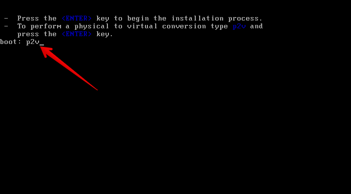](http://rodrigolira.eti.br/wp-content/uploads/2016/12/01.png)

Selecione **Skip** e tecle **ENTER**.

[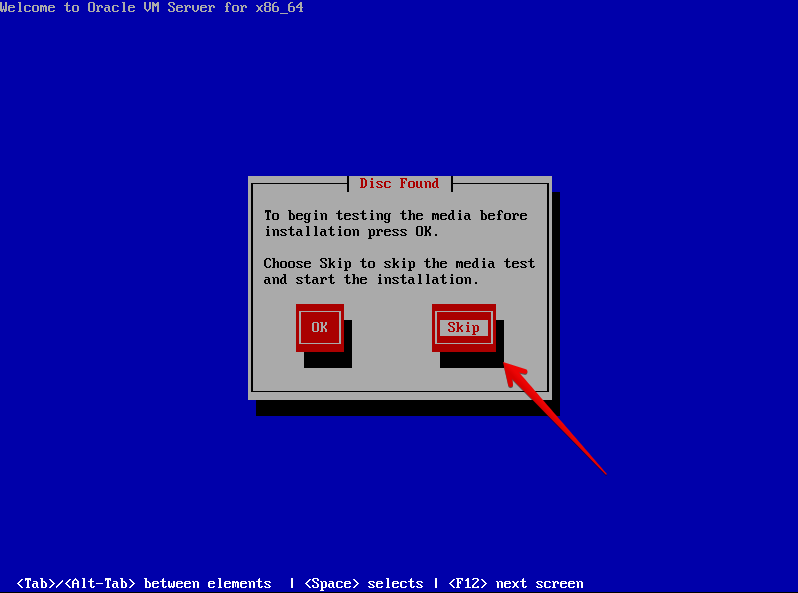](http://rodrigolira.eti.br/wp-content/uploads/2016/12/02.png)

Selecione o(s) disco(s) que deseja fazer o p2v.

[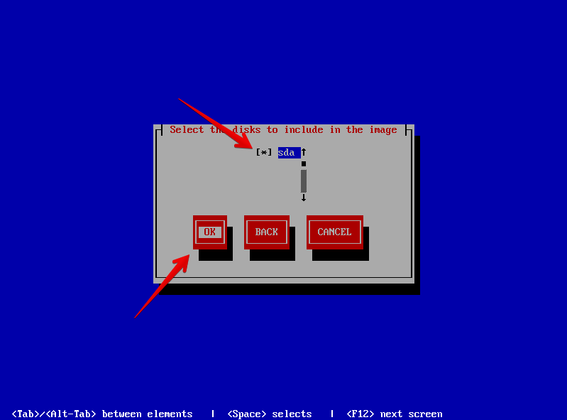](http://rodrigolira.eti.br/wp-content/uploads/2016/12/03.png)

Insira os dados solicitados.

**VM name:** Nome da Maquina Virtual.

**VM Memory (in MB):** Quantidade de memoria que a VM terá no seu destino.

**Virtual CPUs:** Quantidade de CPUs que a VM terá em seu destino.

**Console Password:** Senha

**Confirm console password:** Confirma Senha

**Obs:** A senha solicitada pode ser uma qualquer, o processo de migração não usa para nada.

[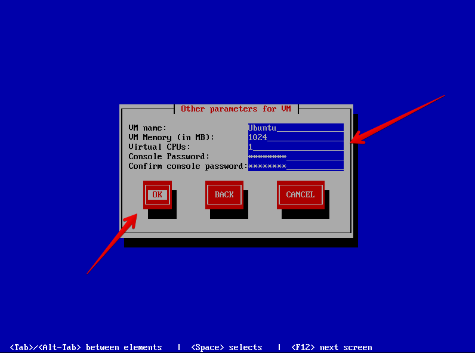](http://rodrigolira.eti.br/wp-content/uploads/2016/12/04.png)

É iniciado um servidor **web** local, rodando na porta **443**.

[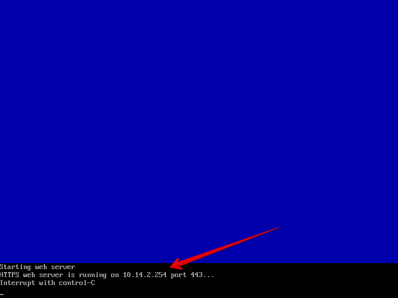](http://rodrigolira.eti.br/wp-content/uploads/2016/12/05.png)

Acesse via navegador o IP informado e verifique se a página está abrindo corretamente, observe os arquivos abaixo, vamos precisar do seguintes arquivos:

**System-sda.img**: Imagem do disco

**vm.cfg**: Configuração da VM

[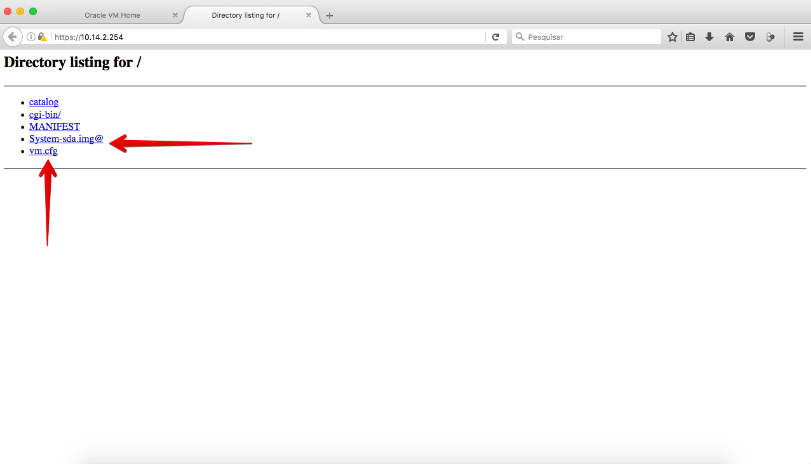](http://rodrigolira.eti.br/wp-content/uploads/2016/12/07.png)

Agora acesse o **Oracle VM Manager**, navegue até a aba de **Repositories**, escolha o **Repositório**, clique em **VM Templates** e depois em **Import VM Template**.

[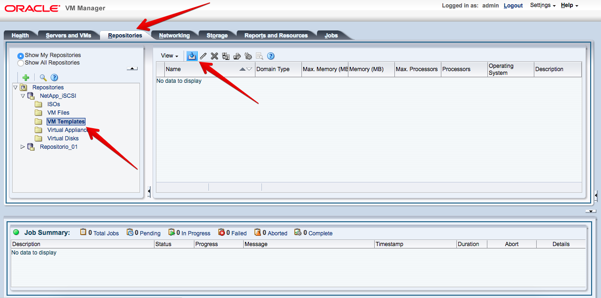](http://rodrigolira.eti.br/wp-content/uploads/2016/12/06.png)

Insira o caminho para os arquivos de disco e configuração e clique em **OK**.

[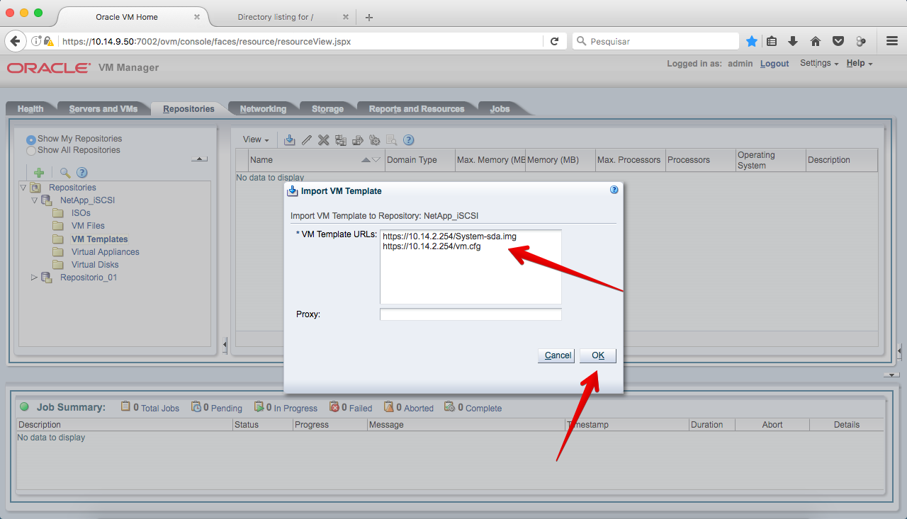](http://rodrigolira.eti.br/wp-content/uploads/2016/12/08.png)

O download da imagem é iniciado.

[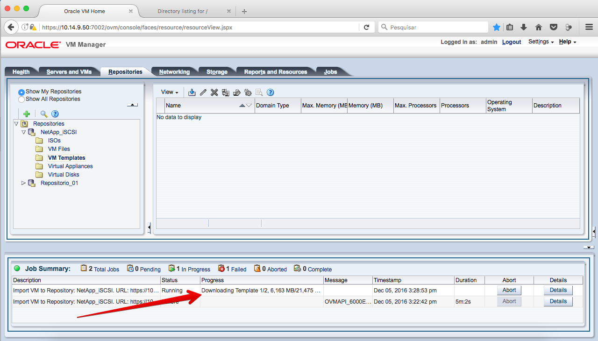](http://rodrigolira.eti.br/wp-content/uploads/2016/12/09.png)

Após o download ser concluído um novo templeta irá aparecer, que na verdade é a maquina(vm) que acabamos de fazer o p2v.

[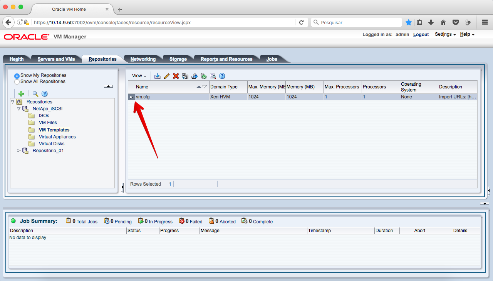](http://rodrigolira.eti.br/wp-content/uploads/2016/12/10.png)

Agora o que precisamos fazer é clonar o template para uma VM.

Clique com o botão direito em cima do template e  clique em **Clone Template**.

[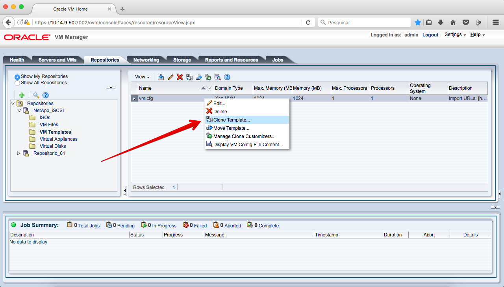](http://rodrigolira.eti.br/wp-content/uploads/2016/12/11.png)

Selecione **Virtual Machine,** insira um **nome** para o clone e clique em **OK**.

[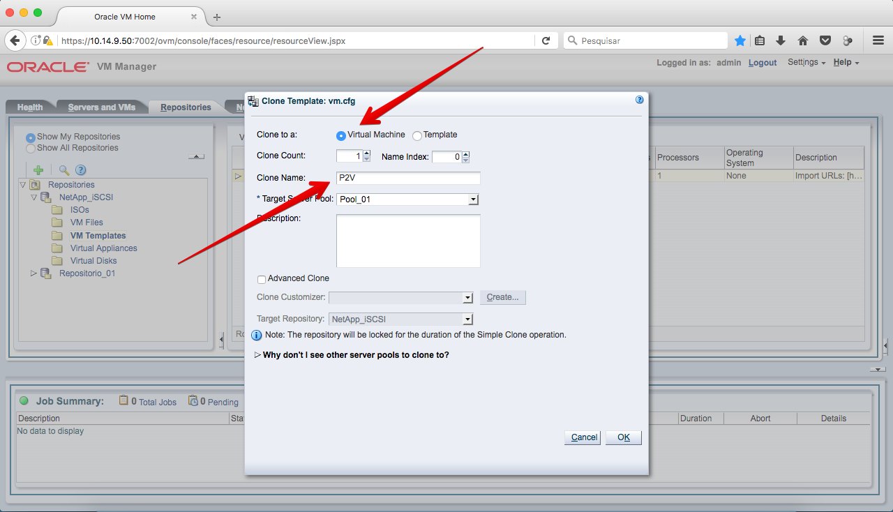](http://rodrigolira.eti.br/wp-content/uploads/2016/12/12.png)

Após o clone ser concluído a vm irá aparecer no pool.

 

[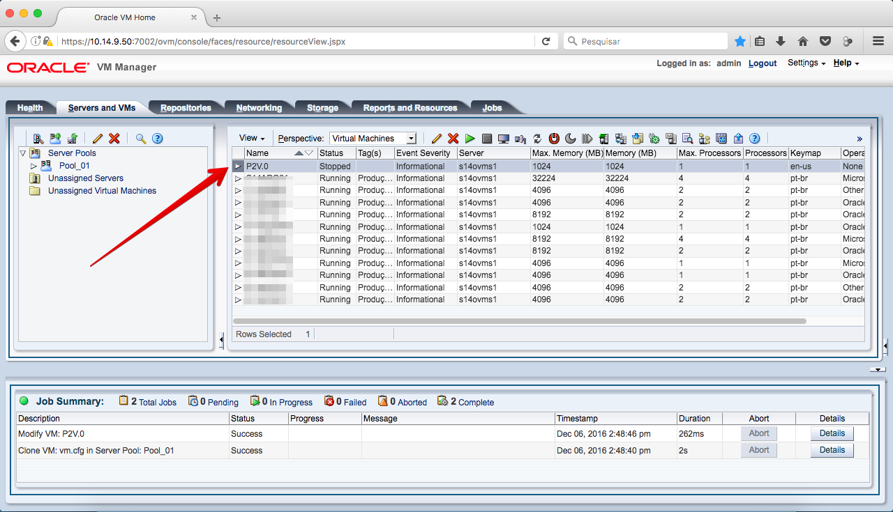](http://rodrigolira.eti.br/wp-content/uploads/2016/12/14.png)

Pronto, agora só personalizar de acordo com as suas necessidades.

Aconselho renomear o disco, remover a nic e adicionar uma nova e configurar a ordem de boot.

Espero que tenham gostado e até a próxima :D
