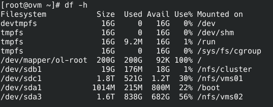
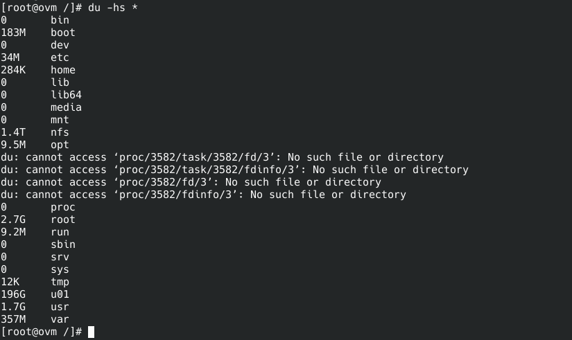
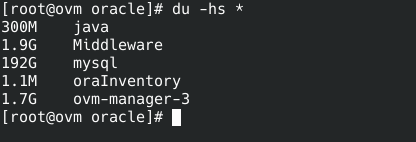
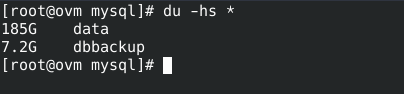

[](images/oracle_vm.gif)

Salve Salve Pessoal!

Ontem tive um problema em um dos clientes, de uma hora para outra o Oracle VM Manager dele parou de funcionar, o serviço ovmm não iniciava mais e acabou que ele não conseguia mais gerenciar suas máquinas virtuais.

Quando acessei o ambiente dele vi que o serviço ovmm\_mysql do banco de dados MySQL também não estava funcionando.

Quando fui verificar o espaço em disco pude constatar que a partição **/** estava **100%** de uso.

[](images/001.png) Então fui investigar o que estava causando esse problema, executando o comando **du -hs \*** no **/** pude constatar que o problema estava dentro do diretório **u01**.

[](images/002.png)

Entrando dentro do diretório **u01** e executando mais uma vez o comando **du -hs \*** pude ver que o problema estava dentro do diretório do **mysql**, logo pensei que tinha sido a rotação dos backups que não deveria estar funcionando como devia.

[](images/003.png)

Entrei no diretório **mysql** e executei o **du -hs \*** novamente e para minha surpresa o problema não estava no backup, mas sim no diretório do banco de dados.

[](images/004.png)

Entrei  no diretório **data** e executei mais uma vez o **du -hs \*** para identificar qual arquivo estava tão grande para encher o disco.

 [](images/005.png)

Bem, agora que já sabia a causa do problema era correr atrás de uma solução, pesquisando no pai google achei um documento da própria Oracle sobre o problema:

[https://support.oracle.com/knowledge/Oracle%20Linux%20and%20Virtualization/2216441\_1.html](https://support.oracle.com/knowledge/Oracle%20Linux%20and%20Virtualization/2216441_1.html)

Porém não tenho acesso a documentação! :(

Então pesquisando mais um pouco descobri que essa tabela armazena apenas as estatísticas do ambiente e se limparmos ela não teremos problema algum em nosso ambiente, voltando a documentação da Oracle eles já mostram o procedimento de login no banco de dados e como acessar a mesma.

```
# mysql ovs -u ovs -p -S /u01/app/oracle/mysql/data/mysqld.sock
```

**OBS:** Use a senha do usuário Admin do Oracle VM Manager para logar no banco de dados.

Depois de logar só precisamos limpar os dados da tabela, para mim foi a parte mais difícil, pois não entendo de banco de dados e tive que dar uma boa pesquisada e rezar antes de executar o comando. :D

```
mysql> truncate table OVM_STATISTIC;
```

Pronto, feito isso só iniciar os serviços do banco e manager.

```
# systemctl start ovmm_mysql

# systemctl start ovmm
```

Até o próximos post!

:D
