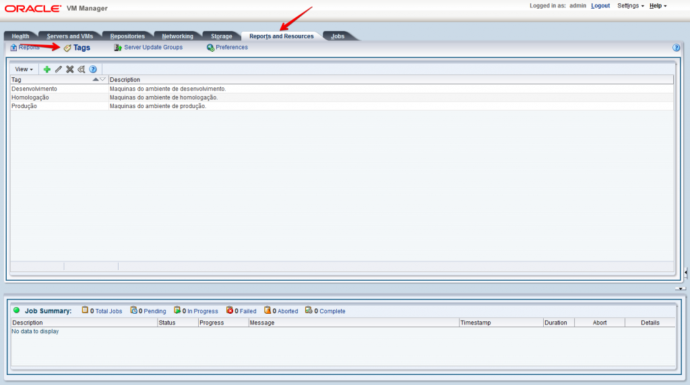
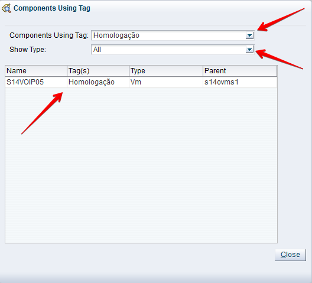

Salve Salve Pessoal!

O uso de tags em grandes ambientes é uma realidade, com ela nós podemos por exemplo, classificar se uma maquina virtual é de um ambiente de desenvolvimento ou de produção.

No Oracle VM, nós podemos usar tags nos Pools, Servidores e Maquinas Virtuais.

Para criar, editar, excluir ou pesquisar os objetos que estão marcados com uma determinada tag, nós devemos acessar o seguinte caminho no Oracle VM.

Clique na aba **Reports and Resources**, e depois clique em **Tags**.

Para criar uma nova tag clique no ícone  e preencha os dados.

Se já tivermos uma tag criada podemos editar a mesma, selecionando a mesma e clicando no ícone .

Podemo deletar a tag selecionando e clicando no ícone .

Clicando no ícone  nós podemos fazer uma pesquisa de um objeto que está usando uma determinada tag, dessa forma podemos refinar a pesquisa por maquinas virtuais por exemplo.

É isso ai, espero que tenham gostado.

Até a próxima :D
