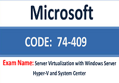

Salve Salve Pessoal!

Estou postando aqui com muita felicidade mais uma certificação conquistada, a batalha foi dura, mas a vitoria foi certa.

Como postei no post anterior essa certificação está gratuita até o final do mês de junho, quem tiver a oportunidade de estudar para tirar a mesma estude pois o nível da prova está muito bom, em uma escala de 0 a 100 diria que a prova tem o nível 80, segue abaixo o link para o simulado que usei como base de estudos para a prova.<!--more-->

http://www.examcollection.com/microsoft/Microsoft.Selftestengine.74-409.v2014-04-11.by.GABRIELA.99q.vce.file.html

Boa sorte na sua prova e que venham outras :)
