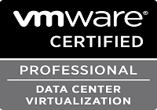

Salve Salve Pessoal!

Depois de algum tempo sem postar nada aqui no blog, venho com muita felicidade informar que passei na prova VCP5-DCV.

Nesse outro post [material-para-prova-vcp5-dcv](http://rodrigolira.eti.br/material-para-prova-vcp5-dcv/) mostrei todo o material que utilizei para estudar para a prova, a prova não é fácil, foi a prova de certificação mais difícil que já fiz, mas vale muito a pena.

As portas já começaram a se abrir no mercado de trabalho devido essa certificação, mas não vou parar por aqui, já estou começando os estudos para VCAP5-DCA que é a linha Advanced Administrator.

Um dos meus próximos posts vou falar sobre a carreira VMware Data Center Virtualization.

Até a próxima :)
