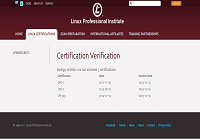

Salve Salve Pessoal!

É com muita alegria que venho informar que passei na LPIC-3 (exame 303 - Security).

Mais para frente vou postar todo o material que usei para passar na mesma.

Até a próxima :D

 

