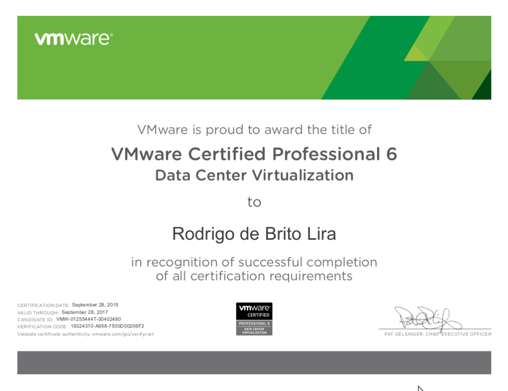

Salve Salve Pessoal!

Venho com muita alegria informar que passei na prova para VCP6-DCV.

A prova foi muito boa, bem melhor do que quando fiz para VCP5, porém a minha prova foi a Delta Beta, apenas de atualização, então caiu apenas o que veio de novidade no vSphere 6.

Os assusntos que mais cairam em minha prova, foram as atualizações, tanto do vCenter, vSphere e VSAN. Caiu muita linha de comando também.

Para essa prova, eu estudei utilizando o material oficial da VMware e alguns sites. Segue abaixo os mesmos:

VMware vSphere: Install, Configure, Manage - ESXi 6 and vCenter Server 6

[http://vwannabe.com/vmware/vcp6-dcv-study-guide/](http://vwannabe.com/vmware/vcp6-dcv-study-guide/)

[http://www.vhersey.com/study-guides/vcp6-dcv/](http://www.vhersey.com/study-guides/vcp6-dcv/)

A prova era apenas atualização, mas estudei todo o conteúdo.

Espero que tenham a mesma sorte que eu, até a próxima :D

