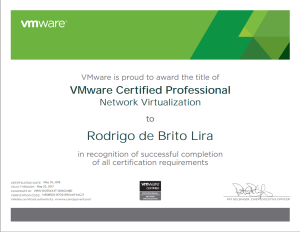

Salve Salve Pessoal!

É com muita alegria que venho informar que passei em mais uma prova da VMware, dessa vez em redes virtualizadas.

Quem me conhece um pouco mais, sabe que estava estudando para ela, e que nesses últimos dias me dediquei exclusivamente a mesma e tive que esquecer um pouco os posts aqui no blog.

A experiência dessa prova foi bem interessante, achei as perguntas muito bem elaboradas e bem diretas, tinha algumas pegadinhas, porém com um pouco mais de atenção você consegue fazer sem problemas, preste atenção nas imagens, elas se repetem com o mesmo cenário e respostas, mudando apenas as perguntas :D

Segue abaixo um roteiro que fiz para estudar para a mesma, indico para quem for estudar seguir a mesma ordem:<!--more-->

1 - Ler esse post sobre o NSX, o mesmo está em português e dá uma noção muito boa do que é a ferramenta:

[http://techcenter.agilitynetworks.com.br/index.php?option=com\_content&view=article&id=460:introducao-ao-vmware-nsx-1&catid=92&Itemid=879](http://techcenter.agilitynetworks.com.br/index.php?option=com_content&view=article&id=460:introducao-ao-vmware-nsx-1&catid=92&Itemid=879)

2 - Fazer o curso fundamental e gratuito da própria vmware:

[VMware Network Virtualization Fundamentals - http://mylearn.vmware.com/mgrReg/courses.cfm?ui=www\_edu&a=det&id\_course=240782](http://VMware Network Virtualization Fundamentals - http://mylearn.vmware.com/mgrReg/courses.cfm?ui=www_edu&a=det&id_course=240782)

3 - Realizar os seguintes labs no labs.hol.vmware.com:

HOL-SDC-1402 - vSphere Distributed Switch from A to Z

HOL-SDC-1403 – VMware NSX Introduction

HOL-SDC-1425 – VMware NSX Advanced

Segue o link para os 03 cursos: [http://labs.hol.vmware.com/HOL/catalogs/catalog/130](http://labs.hol.vmware.com/HOL/catalogs/catalog/130)

4 - Visitar e ler alguns sites, segue uma lista abaixo:

[http://www.elasticsky.co.uk/vcp-nv/](http://www.elasticsky.co.uk/vcp-nv/)

[http://www.routetocloud.com/certifications/vcp-nv/](http://www.routetocloud.com/certifications/vcp-nv/)

[http://thesaffageek.co.uk/vcp-nv/](http://thesaffageek.co.uk/vcp-nv/)

[http://bradhedlund.com/category/nsx/](http://bradhedlund.com/category/nsx/)

[http://blog.scottlowe.org/learning-nvp-nsx/](http://blog.scottlowe.org/learning-nvp-nsx/)

Entre outros...

5 - Material oficial da VMware:

Blue Print - [https://mylearn.vmware.com/lcms/web/portals/certification/VCP\_Blueprints/VCP-NV-Exam-Blueprint-v1\_2.pdf](https://mylearn.vmware.com/lcms/web/portals/certification/VCP_Blueprints/VCP-NV-Exam-Blueprint-v1_2.pdf)

NSX for vSphere Installation and Upgrade Guide - [http://pubs.vmware.com/NSX-61/topic/com.vmware.ICbase/PDF/nsx\_61\_install.pdf](http://pubs.vmware.com/NSX-61/topic/com.vmware.ICbase/PDF/nsx_61_install.pdf)

NSX for vSphere Administration Guide - [http://pubs.vmware.com/NSX-61/topic/com.vmware.ICbase/PDF/nsx\_61\_admin.pdf](http://pubs.vmware.com/NSX-61/topic/com.vmware.ICbase/PDF/nsx_61_admin.pdf)

6 - Testking

Segue o testking que estudei para a prova: [http://www.aiotestking.com/vmware/category/exam-vcpn610-vmware-certified-professional-network-virtualization/](http://www.aiotestking.com/vmware/category/exam-vcpn610-vmware-certified-professional-network-virtualization/)

 Espero que as dicas tenham sido válidas!

Até a próxima :D
