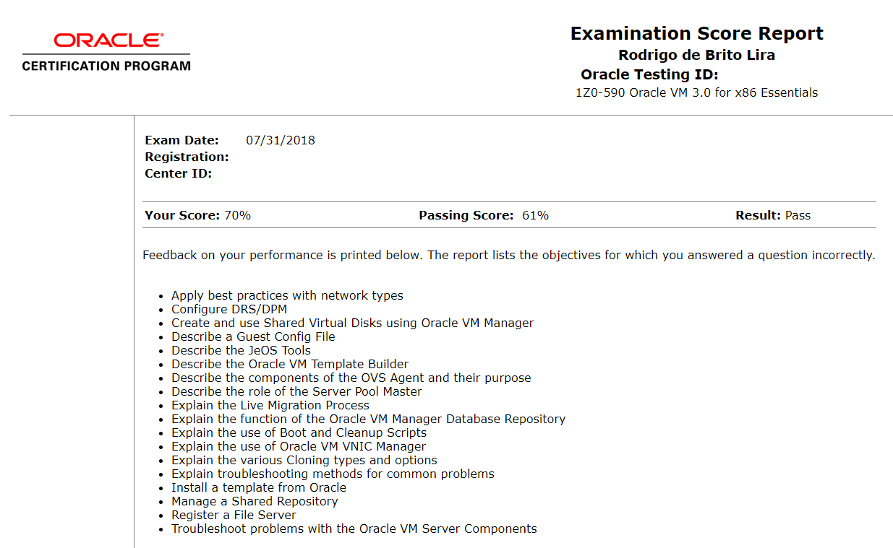

Salve Salve Pessoal!

Hoje venho compartilhar um pouco da minha felicidade com vocês.

Fazia tempo que vinha adiando fazer o exame de certificação do Oracle VM 3.0 for x86 Essentials (1Z0-590), mas a uns 30 dias atrás criei coragem, marquei e realizei a prova hoje, para minha alegria fui aprovado! :D

Vamos falar um pouco sobre o exame ;)

**1** - O exame é em inglês.

**2** - O número de questões é 72.

**3** - A duração da prova é 120 minutos.

**4** - Você é aprovado com 61% de acertos.

**5** - É uma prova com questões de múltiplas escolhas.

**6** - O valor da prova é US$ 245,00 dólares, mas isso depende do país, aqui no Brasil eu paguei US$ 150,00 dólares pagando direto com a PearsonVue, podemos pagar em Real também, direto pelo site da Oracle, fica algo em torno de R$ 590,00 Reais.

Maiores informações sobre assuntos cobrados na prova e cursos no link abaixo:

[https://education.oracle.com/pls/web\_prod-plq-dad/db\_pages.getpage?page\_id=5001&get\_params=p\_exam\_id:1Z0-590](https://education.oracle.com/pls/web_prod-plq-dad/db_pages.getpage?page_id=5001&get_params=p_exam_id:1Z0-590)

**Agora o que eu achei das questões :D**

Apesar de ser uma prova que cobra um percentual de acerto relativamente baixo, achei uma prova um pouco complexa.

É uma prova que pergunta vários detalhes do gerenciamento, tanto via console quanto Manager.

Em perguntas com mais de uma resposta, tinha várias pegadinhas e caso você não preste atenção você pode se dar mal.

Em minha opinião a prova deveria ser dividida em dois níveis, existe perguntas bem básicas, porém algumas bem complexas.

Tive a impressão das questões que você marca mais de uma resposta, se ela não estiver totalmente correta, a questão toda é anulada.

Bem é isso ai, se puder esclarecer um pouco mais ou tirar alguma dúvida, podem deixar um comentário.

Até a próxima! :D

**OBS:** Já tinha marcado essa prova em 2017 e acabei perdendo a prova por problemas pessoais :(
