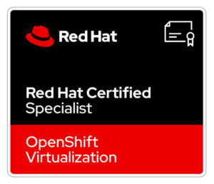
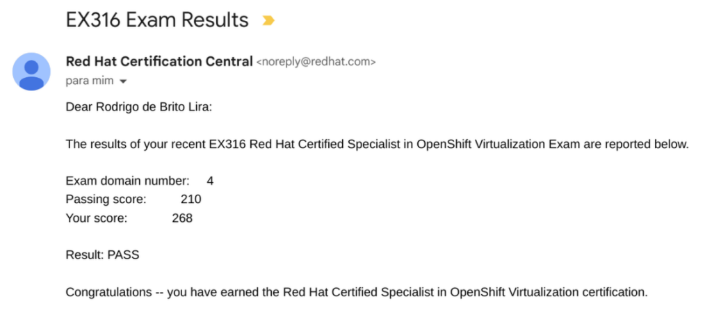

Salve Salve Pessoal!

Hoje fiz o exame **EX316 Red Hat Certified Specialist in OpenShift Virtualization**, e consegui passar.

Tive a oportunidade de fazer o curso oficial para este exame, o mesmo estava em promoção junto com o exame, então acabei pagando apenas 30% do valor.

De todos os exames que eu já fiz da Red Hat, esse foi o que mais estava confiante em fazer, o treinamento tem muito conceito de virtualização e kubernetes, então se você já entende de virtualização e kubernetes, você vai aprender sobre o Openshift Virtualization com bastante facilidade.

Não posso falar muito sobre o exame, apenas que se você tiver a oportunidade de fazer o curso e aprender bem, certamente vai ser de boa essa prova.

A exame tem uma duração de 4 horas, mas terminei em 3 horas e passei mais uns 30 minutos revisando as questões, ou seja, é tempo de sobra para fazer o exame.

Boa sorte e até o próximo post!

:D
