Salve Salve Pessoal!

Hoje em dia se fala muito de segurança, e uma das suas boas práticas é darmos ao usuário apenas as permissões necessárias ao mesmo.

Nessa serie de posts, vou mostrar as permissões que o vCenter Server tem nativamente, como criar permissões personalizadas , como criar novos usuários e grupos e como darmos permissões especificas a cada usuário ou grupo, também vou mostrar como darmos permissão apenas a determinados objetos do nosso vCenter Server.

Vou fazer três cenários, divididos em três posts.

No primeiro cenário, vamos criar um usuário chamado estagiário01 e colocamos ele com as permissões de Read-only(leitura), essa permissão já existe, ou seja, vamos ter o trabalho apenas de criar o usuário e delegar a permissão ao mesmo.

No segundo cenário, nós vamos criar uma permissão personalizada chamada Power-On, criar usuário chamado estagiário02, depois criar um grupo chamado estagiarios, e adicionar o usuário estagiario02 ao grupo estagiarios e delegar a permissão Power-On ao grupo estagiarios.

No terceiro cenário vamos criar um usuário chamado estagiário03 e vamos dar permissão em apenas um objeto do nosso vCenter Server, nesse caso em uma VM, dessa forma quando o estagiario03 logar no vCenter Server, só estará disponível para o mesmo este objeto(VM).

Então vamos ao que interessa :D

Acesse a aba **Administration** no vCenter Server como mostra a imagem abaixo:

[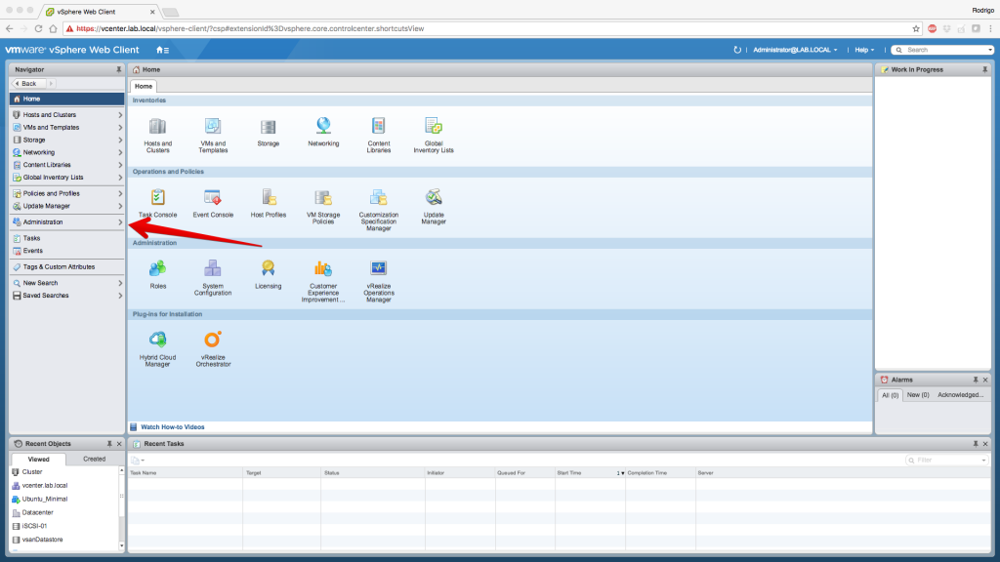](http://rodrigolira.eti.br/wp-content/uploads/2016/11/Screen-Shot-2016-11-26-at-15.12.17-2.png)

 Em **Administration** nós temos diversas possibilidades de configuração, para esse post nós vamos utilizar apenas a parte de **Access Control** e **Sigle Sign-On**.

[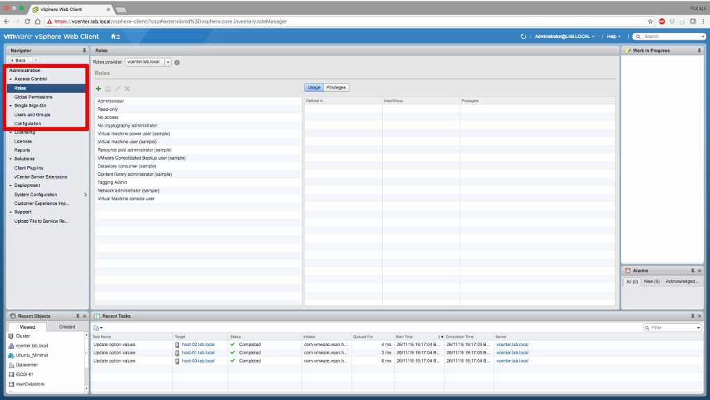](http://rodrigolira.eti.br/wp-content/uploads/2016/11/Screen-Shot-2016-11-26-at-15.20.11-2.png)

Vamos entender um pouco melhor:

**Access Control**

Em Access Control nós temos duas possibilidades:

**Roles** - É onde definimos as permissões do que pode ser acessado e como será acessado. Existem permissões pré-configuradas, como por exemplo a Read-only, essa regra permite que o usuário acesse o vCenter em modo apenas leitura, ou seja, ele consegui visualizar tudo do ambiente, mas não pode criar, deletar ou modificar nada.

[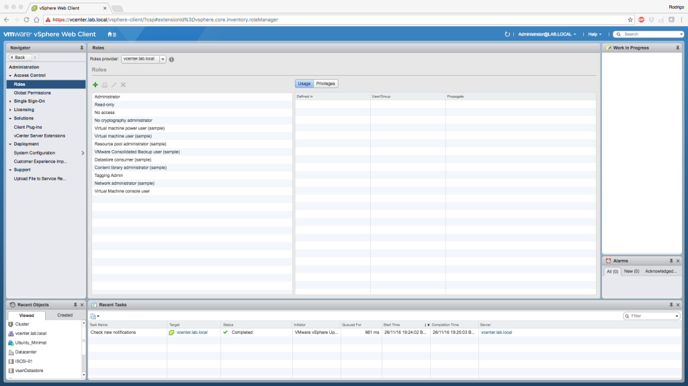](http://rodrigolira.eti.br/wp-content/uploads/2016/11/Screen-Shot-2016-11-26-at-15.32.37-2.png)

 **Global Permissions** - Onde definimos qual permissão o usuário ou grupo terá.

[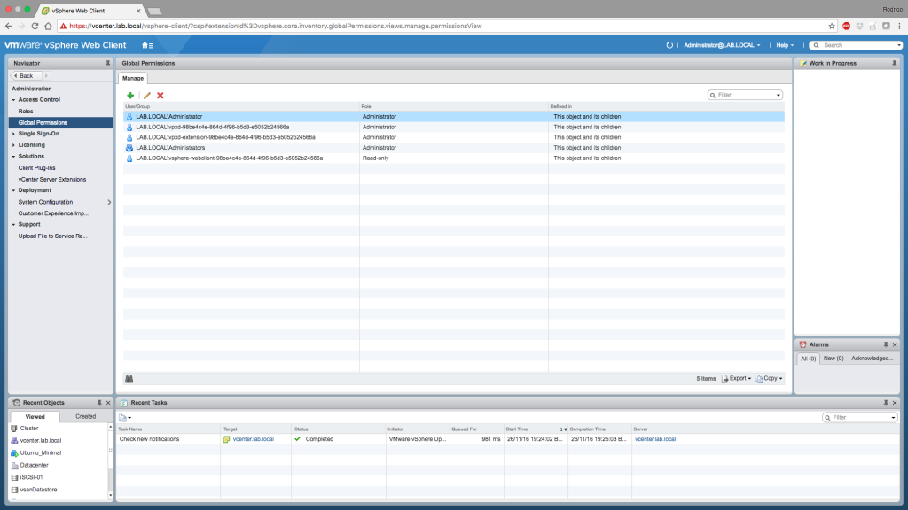](http://rodrigolira.eti.br/wp-content/uploads/2016/11/Screen-Shot-2016-11-26-at-15.36.00-2.png)

**Single Sign-On**

Em Single Sign-On nós também temos duas possibilidades:

**Users and Groups** - Onde criamos nossos usuários e grupos.

[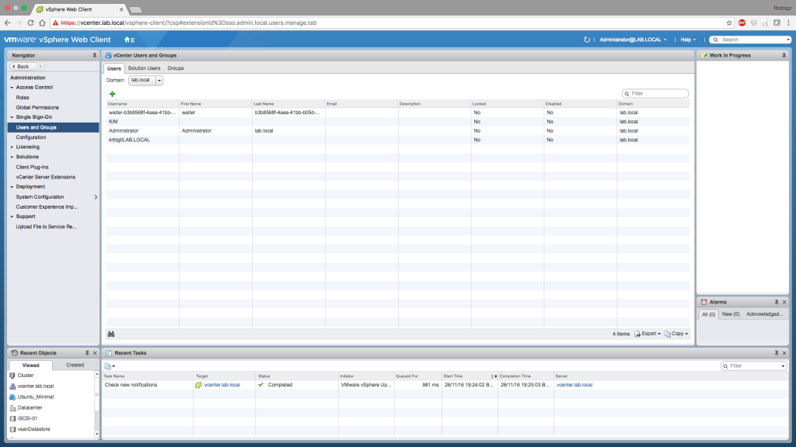](http://rodrigolira.eti.br/wp-content/uploads/2016/11/Screen-Shot-2016-11-26-at-15.42.02-2.png)

**Configuration** - Onde podemos definir políticas de senha, servidores de autenticação como AD ou OpenLDAP e etc. Não vamos falar sobre essa aba nesse post ;)

[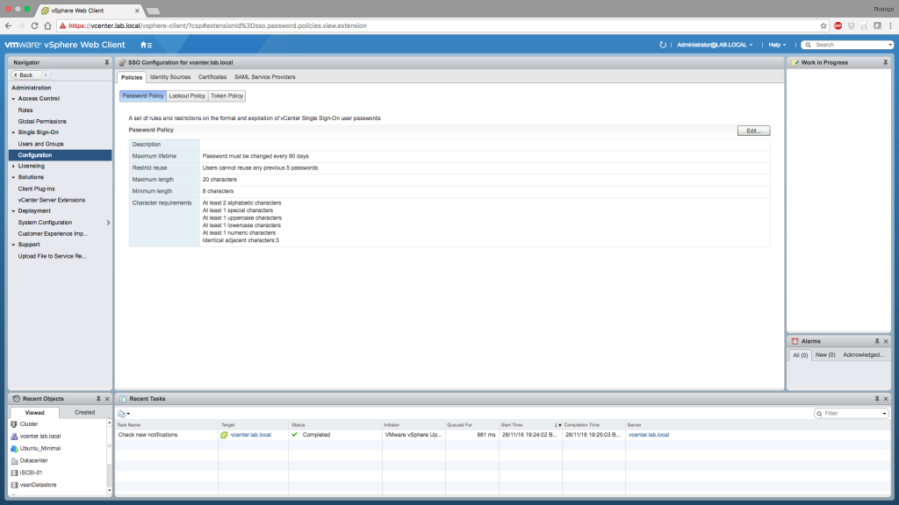](http://rodrigolira.eti.br/wp-content/uploads/2016/11/Screen-Shot-2016-11-26-at-15.42.31-2.png)

Bem, agora que já entendemos um pouco mais sobre o que vamos utilizar, vamos começar a brincadeira.

**Primeiro Cenário:**

Acesse **Administration > Single Sign-On > Users and Groups**:

[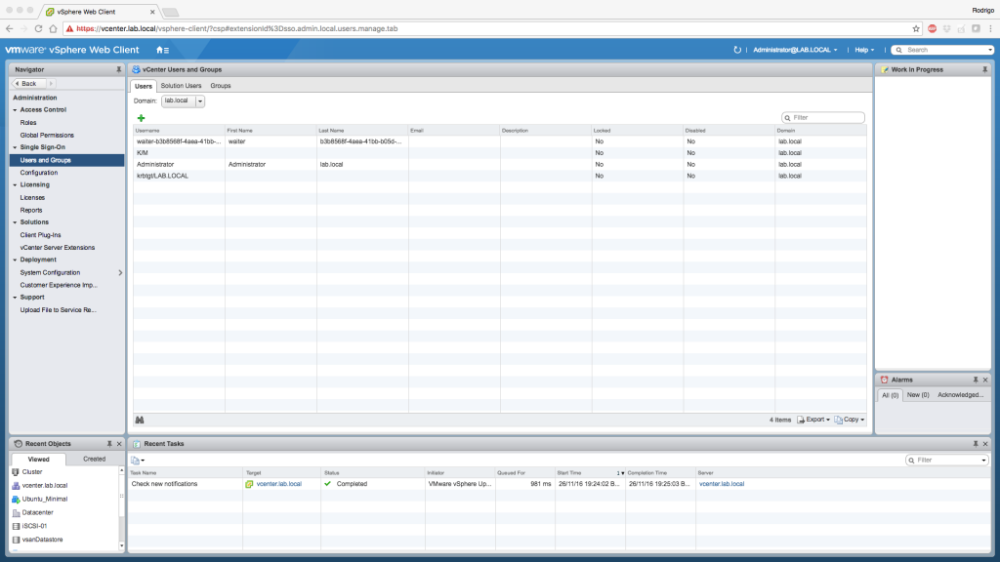](http://rodrigolira.eti.br/wp-content/uploads/2016/11/Screen-Shot-2016-11-26-at-15.59.23-2.png)

Clique no ícone para adicionar um novo usuário:

[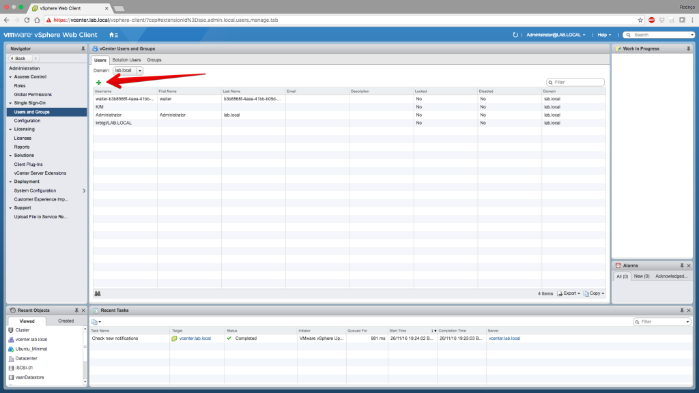](http://rodrigolira.eti.br/wp-content/uploads/2016/11/Screen-Shot-2016-11-26-at-16.01.11-2.png)

Preencha os dados do novo usuário e clique em **OK**:

[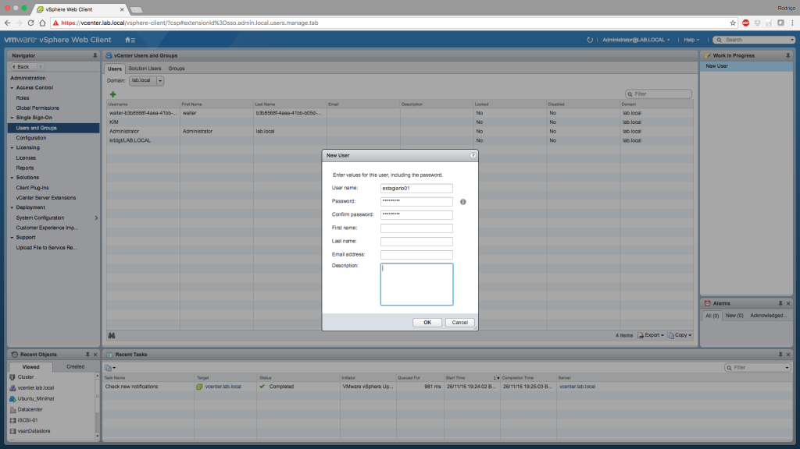](http://rodrigolira.eti.br/wp-content/uploads/2016/11/Screen-Shot-2016-11-26-at-16.04.03-2.png)

Como podemos ver na imagem abaixo o usuário **estagiario01** foi adicionado com sucesso:

[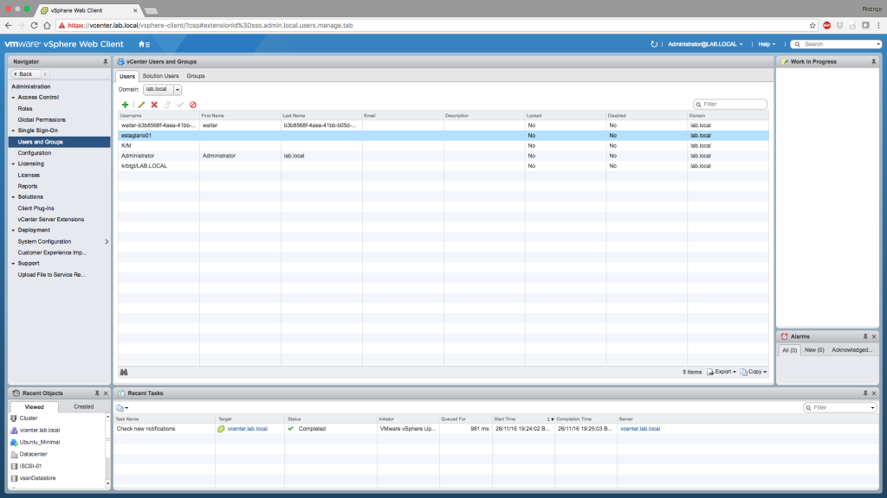](http://rodrigolira.eti.br/wp-content/uploads/2016/11/Screen-Shot-2016-11-26-at-16.06.10-2.png)

Agora, acesse **Administration > Access Control > Global Permissions**:

[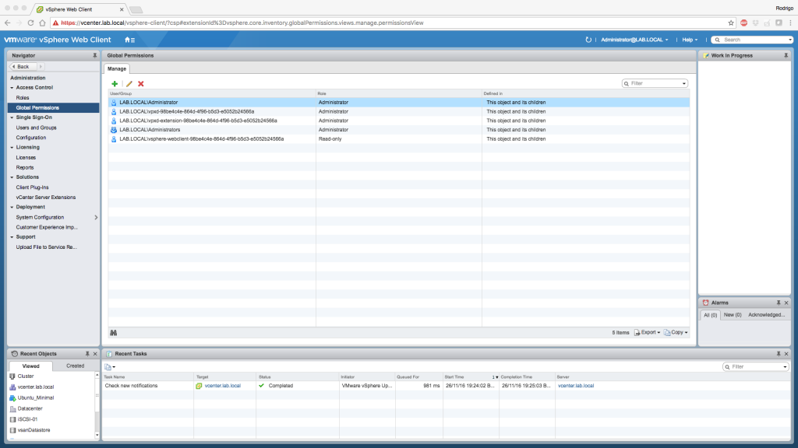](http://rodrigolira.eti.br/wp-content/uploads/2016/11/Screen-Shot-2016-11-26-at-16.10.40-2.png)

Clique no ícone para adicionar uma permissão:

[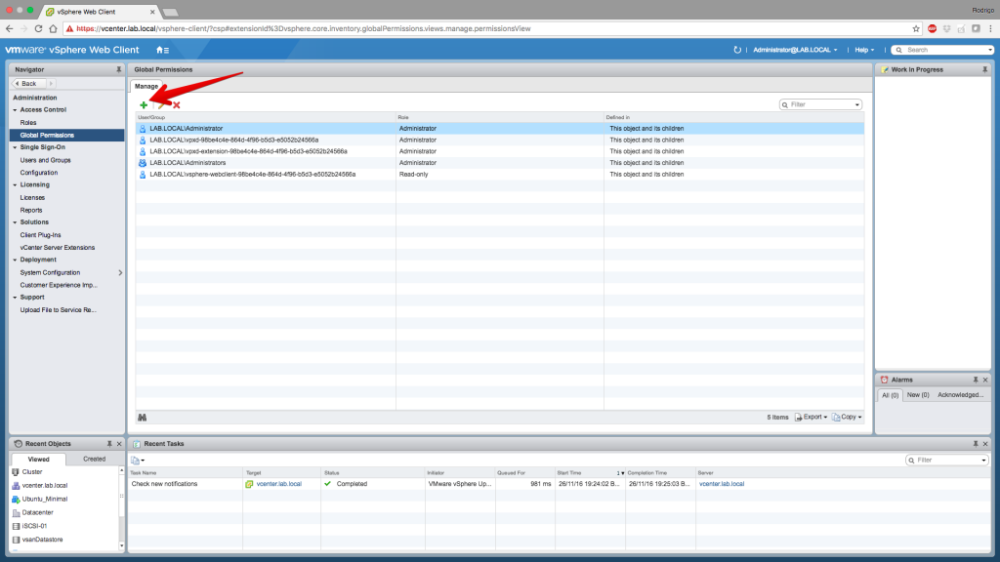](http://rodrigolira.eti.br/wp-content/uploads/2016/11/Screen-Shot-2016-11-26-at-16.11.39-2.png)

Uma nova aba se abre:

[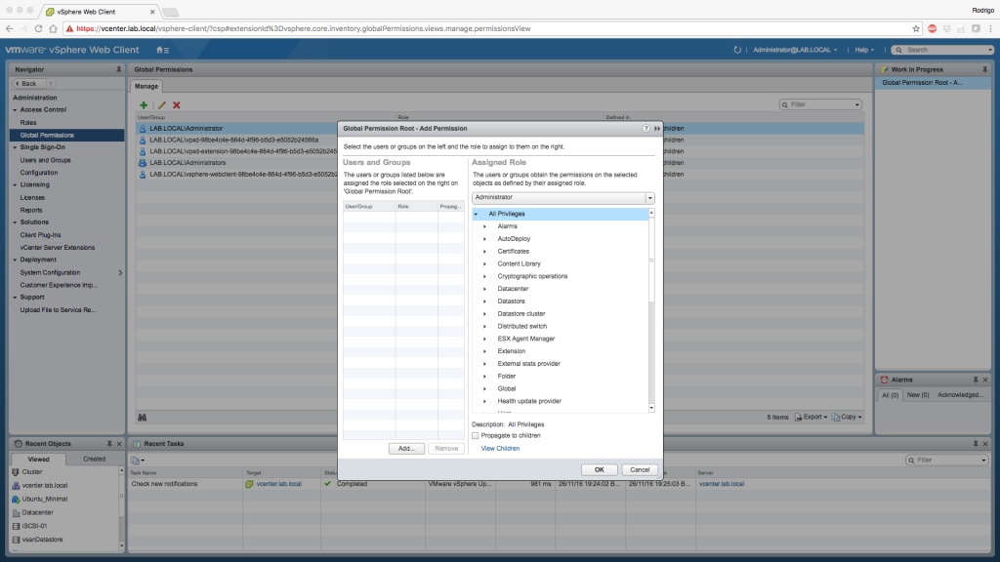](http://rodrigolira.eti.br/wp-content/uploads/2016/11/Screen-Shot-2016-11-26-at-16.13.20-2.png)

Clique em **Add** e será aberta uma outra aba:

[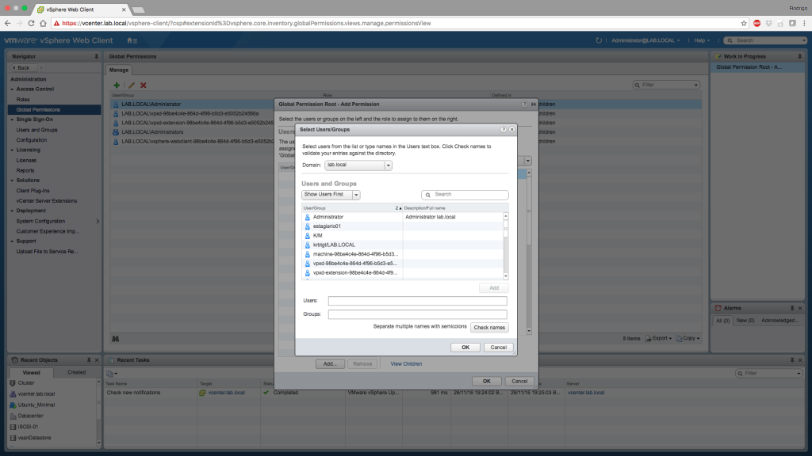](http://rodrigolira.eti.br/wp-content/uploads/2016/11/Screen-Shot-2016-11-26-at-16.15.39-2.png)

Agora selecione o usuário, no nosso caso o **estagiario01**, clique em **Add** e depois **OK**:

[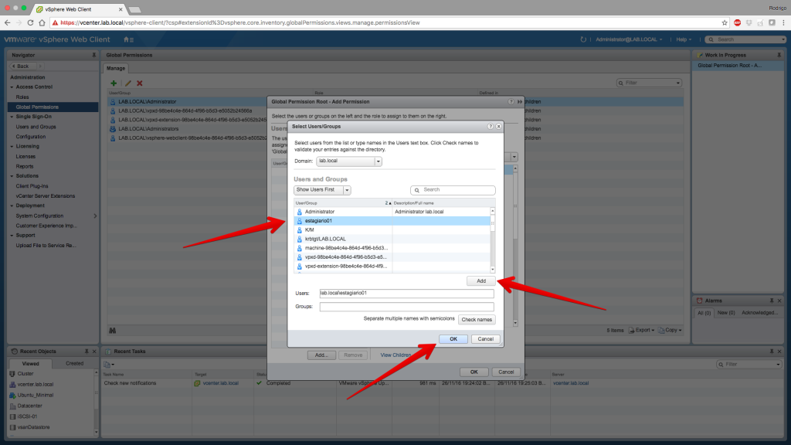](http://rodrigolira.eti.br/wp-content/uploads/2016/11/Screen-Shot-2016-11-26-at-16.17.09-2.png)

Em **Assigned Role** selecione **Read-only** e clique em **OK**:

[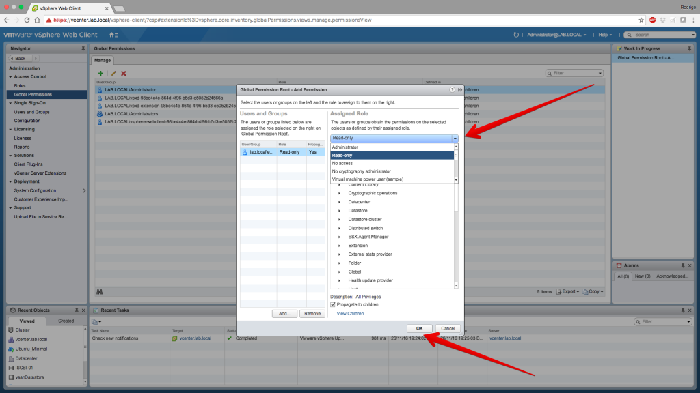](http://rodrigolira.eti.br/wp-content/uploads/2016/11/Screen-Shot-2016-11-26-at-16.19.07-2.png)

Pronto, o usuário **estagiario01** está com permissão de **Read-only**:

[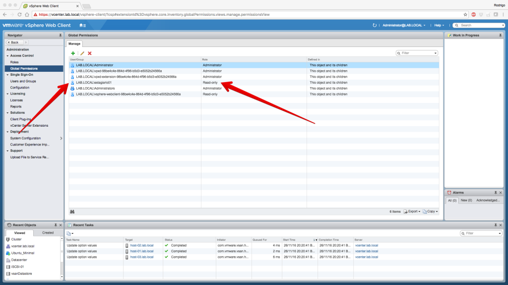](http://rodrigolira.eti.br/wp-content/uploads/2016/11/Screen-Shot-2016-11-26-at-16.22.19-2.png)

Agora podemos logar com nosso novo usuário no vCenter e conferir as permissões do mesmo:

[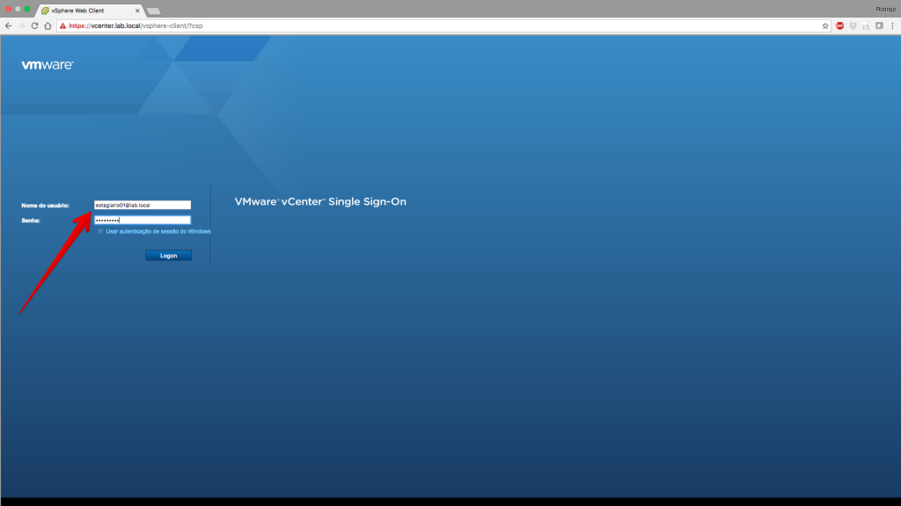](http://rodrigolira.eti.br/wp-content/uploads/2016/11/Screen-Shot-2016-11-26-at-16.24.33-2.png)

Como podemos verificar, ele tem acesso a todos os objetos do vCenter, porém apenas em modo leitura, se selecionarmos um VM podemos verificar que os botões de ação sobre a mesma ficam desabilitados para o usuário estagiario01, como mostra a imagem abaixo:

[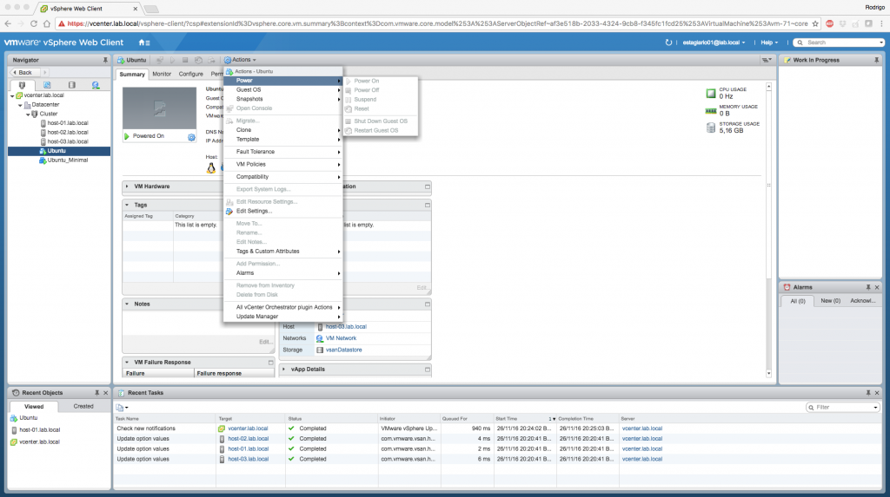](http://rodrigolira.eti.br/wp-content/uploads/2016/11/vSphere-Web-Client-2016-11-26-16-28-51.png)

Até o próximo post :D
