Salve Salve Pessoal!

Nessa segunda parte da serie Permissões no vCenter Server 6.5, nós vamos ver o segundo cenário.

Nós vamos criar uma permissão personalizada chamada Power-On, criar usuário chamado estagiário02, depois criar um grupo chamado estagiarios, e adicionar o usuário estagiario02 ao grupo estagiarios e delegar a permissão Power-On ao grupo estagiarios.

Obs: Se você não leu o primeiro post sobre Permissões no vCenter Server 6.5, acesse o link abaixo e leia ;)

http://rodrigolira.eti.br/permissoes-no-vcenter-server-6-5-parte-01/

Vamos lá :D

Acesse **Administration > Access Control > Roles**:

[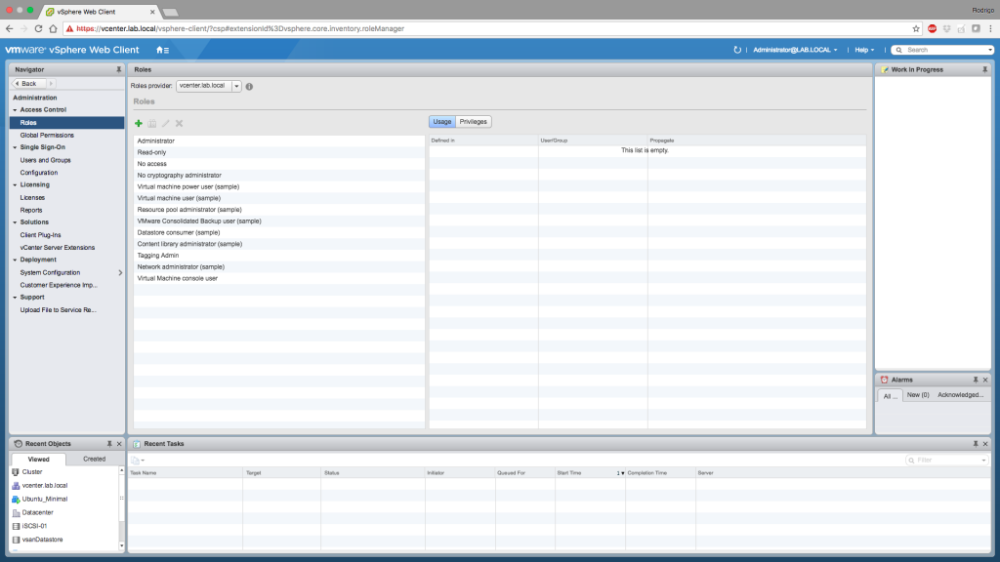](http://rodrigolira.eti.br/wp-content/uploads/2016/11/Screen-Shot-2016-11-26-at-16.54.06-2.png)

Clique no ícone para adicionar uma permissão:

[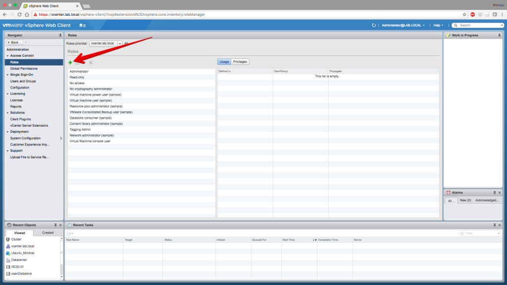](http://rodrigolira.eti.br/wp-content/uploads/2016/11/Screen-Shot-2016-11-26-at-16.54.45-2.png)

Digite o nome da permissão:

[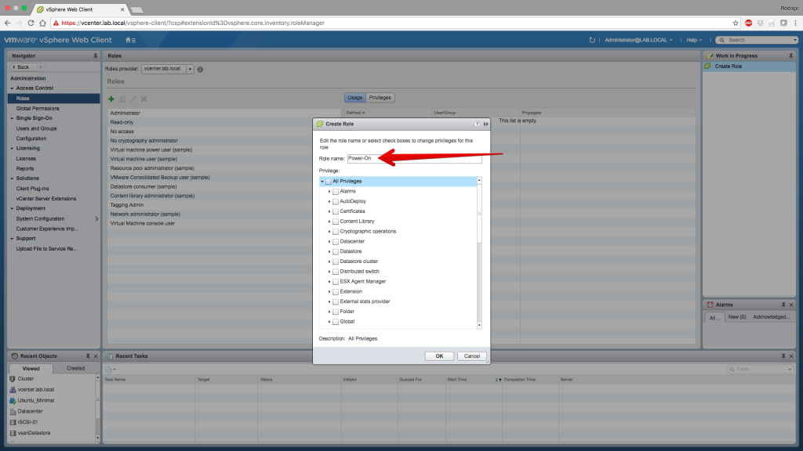](http://rodrigolira.eti.br/wp-content/uploads/2016/11/Screen-Shot-2016-11-26-at-16.56.48-2.png)

Em Privilege nós vamos dizer o que essa permissão pode fazer, como o próprio nome da mesma já diz, essa permissão poderá apenas ligar as VMs.

Acesse **All Privileges > Virtual Machine > Interaction** e selecione **Power on**, depois clique em **OK**:

[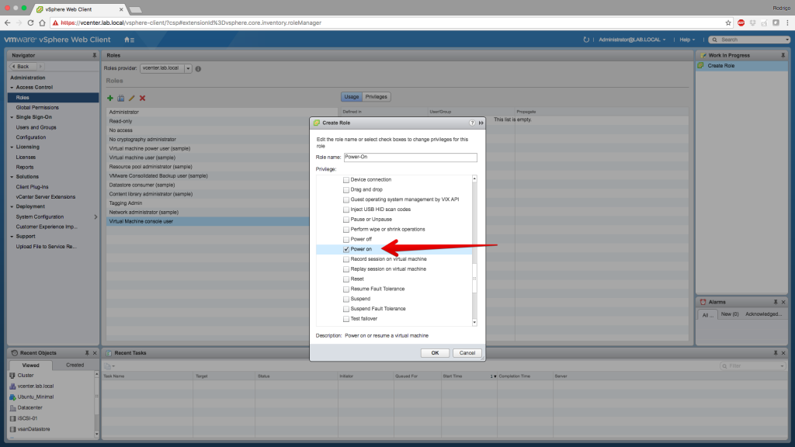](http://rodrigolira.eti.br/wp-content/uploads/2016/11/Screen-Shot-2016-11-26-at-17.01.06-2.png)

A permissão é adicionada:

[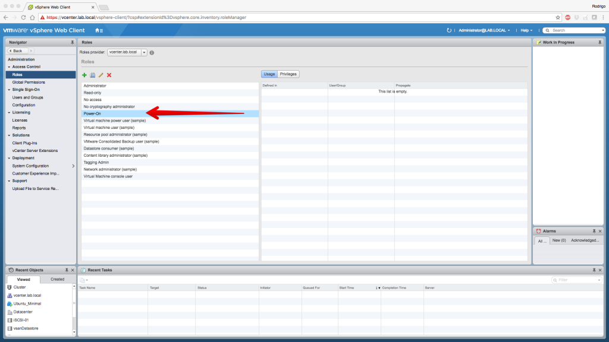](http://rodrigolira.eti.br/wp-content/uploads/2016/11/Screen-Shot-2016-11-26-at-17.03.18-2.png)

Agora vamos criar o usuário chamado estagiario02.

Acesse **Administration > Single Sign-On > Users and Groups**:

[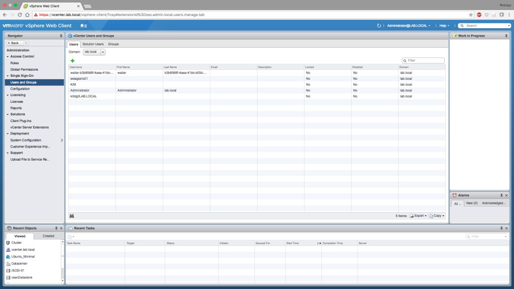](http://rodrigolira.eti.br/wp-content/uploads/2016/11/Screen-Shot-2016-11-26-at-17.08.31-2.png)

Clique no ícone para adicionar um novo usuário:

[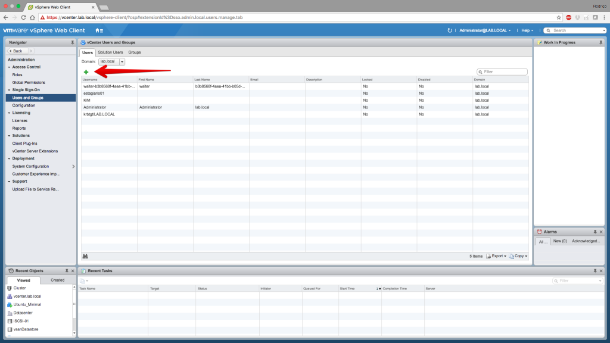](http://rodrigolira.eti.br/wp-content/uploads/2016/11/Screen-Shot-2016-11-26-at-17.09.17-2.png)

Preencha os dados e clique em **OK**:

[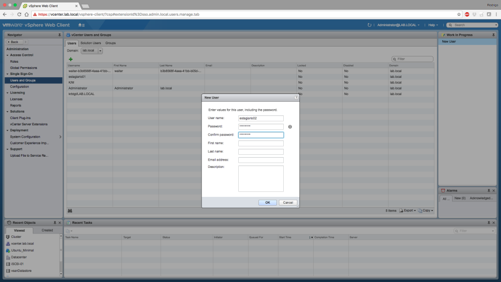](http://rodrigolira.eti.br/wp-content/uploads/2016/11/Screen-Shot-2016-11-26-at-17.10.25-2.png)

Usuário **estagiario02** é adicionado com sucesso:

[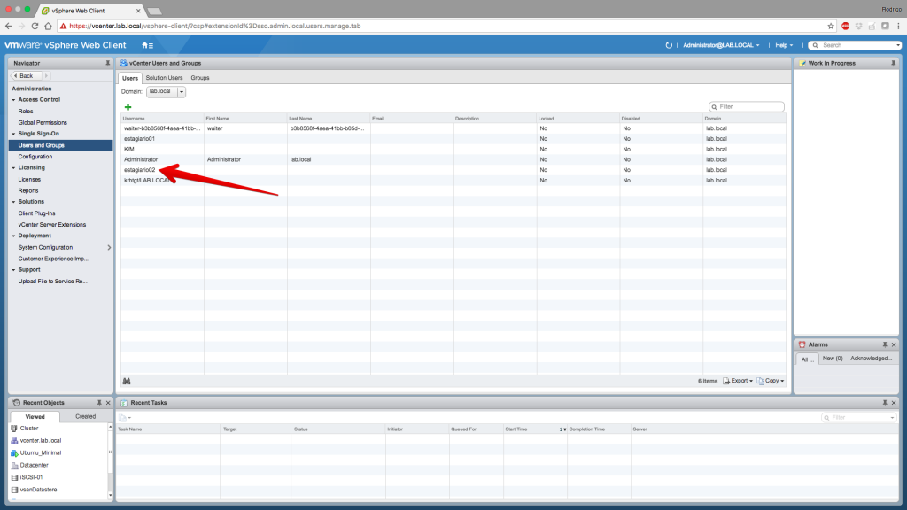](http://rodrigolira.eti.br/wp-content/uploads/2016/11/Screen-Shot-2016-11-26-at-17.11.30-2.png)

Agora vamos criar um grupo, acesse a aba **Groups** e clique no ícone para adicionar um novo grupo:

[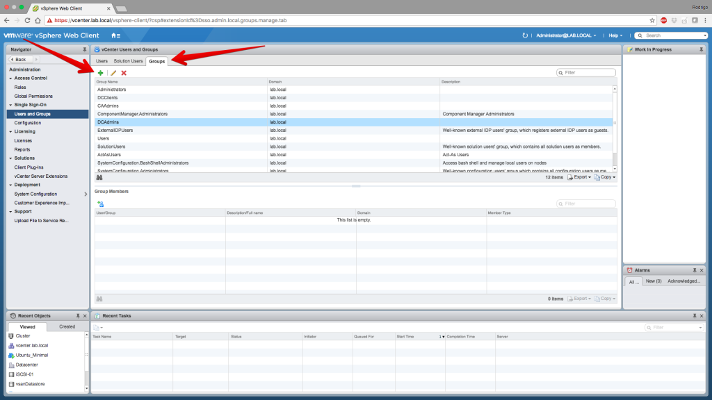](http://rodrigolira.eti.br/wp-content/uploads/2016/11/Screen-Shot-2016-11-26-at-17.12.56-2.png)

Digite o nome do grupo e clique em **OK**:

[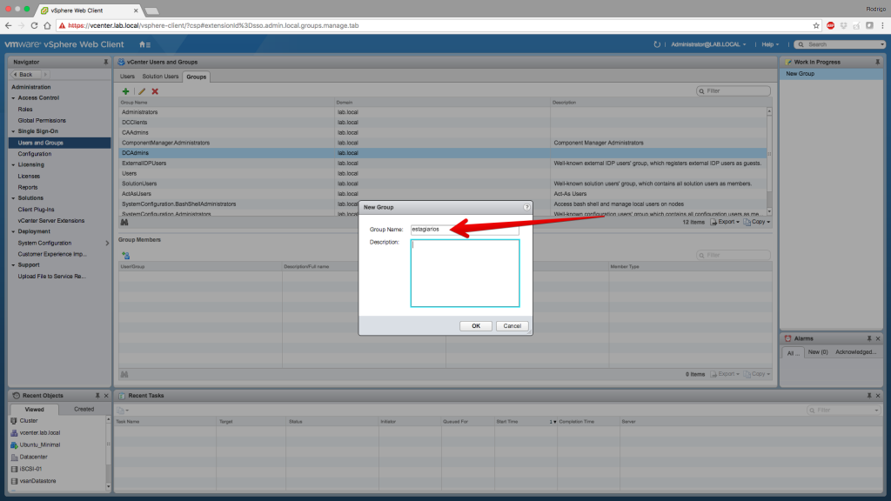](http://rodrigolira.eti.br/wp-content/uploads/2016/11/Screen-Shot-2016-11-26-at-17.14.00-2.png)

O grupo estagiarios é criado com sucesso:

[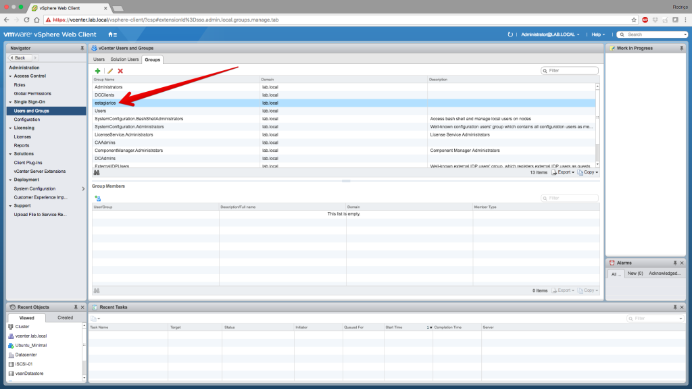](http://rodrigolira.eti.br/wp-content/uploads/2016/11/Screen-Shot-2016-11-26-at-17.15.13-2.png)

Agora, vamos adicionar o usuário estagiario02 ao grupo estagiarios:

Selecione o grupo **estagiarios** e clique em no ícone adicionar membro:

[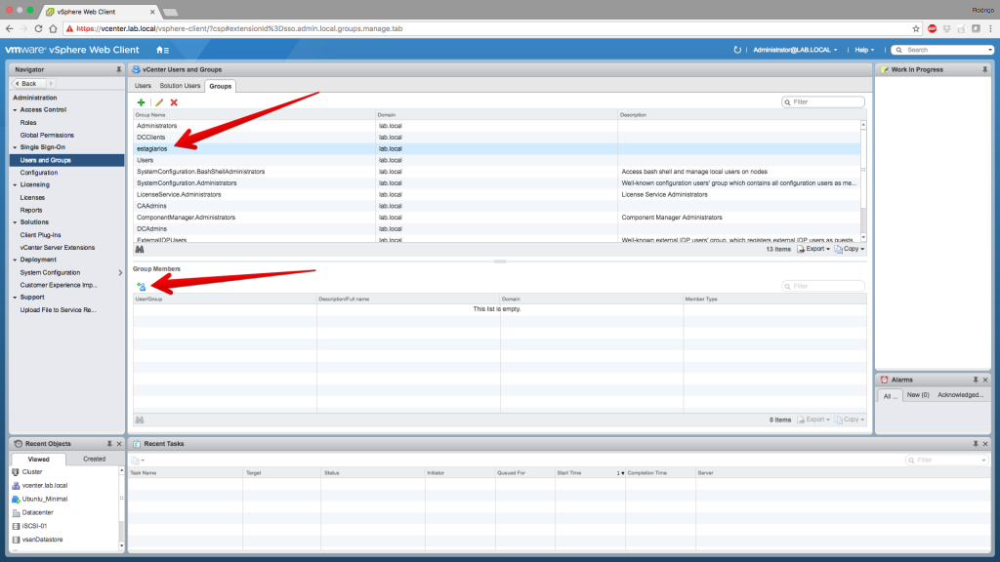](http://rodrigolira.eti.br/wp-content/uploads/2016/11/Screen-Shot-2016-11-26-at-17.18.37-2.png)

Na aba que se abre, selecione o **usuário**, clique em **Add** e depois em **OK**:

[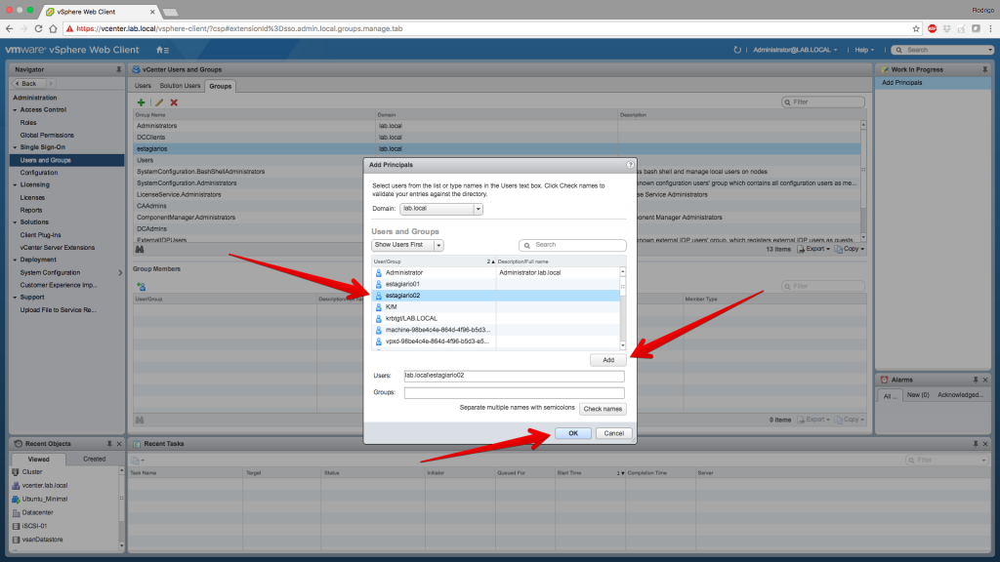](http://rodrigolira.eti.br/wp-content/uploads/2016/11/Screen-Shot-2016-11-26-at-17.19.56-2.png)

Pronto, o usuário **estagiario02** é adicionado ao grupo **estagiarios**:

[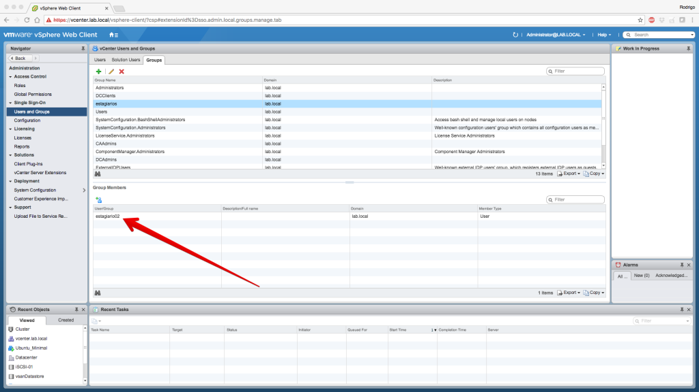](http://rodrigolira.eti.br/wp-content/uploads/2016/11/Screen-Shot-2016-11-26-at-17.22.12-2.png)

Agora vamos configurar a permissão para o grupo.

Acesse **Administration > Access Control > Global Permissions** e clique no ícone de adicionar:

[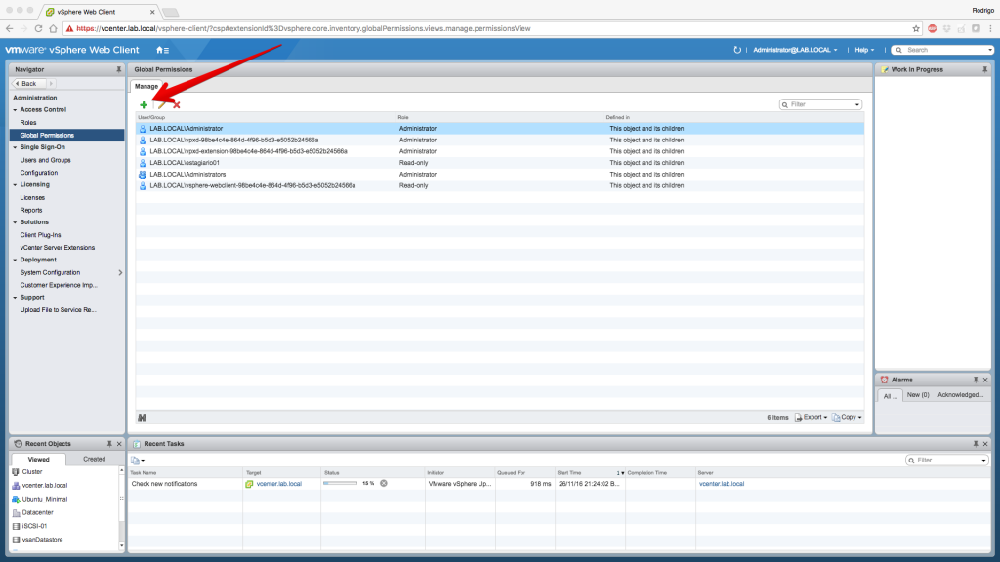](http://rodrigolira.eti.br/wp-content/uploads/2016/11/Screen-Shot-2016-11-26-at-17.24.26-2.png)

Clique em **Add** para adicionar o grupo:

[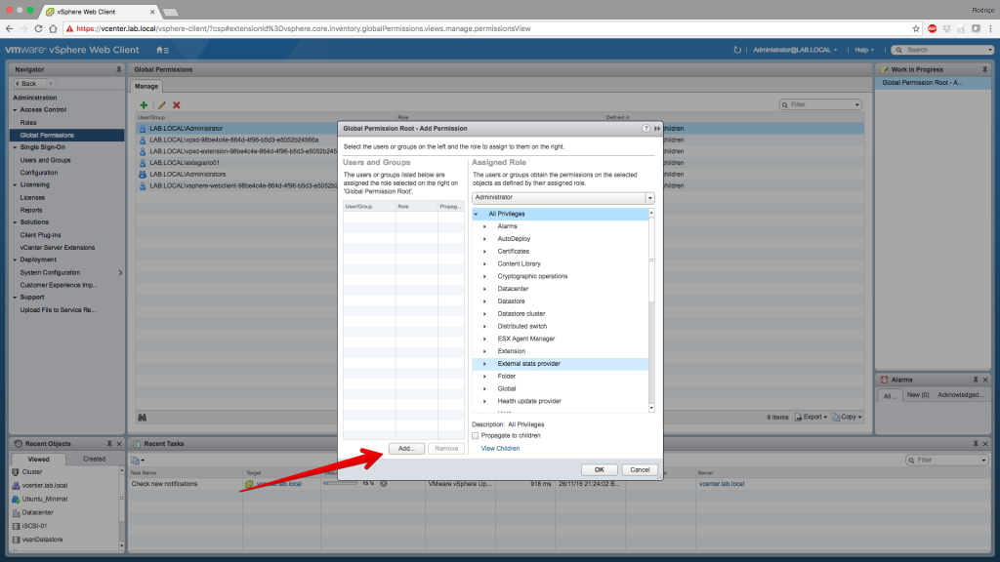](http://rodrigolira.eti.br/wp-content/uploads/2016/11/Screen-Shot-2016-11-26-at-17.25.19-2.png)

Selecione o grupo **estagiarios**, clique em **Add** e depois em **OK**:

[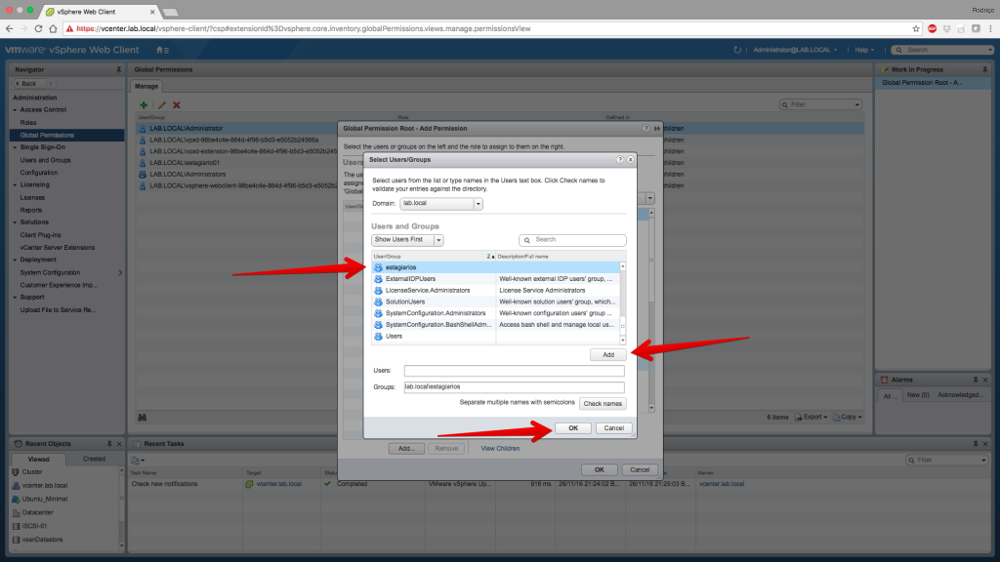](http://rodrigolira.eti.br/wp-content/uploads/2016/11/Screen-Shot-2016-11-26-at-17.26.30-2.png)

Em **Assigned Role** selecione **Power-On** e depois clique em **OK**:

[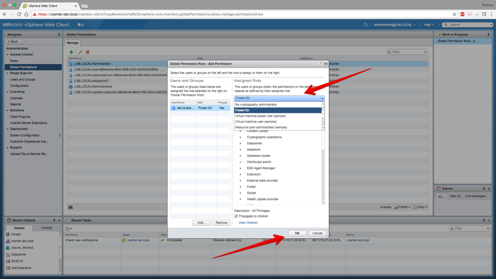](http://rodrigolira.eti.br/wp-content/uploads/2016/11/Screen-Shot-2016-11-26-at-17.27.51-2.png)

Pronto, agora o grupo estagiarios tem a permissão Power-On:

[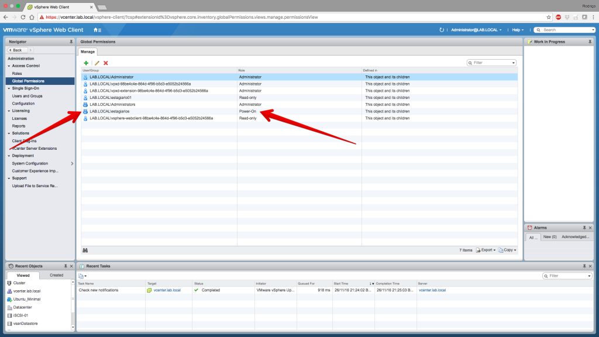](http://rodrigolira.eti.br/wp-content/uploads/2016/11/Screen-Shot-2016-11-26-at-17.29.20-2.png)

Agora vamos logar com o usuário estagiario02 e verificar as permissões:

[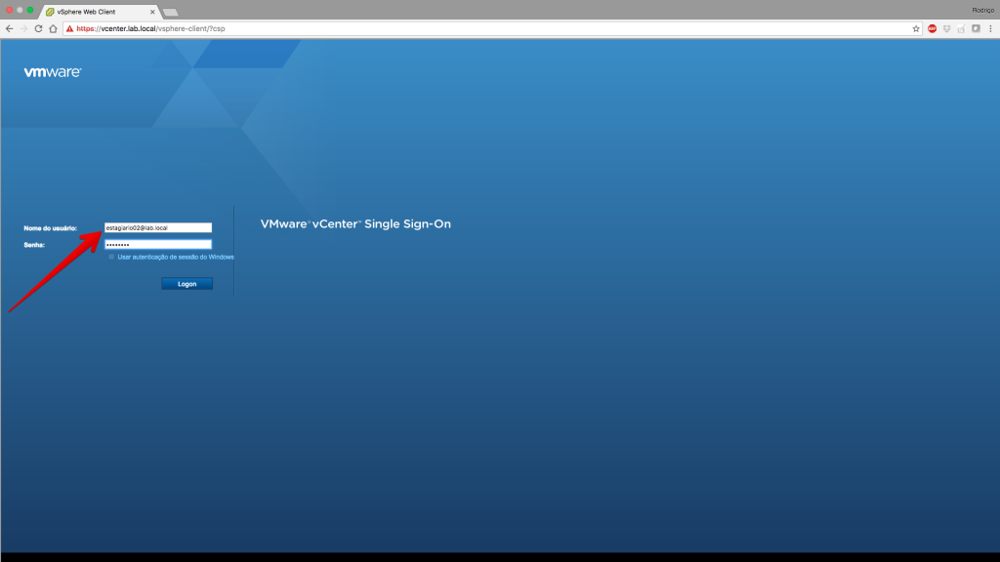](http://rodrigolira.eti.br/wp-content/uploads/2016/11/Screen-Shot-2016-11-26-at-17.31.44-2.png)

Como podemos perceber, eu posso ligar a VM mas não tenho direito de fazer nenhuma outra interação:

[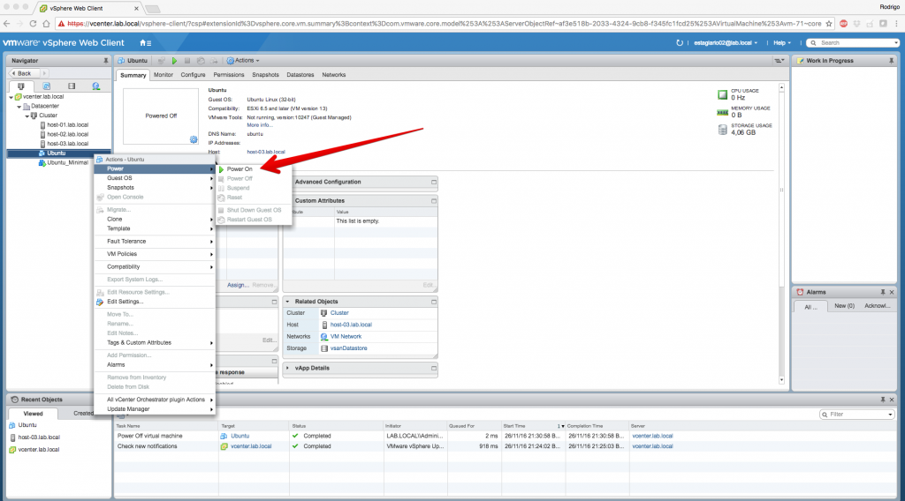](http://rodrigolira.eti.br/wp-content/uploads/2016/11/vSphere-Web-Client-2016-11-26-17-33-49.png)

Espero que tenham gostado e até o próximo post :D
