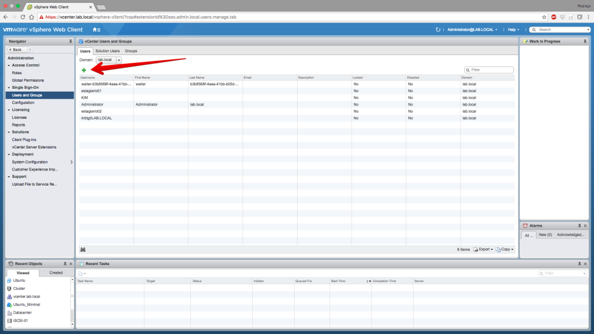
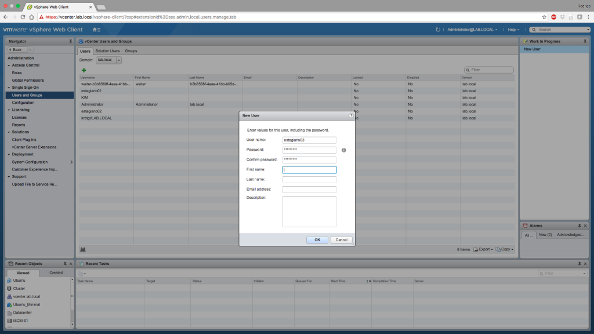
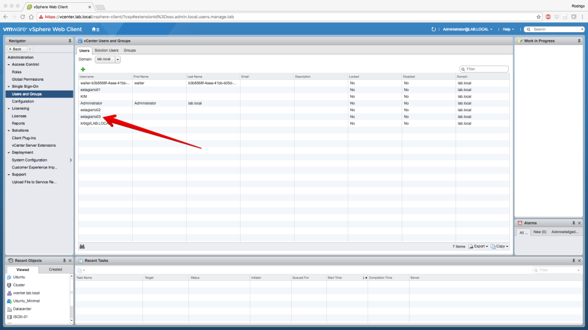
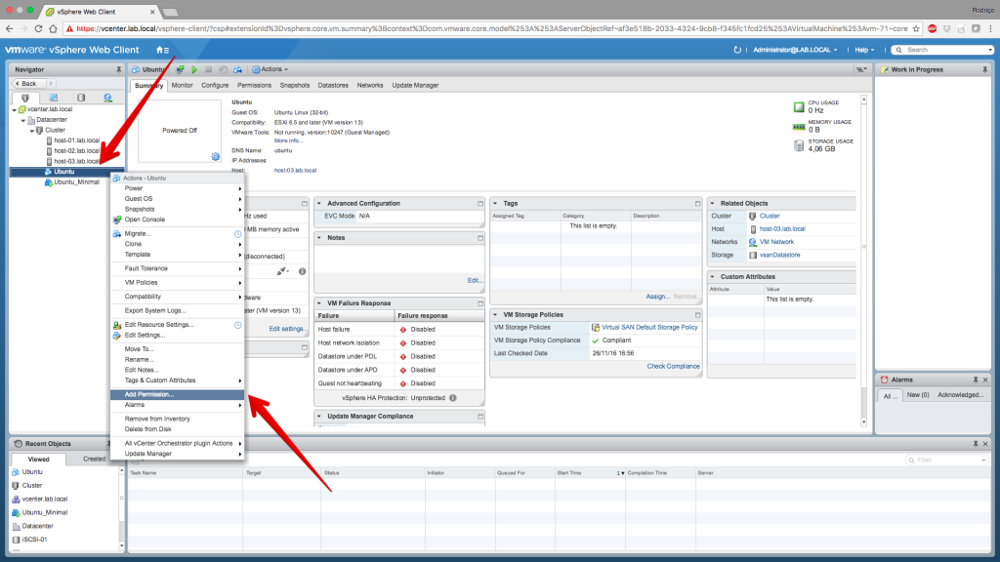
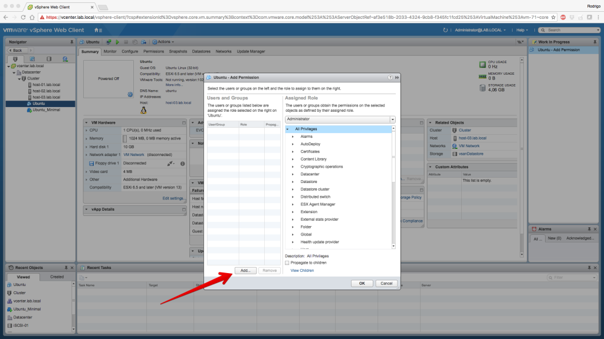
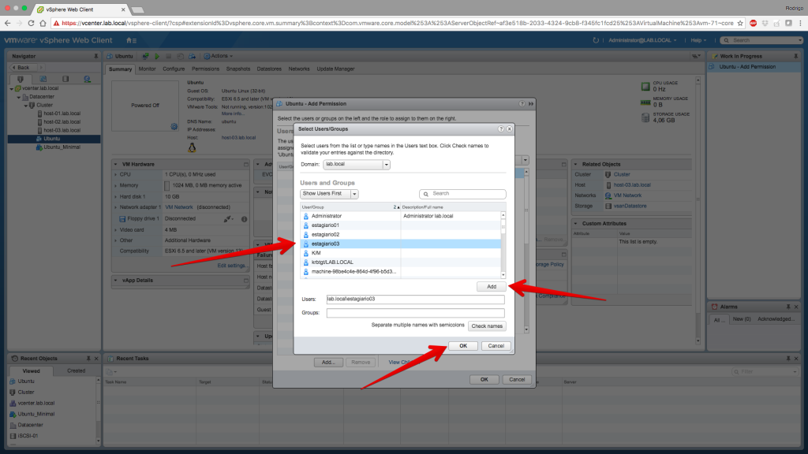
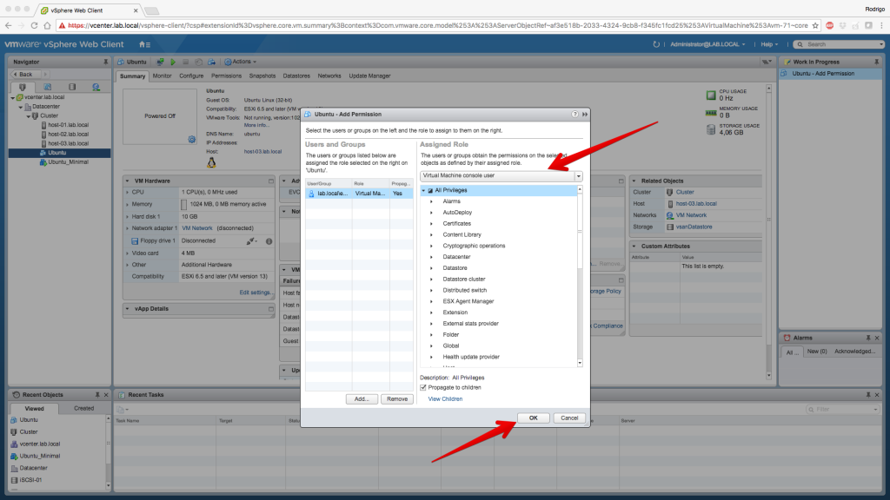
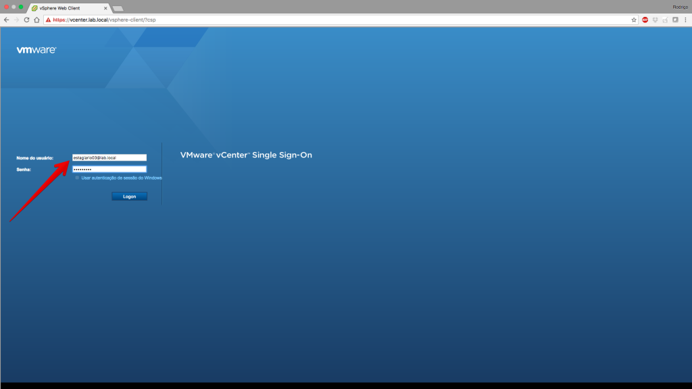
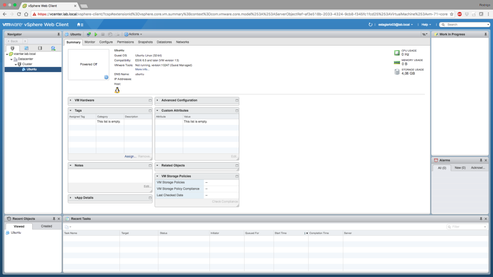
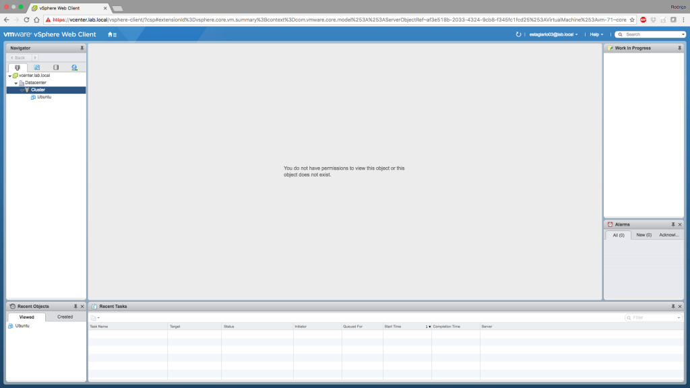

Salve Salve Pessoal!

Nessa terceira parte da serie Permissões no vCenter Server 6.5, nós vamos ver o terceiro cenário.

Vamos criar um usuário chamado estagiário03 e vamos dar permissão em apenas um objeto do nosso vCenter Server, nesse caso em uma VM, dessa forma quando o estagiario03 logar no vCenter Server, só estará disponível para o mesmo este objeto(VM).

Diferentemente dos outros cenários, que nós estavamos dando permissões globais, ou seja, a todos os objetos do nosso vCenter Server, nesse cenários nós vamos dar permissão apenas para um objeto, que nesse caso será uma VM.

Obs: Se você não leu o primeiro e o segundo post sobre Permissões no vCenter Server 6.5, acesse os links abaixo e leia ;)

http://rodrigolira.eti.br/permissoes-no-vcenter-server-6-5-parte-01/

http://rodrigolira.eti.br/permissoes-no-vcenter-server-6-5-parte-02/

Vamos lá :D

Acesse **Administration > Single Sign-On > Users and Groups**, na aba **Users** clique no ícone para adicionar um novo usuário:

Preencha os dados e clique em **OK**:

O usuário **estagiario03** é criado com sucesso:

Agora vamos configurar a permissão para um determinado objeto, nesse nosso caso será uma VM, clique com o **botão direito** do mouse em cima da **VM** e clique em **Add Permission**:

Uma nova aba se abre, clique em **Add** para selecionarmos o usuário **estagiario03**:

Selecione o **usuário**, clique em **Add** e depois em **OK**:

Agora em **Assigned Role** diga qual o tipo de **permissão** que o usuário terá sobre o objeto, em nosso caso selecione **Virtual Machine console user** e clique em **OK**:

Pronto, agora vamos logar com o usuário **estagiario03** e verificar o que ele pode fazer:

Como podemos verificar nas imagens abaixo, o usuário estagiario03 tem permissão apenas no objeto ao qual foi dada a permissão, na VM Ubuntu, outros objetos podem até aparecer devido a hierarquia, mas o usuário não tem nenhuma permissão sobre os mesmos.

Espero que tenham gostado dos posts e até a próxima :D
