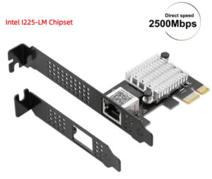
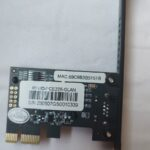
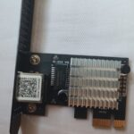
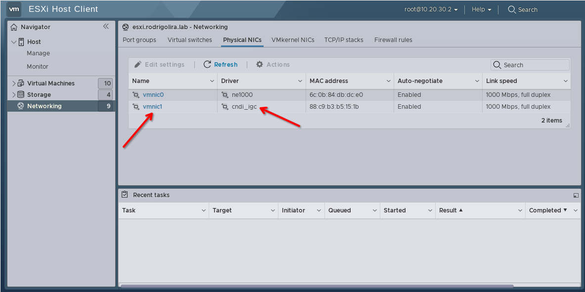
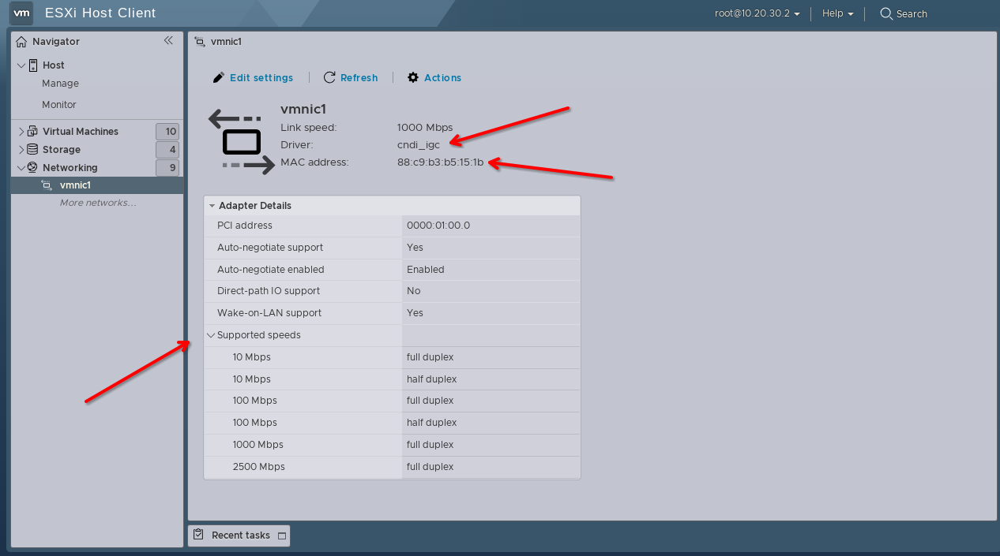
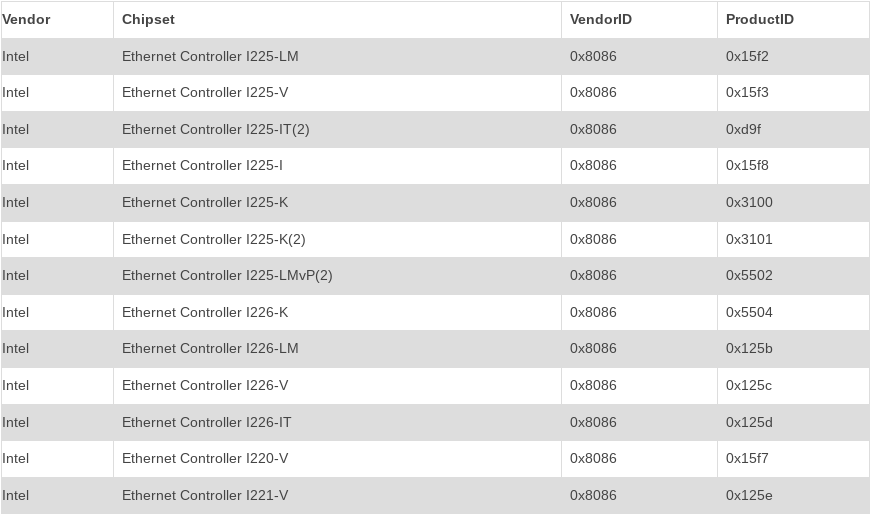

Salve Salve Pessoal!

Desde o lançamento do **VMware ESXi 7.0**, nós não conseguimos mais inserir drivers da comunidade com suporte a chipsets realtek, isso é um problema para as pessoas que possuem pequenos ambientes ou até mesmo seus homelabs.

Como alternativa a isso nós podemos usar placas USB, como falei anteriormente nesse post: [Adaptadores USB para Ethernet no ESXi 7](https://rodrigolira.eti.br/adaptadores-usb-para-ethernet-no-esxi-7/).

Porém desde o lançamento do **VMware ESXi 8.0**, nós temos suporte nativo a algumas placas de rede com **chipsets Intel** que são baixo custo.

Se procurarmos e tivermos um pouco de paciência, nós encontramos diversos modelos no **AliExpress**, como é o caso desse modelo das fotos abaxio, uma **Intel l225-LM.**

  

 

 

 

 

Comprei essa placa de rede por **menos de R$ 60,00** reais, o **ESXi 8.0** reconheceu perfeitamente e sem necessidade de instalação de nenhum pacote extra, como podemos ver nas imagens abaixo.

Segue uma tabela com uma lista de placas que já tem suporte nativo no ESXi 8.

Aqui está o link para a placa **Intel l225-LM** que eu comprei.

[https://pt.aliexpress.com/item/1005005555386876.html](https://pt.aliexpress.com/item/1005005555386876.html)

Até o próximo post!

:D
