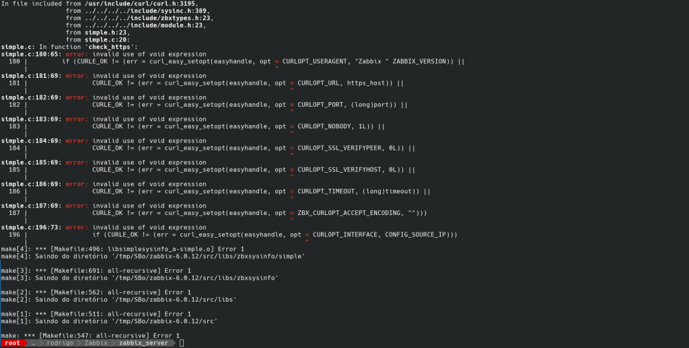
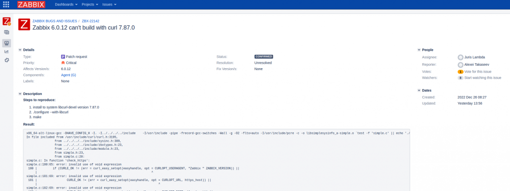
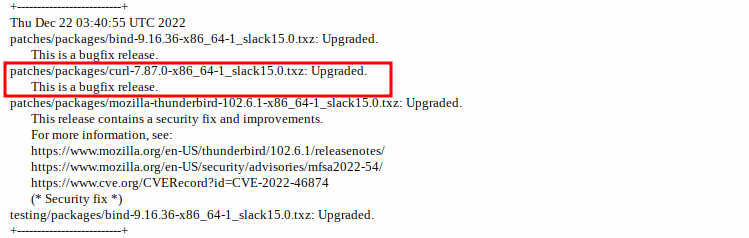

Salve Salve Pessoal!

Hoje quando fui atualizar o meu **Zabbix Server** para a versão **6.0.12** recebi um erro na hora de criar o pacote para o **Slackware**.

[](images/2023-01-05_11-21.png)Pesquisando um pouco sobre o problema, já cai na página de suporte da Zabbix.

[](images/2023-01-05_11-25.png)

[https://support.zabbix.com/browse/ZBX-22142](https://support.zabbix.com/browse/ZBX-22142)

[https://support.zabbix.com/browse/ZBX-22152](https://support.zabbix.com/browse/ZBX-22152)

Existe um problema de compatibilidade na contrução do pacote do Zabbix com o **Curl 7.87.0**, que é exatamente a versão atual do **Curl** no **Slackware 15** ou **Current,** podemos confirmar isso através do changelog do Slackware ou listando os pacotes instalados.

[](images/2023-01-05_11-36.png)

[](images/2023-01-05_11-33.png)

O problema já foi resolvido, porém estará disponível apenas na próxima versão **6.0.13**.

Para conseguir criar o pacote sem problemas basta fazer o downgrade do curl momentaneamente para versão **7.86.0**, você pode baixar o pacote da URL abaixo.

[https://slackware.uk/cumulative/slackware64-15.0/patches/packages/curl-7.86.0-x86\_64-1\_slack15.0.txz](https://slackware.uk/cumulative/slackware64-15.0/patches/packages/curl-7.86.0-x86_64-1_slack15.0.txz)

Execute o seguinte comando para fazer o downgrade:

```
# upgradepkg --install-new curl-7.86.0-x86_64-1_slack15.0.txz
```

Pronto, agora você consegui criar os pacotes sem problemas, depois basta atualizar o ambiente novamente.

Espero que tenham gostado e resolvido seu problema.

Até o próximo post!

:D
