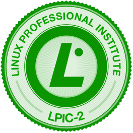

Salve Salve Pessoal!

Amanhã estarei fazendo as duas provas (201, 202) para tentar tirar a Certificação LPI-2, espero que eu possa mim dar bem e que eu obtenha mais esse sucesso. Postarei aqui o resultado assim que eu receber e espero que seja bom. Fui e até a próxima.

Depois da Prova...

Salve Salve Pessoal!

Fiz as provas e graças a DEUS acho que deu tudo certo, agora é só esperar a correção das mesmas e esperar o resultado para ver no que vai dar. Sobre as provas o que posso falar é que são muito, mas muito difíceis, não é uma prova fácil é muito puxado e bastante cansativas, as duas provas (201 e 202) são bem aprofundadas nos assuntos, mas os assuntos que mais me chamaram a atenção e que na minha opinião foram os mais cobrados foram, Apache, DNS e Kernel. Agora vamos esperar o resultado pra ver no que vai dar, fui...
