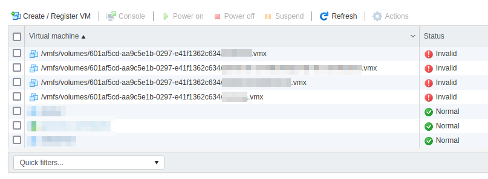
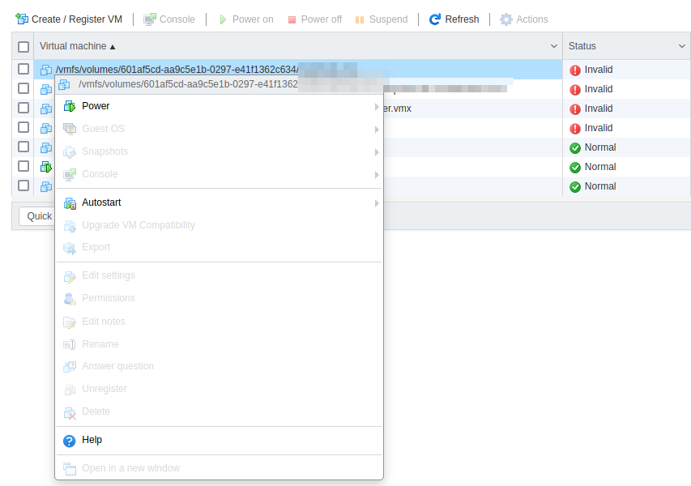
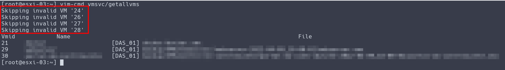
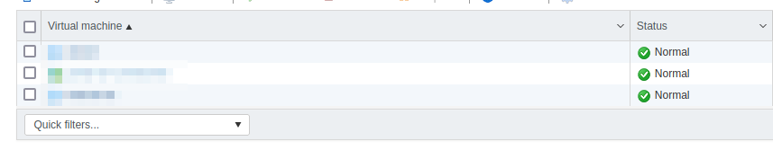

Salve Salve Pessoa!

Hoje um dos meus clientes perdeu um dos discos do seu servidor.

Existiam máquinas virtuais rodando em produção nesse disco. :(

Como ESXi perdeu referência com essas máquinas virtuais ficou apresentando um **Status** de **Invalid** para essas máquinas virtuais.

[](images/2022-08-01_14-12.png)Via interface gráfica não foi possível remover as referências para as máquinas virtuais que estava alocadas nesse disco, o ESXi não habilitou a opção de **Unregister**.

Como podemos ver na imagem abaixo:

[](images/2022-08-01_14-19.png)

Para remover essas referências do nosso ambiente foi necessário entrar na CLI do servidor, normalmente através de **ssh** ou direto no **shell** do **ESXi**, e executar alguns comando.

Execute o comando abaixo para listar todas as máquinas virtuais do ambiente e descobrir o  **ID** das **VMs**.

```
# vim-cmd vmsvc/getallvms
```

[](images/2022-08-01_14-14.png)

Com os IDs das máquinas virtuais, basta executar o seguinte comando:

```
# vim-cmd /vmsvc/unregister ID_DA_VM
```

[](images/2022-08-01_14-21.png)Pronto, todas as referências inválidas foram removidas do ambiente.

[](images/2022-08-01_14-21_1.png)

Até o próximo post!

:D
