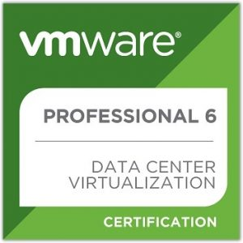

Salve Salve Pessoal!

Ontem fiz a renovação da minha VCP6-DCV, não sei se vocês sabem, mas é necessário renovar a sua certificação a cada dois anos.

Os caminhos para renovação são os seguintes:

(1) Realizar um exame para VCAP (2) Realizar o exame VCP mais recente (3) Realizar um exame em uma tecnologia diferente

Como não tinha a pretensão de realizar o vcap e nem obter uma certificação de tecnologia diferente, apenas fiz o exame atualizado para vcp6.

Mas Rodrigo, porque você não fez para vcp6.5?

Simples, não estava com tempo para estudar todas as novidades e estava muito próximo de minha vcp6 expirar :(

Com a renovação da minha VCP6-DCV, atualiza todas as minhas outras certificações, ou seja, não preciso renovar minha VCP6-NV, por exemplo.

O mais importante de tudo é que eu passei :D

Até a próxima ;)
