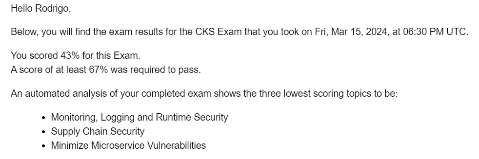

Salve Salve Pessoal!

Como o título do post fala, fui reprovado em minha primeira tentativa no exame CKS. :(

Sei exatamente onde errei, comprei essa prova em dezembro de 2022, e deixe para fazer nas pressas para não perder o exame, então não estudei corretamente os assuntos.

Tenho uma nova chance com o **retake free**, porém o mesmo deve ser realizado até o **dia 21 desse mês**, provavelmente se fizer até essa data, não terei tempo para estudar corretamente e vou ser reprovado novamente.

Existe um fio de esperança, quando fui tentar marcar o retake não existem horários disponíveis, estou abrindo um chamado com a Linux Foundation, vai que ganho um pouco mais de tempo graças a isso.

A prova é bem mais díficil que a CKA, porém é muito legal de estudar os assuntos, pena que estudei nas pressas, na minha prova caiu 16 questões, o tempo de duas horas é bem apertado, não consegui fazer todas as questões, fiz apenas 12. A Linux Foundation poderia dar mais 30 minutos para essa prova. :D

Vamos aguardar o suporte da Linux Foundation responder e ver se terei uma nova chance de fazer o exame.

Até o próximo post!

:D
