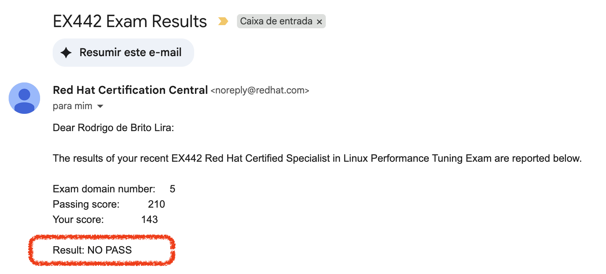

Salve, salve, pessoal!

Hoje fiz o exame **EX442 – Red Hat Certified Specialist in Linux Performance Tuning**, e infelizmente não passei.

Estudei bastante para este exame — ele tem um nível de complexidade bem alto. Ainda assim, acabei me enrolando em algumas questões e, sinceramente, achei que meu score seria um pouco maior.

Mas, como costumo dizer: **sem stress!** Ainda tenho mais uma chance graças ao _retake free_ da Red Hat.

Agora é estudar mais um pouco e partir para a próxima tentativa!  
Depois da segunda prova, prometo trazer aqui um relato mais detalhado sobre os assuntos abordados.

**Até o próximo post!** ?
