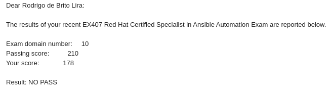

Salve Salve Pessoal!

Estava um pouco distante do blog devido a outras prioridades, uma delas foi os estudos para o exame Red Hat Certified Specialist in Ansible Automation (EX407).

Infelizmente fiquei reprovado no exame, mas foi um bom desafio e aprendi muito estudando para este exame.

Não fiz o curso oficial, então todos os meus estudos foram usando os objetivos descritos no próprio site da Red Hat e usando a documentação do Ansible.

[https://www.redhat.com/en/services/training/ex407-red-hat-certified-specialist-in-ansible-automation-exam](https://www.redhat.com/en/services/training/ex407-red-hat-certified-specialist-in-ansible-automation-exam)

[https://docs.ansible.com/](https://docs.ansible.com/)

Procurei no google por dicas sobre o exame, os melhores sites que achei foram os seguintes:

[https://www.lisenet.com/](https://www.lisenet.com/)

[https://linuxbuff.wordpress.com/](https://linuxbuff.wordpress.com/)

Também existe um grupo no Slack sobre certificações da Red Hat, muito bom:

[https://redhat-certs.slack.com/](https://redhat-certs.slack.com/)

Os demais links que achei foram com dicas mais básicas.

Mas onde você acha que errou Rodrigo?

Meu maior erro foi o inglês, diferentemente dos exames RHCSA e RHCE que existe a disponibilidade de fazer o exame em português, o EX407 só está disponível em Inglês e Japonês/Chines(não me lembro bem).

Porque o Inglês?

Diferentemente dos exames como VCP da VMware ou LPI que tem perguntas curtas, objetivas e sem cenários práticos, as provas da Red Hat são práticas e as questões são cheias de tarefas e contexto, ou seja, para fazer a questão você tem que fazer N tarefas e as vezes uma questão depende da resolução de outras.

Fiz cerca de 80% da prova (não posso falar o número exato da quantidade de questões),testando e funcionando o que era pedido, porém fazendo da maneira que eu entendia as questões, não entendi o contexto que o exame pedia, apesar de resolver as questões, imagino que o exame pedia para que eu resolvesse de uma forma diferente (pelo menos eu acho).

Mas de modo geral eu gostei muito, foi um bom aprendizado e me ensinou uma lição que vinha postergando faz tempo, tenho que me dedicar ao inglês, hehehehe.

Esse ano espero tentar fazer o exame novamente, porém antes disso preciso fazer um intensivão no inglês, vou continuar estudando e começarei a escrever sobre o Ansible aqui no blog.

Espero que tenham gostado do post.

Até a próxima!

:D
