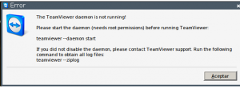

[](http://rodrigolira.eti.br/wp-content/uploads/2013/08/team-viewer-8-download.jpg)Salve Salve Pessoal!

Essa semana precisei utilizar o teamviewer para atender um cliente, fiz a instalação tudo bem certinho pelo sbopkg.

O problema foi que na hora de iniciar o programa ficava dando a seguinte tela de erro:

[](http://rodrigolira.eti.br/wp-content/uploads/2013/08/teamviewer4.png)

Fiz o que manda a tela e tentei iniciar o daemon, e nada.

Procurei no pai google e sempre achava o pessoal de outras distros pedindo para iniciar a daemon executando o seguinte comando:

```
#teamviewerd start
```

Tentei e nada de inicializar, então resolvi bisbilhotar um pouco os diretórios do individuo, que fica no /opt/teamviewer8.

E acabei descobrindo que o arquivo de inicialização da daemon é o teamviewerd.sysv, então executei o seguinte comando:

```
#teamviewerd.sysv start
```

Dessa forma a daemon do teamviewer iniciou e o programa funcionou perfeitamente.

Coloquei o comando no rc.local também para toda vez que iniciar o sistema a daemon inicializa automaticamente e não tenha o trabalho de ficar iniciando manualmente.

Para colocar no rc.local execute o comando abaixo:

```
echo /opt/teamviewer8/tv_bin/script/teamviewerd.sysv start >> /etc/rc.d/rc.local
```

Não sei se a maneira de resolver o problema foi a mais elegante, o importante é que resolveu.

Até a próxima!
