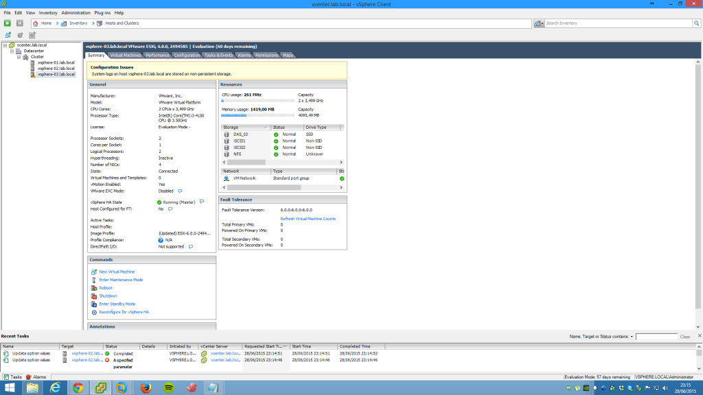
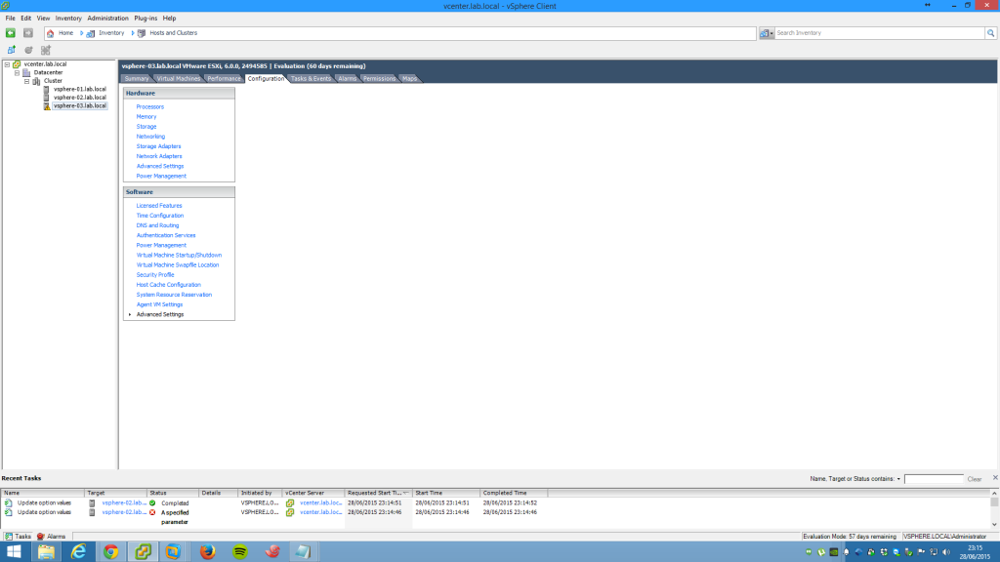
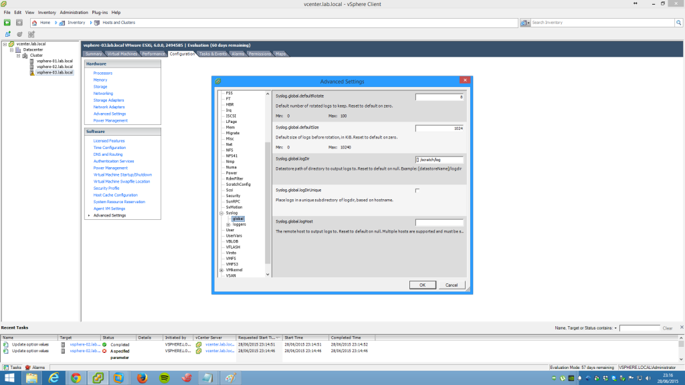
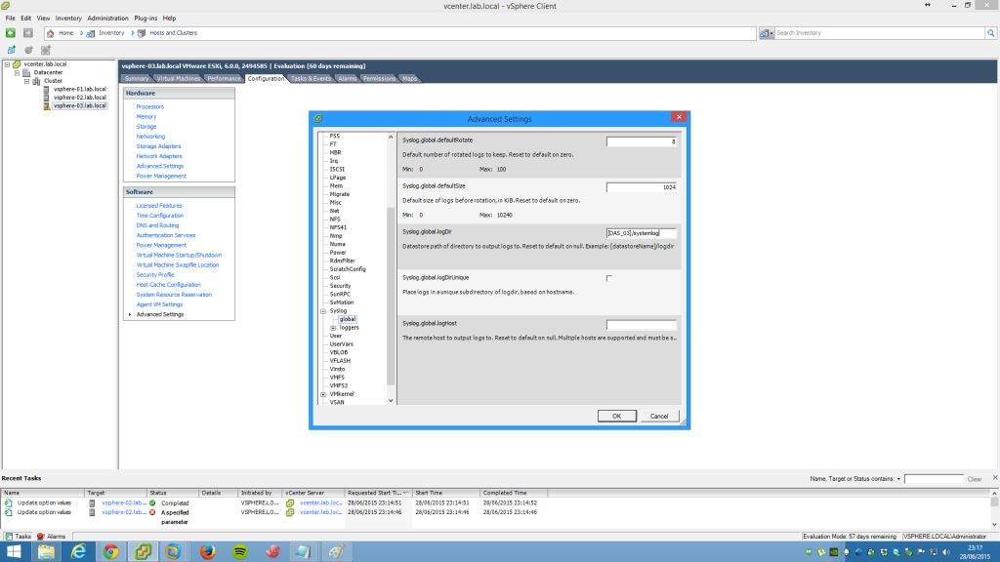
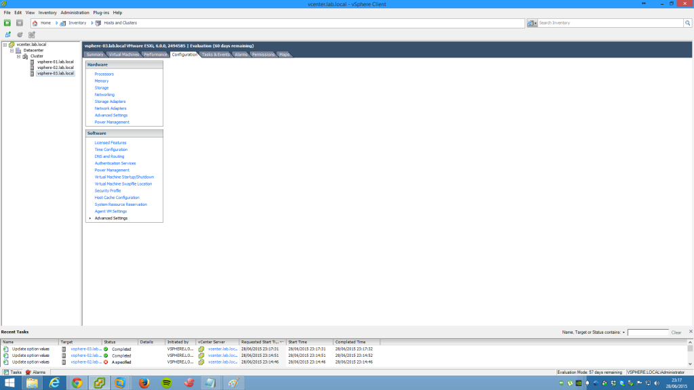

Salve Salve Pessoal!

Estava configurando o meu laboratório para VCP6-DCV quando me deparei com a seguintes mensagem "System logs on host vsphere-03.lab.local are stored on non-persistent storage", achei estranho e fui pesquisar para saber melhor sobre o problema, que é basicamente o seguinte, os logs não estão sendo gravados em disco, dessa forma você tem que adicionar o caminho manualmente para que os mesmos possam ser gravados em disco.

Este problema já foi diagnosticado pela VMware "**KB 2032823**".

Segue abaixo um passo-a-passo de como resolver o problema:

1 - Abra p vSphere Client e selecione o host, no meu caso o vsphere-03.lab.local:<!--more-->

2 - Clique em **Configuration** > **Advanced Settings**:

3 - Na aba lateral esquerda clique em **Syslog** > **global**, observe na opção **Syslog.global.logDir** ele não está apontando para nenhum storage (disco):

4 - Substitua o seu conteúdo por **\[SEU\_STORAGE\]/systemlog**, observe que no meu caso o nome do meu storage local é DAS\_03, caso você não tenha renomeado o seu storage local, ou seja, o disco onde você instalou o vSphere ele deve estar como datastore, feito isso basta clicar em OK.

5 - Pronto, problema resolvido.

Espero ter ajudado, até a próxima :D

Referência:

[http://kb.vmware.com/selfservice/microsites/search.do?language=en\_US&cmd=displayKC&externalId=2032823](http://kb.vmware.com/selfservice/microsites/search.do?language=en_US&cmd=displayKC&externalId=2032823)
