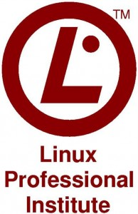

A LPI (Linux Professional Institute) anunciou hoje que novas mudanças para seu programa de certificação LPIC-2 e LPIC-3. Segue a baixo a noticia.

(Sacramento, CA, USA: January 24, 2013) The Linux Professional Institute (LPI), the world's premier Linux certification organization, announced upcoming changes to their LPIC-2 and LPIC-3 certification programs. New objectives for these certifications are presently under development. New exams will be available in English on October 1, 2013 with local translations and pricing TBA.

"Following extensive consultations with partner organizations and industry representatives we will be concentrating essential and advanced system administration skills in LPIC-2 while further focusing the LPIC-3 program on specific specialties: Mixed Environments, Security, and High Availability/Virtualization, " said Jim Lacey, President and CEO of the Linux Professional Institute. Mr. Lacey added that these upcoming changes also reflect LPI's engagement with the wider Open Source community in determining the best skill sets required for a variety of specialized job roles for Linux professionals.

<!--more-->

Specific exam changes and other relevant information includes the following:

- moving Capacity Planning and OpenLDAP server essentials from the original LPI-301 exam to the LPIC-2 certification exams
- merging remaining technologies from the LPI-301 and LPI-302 exams into a single exam: LPI-300/Mixed Environments. The LPI-300 exam will also include new objectives on such technologies as Samba4 and Kerberos
- each single exam at the LPIC-3 level (LPI-300/Mixed Environments, LPI-303/Security and LPI-304/High Availability-Virtualization) will be sufficient to earn the LPIC-3 certification
- each individual exam within LPIC-2 and LPIC-3 will cost US $173 or local currency/pricing equivalent
- time permitted to complete an individual exam will remain at 90 minutes
- the LPI-301 "Core" exam (US $260 or local pricing) for the LPIC-3 certification and the LPI-302 exam (US $173 or local pricing) for the Mixed Environment specialty will continue to be available until the end of 2013
- existing holders of the LPIC-3 certification (or the LPI-302 specialty) will continue to have their certifications remain "active" as per LPI's recertification policy: #6 at [http://www.lpi.org/linux-certifications/policies](http://www.lpi.org/linux-certifications/policies)

The Job Task Analysis for the new objectives for LPIC-2 and LPIC-3 exams is presently underway and will continue into March 2013. Beta exams for these revised objectives and exams will commence on May 1, 2013 and continue until August. The new exams for both LPIC-2 and LPIC-3 will be available in English on October 1, 2013 and other languages TBA.

Progress on objective development can be monitored at [http://wiki.lpi.org/](http://wiki.lpi.org/)

A revised program roadmap and a description of proposed changes to the LPIC-2 and LPIC-3 certification program can be found at: [http://wiki.lpi.org/wiki/LPIC2AndLPIC3ChangeProposalVersion3...](http://wiki.lpi.org/wiki/LPIC2AndLPIC3ChangeProposalVersion3To4)

LPI alumni and other Linux professionals that are interested in participating in the exam development process are invited to join LPI's exam development mailing list: [http://list.lpi.org/cgi-bin/mailman/listinfo/lpi-examdev](http://list.lpi.org/cgi-bin/mailman/listinfo/lpi-examdev)

The Linux Professional Institute is globally supported by the IT industry, enterprise customers, community professionals, government entities and the educational community. LPI's certification program is supported by an affiliate network spanning five continents and is distributed worldwide in multiple languages at more than 5,000 testing locations. Since 1999, LPI has delivered over 350,000+ exams and 120,000+ LPIC certifications around the world.

\# # #

About the Linux Professional Institute:

The Linux Professional Institute provides a global framework, industry leadership and other services to enhance, develop and further lifelong professional careers in Linux and Open Source technologies. Established as an international non-profit organization in September 1999 by the Linux community, the Linux Professional Institute continues to demonstrate recognized global leadership, direction and skill standards for those who pursue a career in Linux and Open Source technology. LPI advances the Linux and Open Source movement through strategic partners, sponsorships, innovative programs and community development activities. LPI's major financial sponsors are Platinum Sponsors IBM, Linux Journal, Linux Magazine, Novell, SGI, and TurboLinux as well as Gold Sponsors, HP and IDG.
