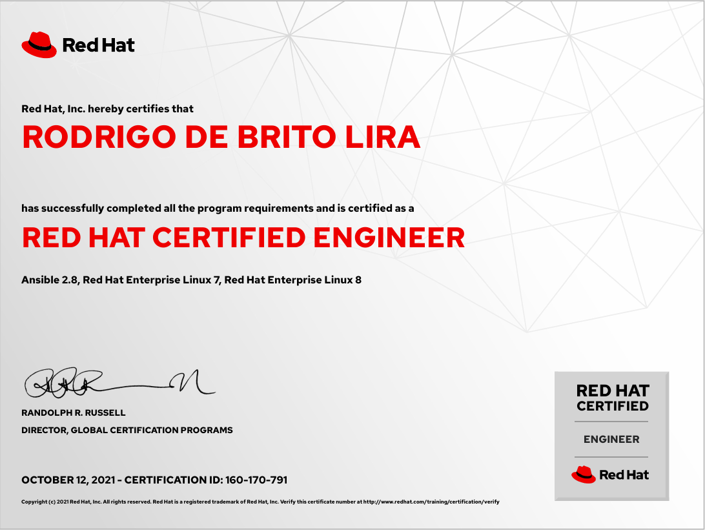

Salve Salve Pessoal!

Passando aqui rapidinho para informar que nesse dia das crianças (12/10/2021) fui aprovado no exame RHCE 8 (EX294).

Diferentemente do RHCE 7 (EX300) este exame é baseado no **Ansible 2.8** e **Red Hat 8,** mais para frente escrevo um post com maiores detalhes sobre o exame.

Até o próximo post!

:D
