Salve Salve Pessoal!

Depois de um bom tempo, enfim terminei meu script para clonar vms no ESXi :D

Segue o link do mesmo no GitHub - [https://github.com/eurodrigolira/esxi](https://github.com/eurodrigolira/esxi)

Tenho vários clientes que utilizam a solução gratuita da VMware como solução de virtualização, normalmente empresas de pequeno porte, como no ESXi Hypervisor(free) não utilizamos o vCenter Server, não temos a opção nativa de clonar uma VM, dessa forma é necessário fazermos esse processo manual, seja através de scripts, ou através de **Ctrl+c** e **Ctrl+v**, sendo que dessa forma gera uma mão de obra desnecessária.

Por padrão sempre crio vms que utilizo como templates, ou seja, faço a instalação do sistema operacional, faço as atualizações do sistema, instalo os software que utilizo por padrão, faço os ajustes necessários, seja de segurança ou qualquer outro e desligo a vm, depois disso basta realizar a copia da mesma.

Sendo que esse processo era manual e não ficava como eu queria exatamente, dessa forma resolvi criar o script.

Vamos deixar de conversa e vamos ao script.

No ambiente de teste que usei para esse post temos duas vms, uma chama **Ubuntu-01** e outra chamada **Windows-10**, vamos utilizar a vm Ubuntu-01 para nossa explicação.

[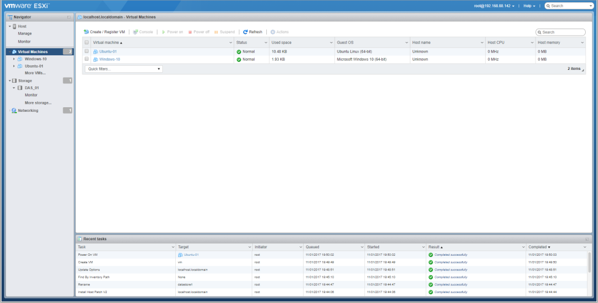](http://rodrigolira.eti.br/wp-content/uploads/2017/11/01.png)

Por padrão quando terminamos uma instalação de uma VM e desligamos a mesma, os seguintes arquivos são criados, como mostra a imagem abaixo.

[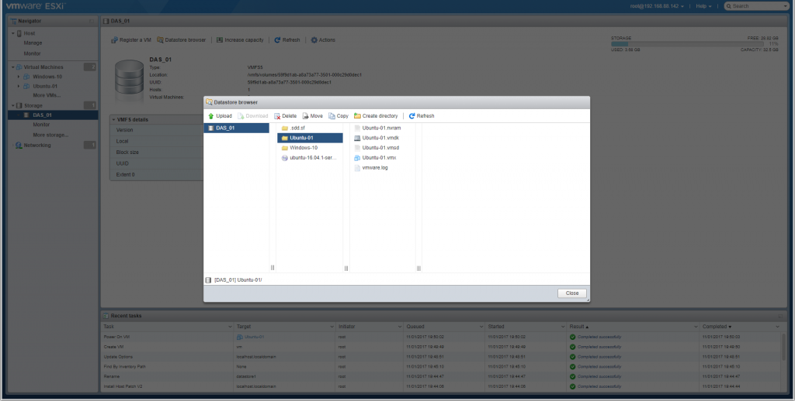](http://rodrigolira.eti.br/wp-content/uploads/2017/11/02.png)

O que o script faz exatamente?

Basicamente, ele cria uma nova pasta em um datastore escolhido por você, copia todos os arquivos e renomeia todos com o nome que você informou.

Vamos ao script.

Envie o script para dentro do ESXi e dê permissão de execução ao mesmo.

```
# chmod +x clone-vm.sh
```

[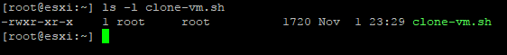](http://rodrigolira.eti.br/wp-content/uploads/2017/11/03.png)

Agora basta executar o script.

```
./clone-vm.sh
```

A primeira informação quer será mostrada após executarmos o script, é uma lista com as vms que estão disponíveis em nosso ESXi.

[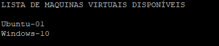](http://rodrigolira.eti.br/wp-content/uploads/2017/11/04.png)

Depois disso, será solicitado o nome da VM que você deseja clonar, digite o nome da mesma forma que aparece e tecle ENTER.

[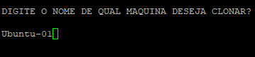](http://rodrigolira.eti.br/wp-content/uploads/2017/11/05.png)

Agora será mostrado uma lista com os datastores disponíveis, no nosso caso só existe um.

[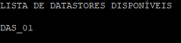](http://rodrigolira.eti.br/wp-content/uploads/2017/11/06.png)

Agora digite o nome do datastore exatamente do mesmo jeito, esse datastore será o destino da nossa vm clonada e tecle ENTER.

[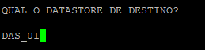](http://rodrigolira.eti.br/wp-content/uploads/2017/11/07.png)

Agora digite o nome da nova vm.

[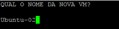](http://rodrigolira.eti.br/wp-content/uploads/2017/11/08.png)

Se tudo der certo e nenhum erro acontecer, a saída deverá ser igual a que está abaixo.

[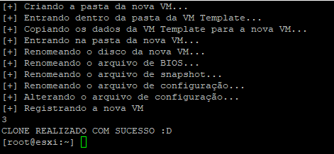](http://rodrigolira.eti.br/wp-content/uploads/2017/11/09.png)

Pronto, o clone foi realizado com sucesso, agora basta abrir o ESXi e iniciar a vm.

[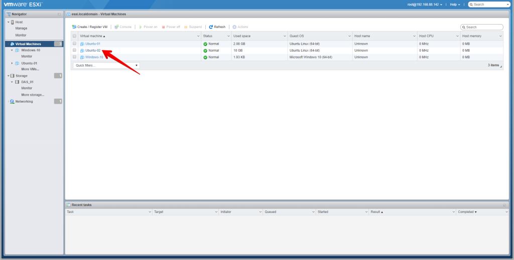](http://rodrigolira.eti.br/wp-content/uploads/2017/11/10.png)

Se formos na pasta da vm no datastore, veremos que todos os arquivos estão com o nome da nova vm.

[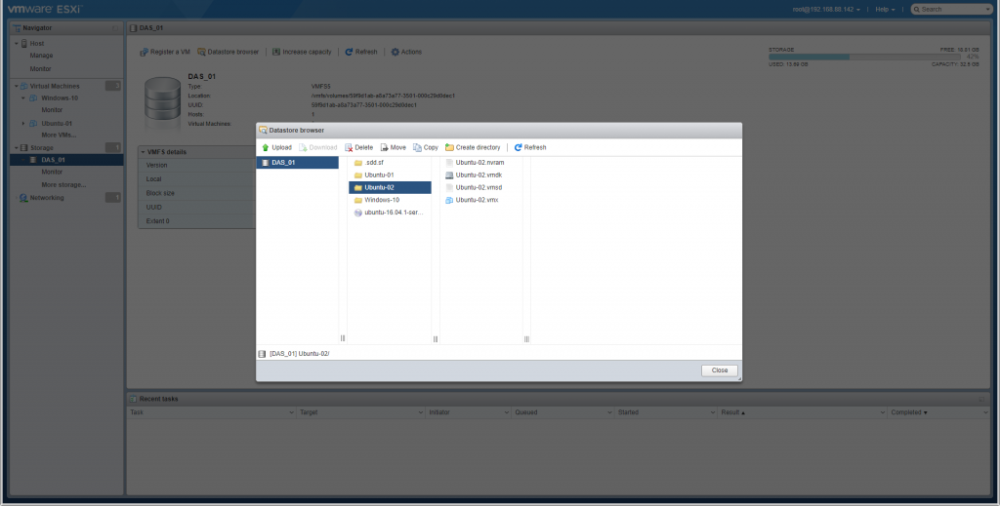](http://rodrigolira.eti.br/wp-content/uploads/2017/11/11.png)

Pronto, é isso aí, nas próximas versões desejo implementar várias funcionalidades ao script, basta acompanhar o github para ver as novidades :D

Peguei a ideia inicial do script do [@RicardoConzatti](https://twitter.com/RicardoConzatti) do blog [SOLUTIONS4CROWDS](http://solutions4crowds.com.br/) e adequei as minhas necessidades :D

Até a próxima!
