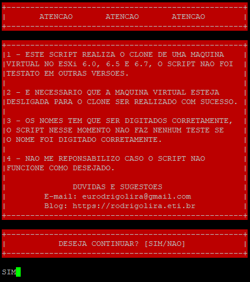
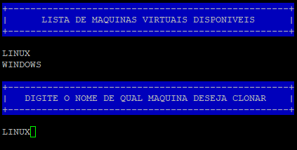
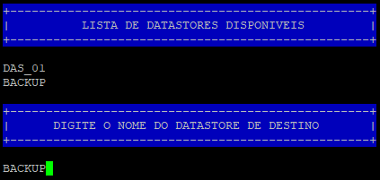
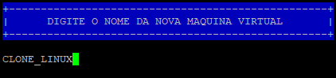
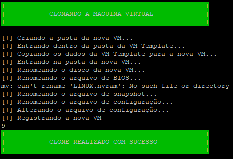
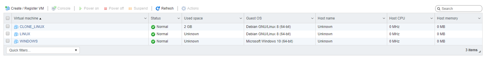

Salve Salve Pessoal!

Algum tempo atrás fiz um script para clonar máquinas virtuais no ESXi Free, segue o link abaixo para o post sobre o mesmo:

https://rodrigolira.eti.br/script-para-clonar-vm-no-esxi-versao-1-0/

Fiz algumas pequenas alterações nele para ficar um pouco mais amigável.

Acesse o link abaixo e faça o download do mesmo:

[https://gitlab.com/eurodrigolira/esxi](https://gitlab.com/eurodrigolira/esxi)

Segue abaixo um passo a passo de utilização:

**1** - Execute o script:

```
# ./clone-vm.sh
```

[](images/01.png)

**OBS:** Leia com atenção ;)

**2** - Ele vai listar as máquinas virtuais disponíveis no ambiente, após isso vai perguntar qual máquina deseja clonar.

[](images/02.png)

**3** - Vai listar os datastores disponíveis e pergunta o nome do datastore de destino.

[](images/03.png)

**4** - Agora irá perguntar o nome da nova máquina virtual.

[](images/04.png)

**5** - Agora apresenta o que está acontecendo e o status de sucesso se tudo ocorrer como esperado.

[](images/05.png)

Pronto, máquina virtual clonada com sucesso :D

[](images/06.png)

Algumas observações:

O script "ainda" não faz nenhum tipo de checagem, se você está ou não digitando os nomes corretos, isso é o que desejo implementar em breve.

O tipo de disco de destino é sempre tick nessa versão, na próxima já estará com a opção de escolha do tipo de disco de destino.

O script ainda não faz o clone de máquinas virtuais ligadas, também quero implementar em breve.

Até a próxima! :D
