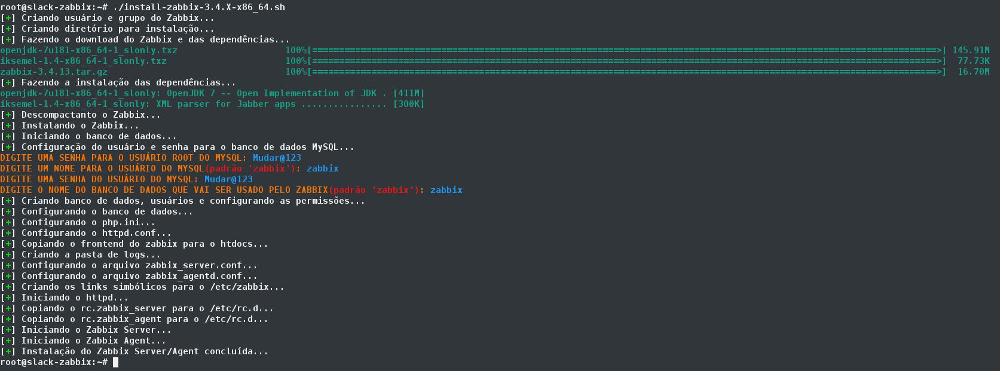

Salve Salve Pessoal!

Alguns meses atrás, fiz um post mostrando como fazer a instalação do Zabbix Server no Slackware 14.2, para maiores detalhes sobre o post acessem o link abaixo:

https://rodrigolira.eti.br/instalando-o-zabbix-3-4-no-slackware-14-2/

Para poder automatizar o processo e ajudar ao pessoal, criei um script para fazer todo o trabalho por nós :D

O script é simples, basta você baixar, dar permissão de execução e executar o mesmo, será solicitado apenas usuário e senhas para o banco de dados mysql.

O script está disponível no meu repositório do GitLab, segue o link abaixo.

[https://gitlab.com/eurodrigolira/slackware](https://gitlab.com/eurodrigolira/slackware)

Também criei um vídeo mostrando todo passo-a-passo de instalação.

<iframe src="https://www.youtube.com/embed/2yhuUaGZ2yU" width="750" height="410" frameborder="0" allowfullscreen="allowfullscreen"></iframe>

Qualquer dúvida estou a disposição, caso queiram fazer algum comentário sobre o script fiquem a vontade, todos serão bem vindos.

Até a próxima!
