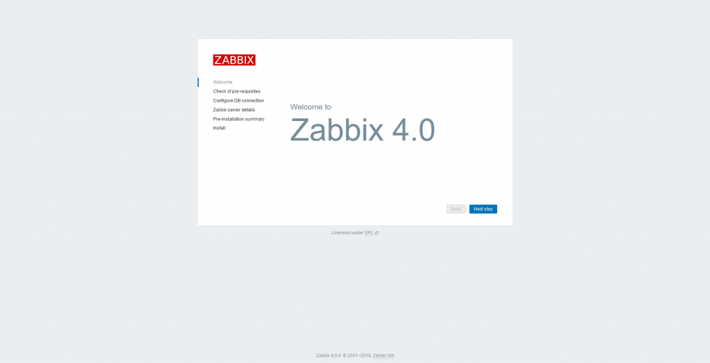

Salve Salve Pessoal!

Para quem acompanha o blog, viu que um dos meus últimos posts foi um script para instalação do Zabbix 3.4.X no Slackware 14.2, se você não viu, o link do post está abaixo:

https://rodrigolira.eti.br/script-para-instalacao-do-zabbix-server-3-4-x-no-slackware-14-2/

Hoje foi lançado o Zabbix 4.0.0 LTS, fiz as alterações necessárias no script e criei um novo diretório no GitLab para está nova versão, o procedimento de instalação é o mesmo que a versão 3.4.x.

[https://gitlab.com/eurodrigolira/slackware](https://gitlab.com/eurodrigolira/slackware)

Então podem baixar e fazer a instalação dessa nova versão, já testei e está funcionando perfeitamente.

Se estiver com dúvida sobre o procedimento de instalação, basta seguir os passos do vídeo abaixo:

<iframe src="https://www.youtube.com/embed/2yhuUaGZ2yU" width="750" height="410" frameborder="0" allowfullscreen="allowfullscreen">?</iframe>

Até a próxima :D
