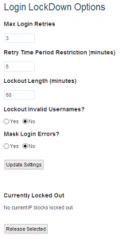

Salve Salve Pessoal!

A partir de hoje irei criar vários posts sobre segurança no Wordpress, irei mostrar plugins, falhas e ataques feitos no Wordpress, tudo com muita calma e passo-a-passo. O primeiro plugin do qual vou falar é o Login LockDown, esse é um plugin contra ataque de Brute Force, após a sua instalação as suas configurações poderão ser alteradas em **Painel > Configurações > Login LockDown**, por padrão ele vem configurado da seguinte forma:

**Max Login Retries** - O numero máximo de tentativas de login é 3.

**Retry Time Period Restriction (minutes)** - Caso você erre 3 vezes só poderá efetuar o login novamente depois de 5 minutos.

**Lockout Length (minutes)** - Caso venha errar novamente ele ficará bloqueado por 60 minutos.

 **Lockout invalid Username?** - Bloquear usuários inválidos.

**Mask Login Erros?** - Esconde erros de login.

**Currently Lockout Out** - Os endereços IP que estão bloqueados.

Como vocês podem ver é um plugin simples de se configurar, porém muito bom para esses tipos de ataques, o mesmo faz um tempinho que não é atualizado, sua ultima atualização foi em 17/09/2009, mas até agora não se achou vulnerabilidades nele, e vem cumprindo bem o seu papel. Abaixo segue o link para download do plugin e mais informações.

Link Plugin - [http://wordpress.org/plugins/login-lockdown/](http://wordpress.org/plugins/login-lockdown/)

Fico por aqui e até a próxima pessoal.
