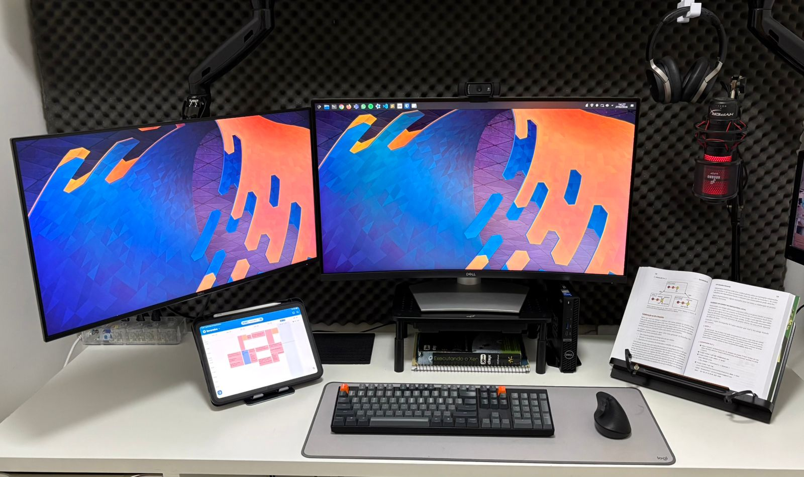
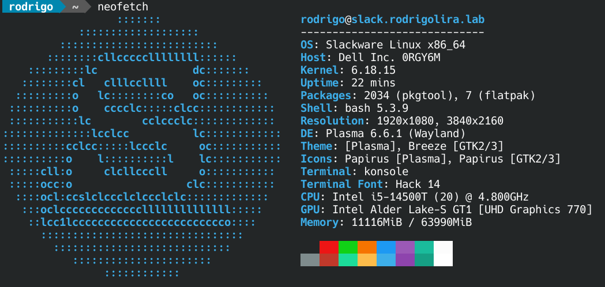
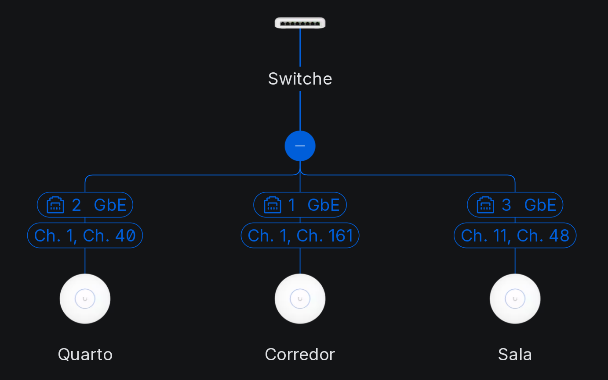
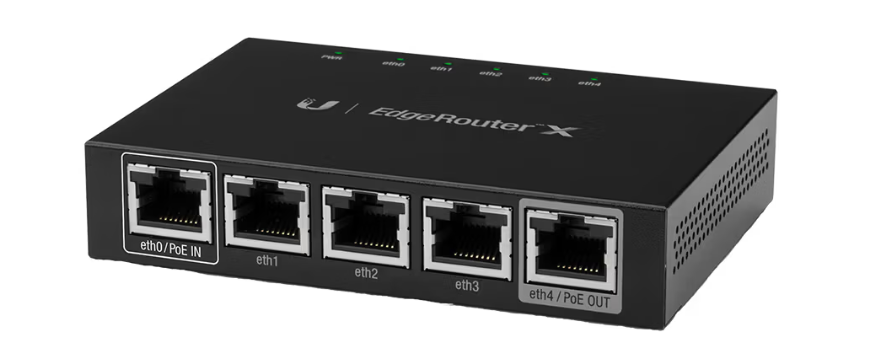

Salve Salve Pessoal!

Passando aqui para falar um pouco sobre o meu **Setup 2026**.

Não utilizo mais notebook, atualmente estou apenas com um mini desktop. Também deixei de ter um **homelab** dedicado, todos os meus laboratórios estão sendo executados no próprio desktop, que, até o momento, está dando conta de todas as demandas sem dificuldades.

Pode ser que, no futuro, eu volte a comprar um notebook… ou não. Com o valor que as peças de informática estão alcançando hoje em dia, fica cada vez mais difícil justificar o investimento. 😅

## Setup

Atualmente, estou utilizando os seguintes hardwares:

**Desktop** - [OptiPlex Micro 7020](https://www.dell.com/pt-br/shop/computadores-all-in-ones-e-workstations/desktop-optiplex-micro/spd/optiplex-7020-micro)

**Processador:** Intel i5-14500T (até 4,8 GHz, 20 núcleos)  
**Memória**: 64 GiB (2 módulos de 32 GB, 4800 MT/s)  
**Vídeo**: UHD Graphics 770 (onboard)  
**Armazenamento**: NVMe SK hynix PVC10 de 512 GB e NVMe Crucial P3 Plus de 4 TB  

**Monitor Pricipal** - [Dell S3221QS (4K, 32", curvo)](https://www.dell.com/pt-br/shop/monitor-uhd-4k-curvo-de-32-dell-s3221qs/apd/210-axkm/monitores-e-acess%C3%B3rios)

**Monitor Secundário** - [Dell P2725H Full HD, 27"](https://www.dell.com/pt-br/shop/monitor-dell-de-27-s2725h/apd/210-bnvz/monitores-e-acess%C3%B3rios)

**Teclado** - [Keychron K10](https://www.keychron.com/collections/all-keyboards/products/keychron-k10-wireless-mechanical-keyboard)

**Mouse** - [Logitech Lift](https://www.logitech.com/pt-br/shop/p/lift-vertical-ergonomic-mouse)

**Webcam** - [Logitech C920](https://www.logitechstore.com.br/camera-webcam-full-hd-logitech-c920)

**Microfone** - [HyperX QuadCast](https://hyperx.com/products/hyperx-quadcast-usb-microphone?variant=41031692189853)

**Sistema Operacional:** Slackware Current ❤️❤️❤️

## Rede

Toda a rede da minha casa é Wi-Fi. Quando estava construindo, já projetei para que fosse dessa forma.

Atualmente, possuo três **UniFi AP AC Lite**, operando em 2,4 GHz e 5 GHz, além de um **UniFi USW Lite 8 PoE**, que alimenta os APs via PoE.

## Firewall

Na borda da rede, utilizo um **EdgeRouter X**. Substitui o sistema operacional padrão pelo **OpenWrt**.

Dessa forma, tenho mais flexibilidade para instalar diversos pacotes e serviços diretamente no roteador.

Acho que é isso, qualquer atualização no ambiente vou informando aqui.

Até o próximo post!

🖖🖖🖖