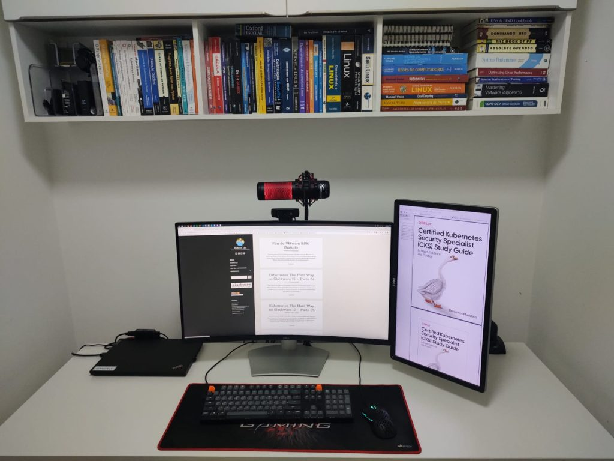
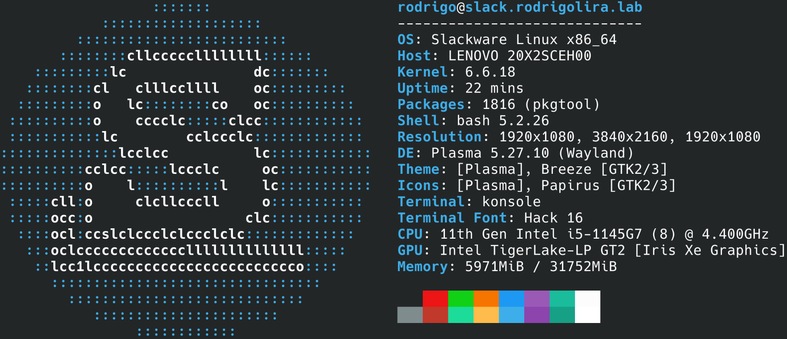
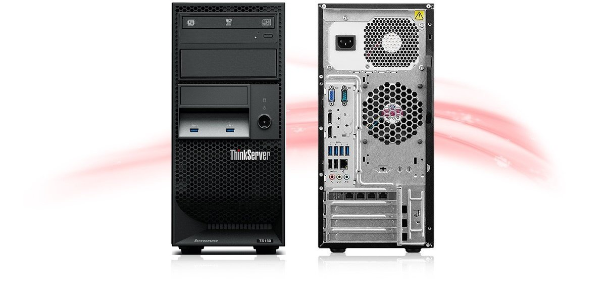
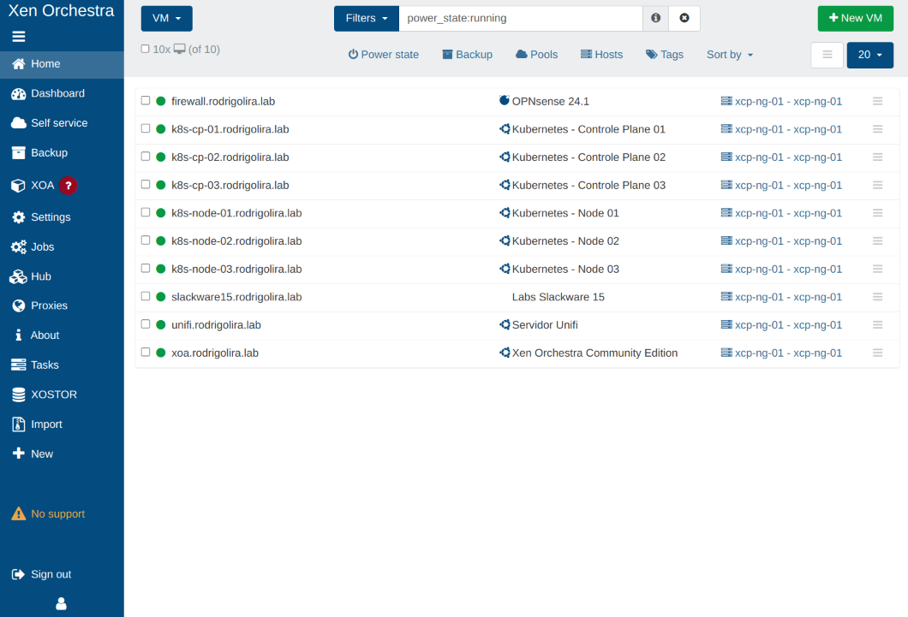

Salve Salve Pessoal!

Passando aqui para falar um pouco sobre o meu setup e meu homelab pessoal, recentemente fiz algumas mudanças, como a troca do meu notebook e a compra de um monitor novo, então resolvi falar um pouco sobre o que estou usando em casa.

Para o setup estou com os seguintes hardwares:

**Monitor Pricipal** - [Dell S3221QS 4K Curvo de 32p](https://www.dell.com/pt-br/shop/monitor-uhd-4k-curvo-de-32-dell-s3221qs/apd/210-axkm/monitores-e-acess%C3%B3rios)

**Monitor Secundário** - [Dell P2314H Full HD](https://downloads.dell.com/manuals/all-products/esuprt_display_projector/esuprt_display/dell-p2314h_user's%20guide_pt-br.pdf)

**Teclado** - [Keychron K10](https://www.keychron.com/collections/all-keyboards/products/keychron-k10-wireless-mechanical-keyboard)

**Mouse** - [Keychron M1 Ultra-Light](https://www.keychron.com/products/keychron-m1-mouse)

**Webcam** - [Logitech C920 Full HD](https://www.logitechstore.com.br/camera-webcam-full-hd-logitech-c920)

**Microfone** - [Gamer HyperX QuadCast Podcast](https://hyperx.com/products/hyperx-quadcast-usb-microphone?variant=41031692189853)

**Notebook** - [ThinkPad L14](https://www.lenovo.com/br/pt/laptops/thinkpad/serie-l/ThinkPad-L14-G2/p/22TPL14L4N2)

**Processador:** 11th Gen Intel® Core™ i5-1145G7 @ 2.60GHz **Memória**: 32 GiB **Disco**: HP NVMe EX950 1TB

Sistema Operacional é **Slackware Current** :D

No Homelab continuo com meu **Lenono TS150**.

**Processador:** Intel(R) Xeon(R) CPU E3-1225 v5 @ 3.30GHz

**Memória:** 64 GiB

**Discos:**

SSD Axiom - 120GB SSD Kingston - 240GB SSD Intel - 500GB SATA Seagate Barracuda - 1TB SSD WD Green - 1TB

**Sistema Operacional:** XCP-ng + Xen Orchestra Community Edition

Após a recente mudança da VMware não disponibilizando mais a sua versão gratuita, foi necessário a mudança do SO.

E para falar a verdade, estou muito satisfeito, pois as possibilidades de uso são bem maiores.

Fiz uma serie de vídeos sobre o XCP-ng, ainda não tive a oportunidade de falar sobre o Xen Orchestra, mas devo fazer em breve, acessem o link abaixo para assistir a playlist no youtube.

https://www.youtube.com/playlist?list=PLc6zDeh3jsIVHpwSEhLGdCnOFGe0Be6ko

Até o próximo post!

:D
