

Salve Salve Pessoal!

Quem trabalha com redes sabe o quanto é bom termos dispositivos para podermos validar as configurações antes de colocar em produção, quando não temos esses dispositivos nós podemos utilizar os simuladores ou emuladores, que normalmente são distribuídos pelos próprios fabricantes ou terceiros, nós temos alguns famosos, como:

**Packet Tracer**

**GNS3**

**EVE-NG**

Porém, de todos que citei acima, nenhum trabalha com o **comware**, o **comware** é o sistema utilizado nos equipamentos da **HP**, **3Com** e **H3C**.

Para simular redes com o comware temos a possibilidade de trabalhar com o **HP Network Simulator for Comware Devices** ou com o  **Huasan Cloud Lab (HCL)**.

Podemos fazer o download deles nos links abaixo:

**HP Network Simulator for Comware Devices**

[https://support.hpe.com/hpesc/public/home/driverHome?sp4ts.oid=7107839](https://support.hpe.com/hpesc/public/home/driverHome?sp4ts.oid=7107839)

**Huasan Cloud Lab (HCL)**

[http://www.h3c.com/cn/d\_201410/842486\_30005\_0.htm](http://www.h3c.com/cn/d_201410/842486_30005_0.htm)

O foco desse post e de outros que farei é o **Huasan Cloud Lab (HCL)**, ele tem uma interface bem melhor do que o **HP Network Simulator**, além de ser bem mais atual e fácil de instalar e usar.

O HCL trabalha em conjunto com o VirtualBox, que é instalado junto com o HCL, caso você já possua o VirtualBox, recomendo remover e instalar a versão homologada que vem junto com o HCL.

Vamos ao que interessa :D

Descompacte o arquivo baixado, nós teremos os seguintes arquivos como mostra a imagem abaixo, primeiro vamos instalar o **HCL\_V2.1.1\_Setup**.

[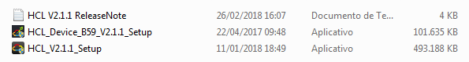](images/00.png)**1** - Clique em **Next**.

[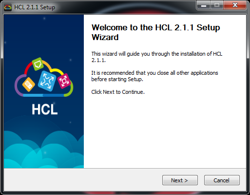](images/01-1.png)**2** - Aceite os termos e clique em **Next**.

[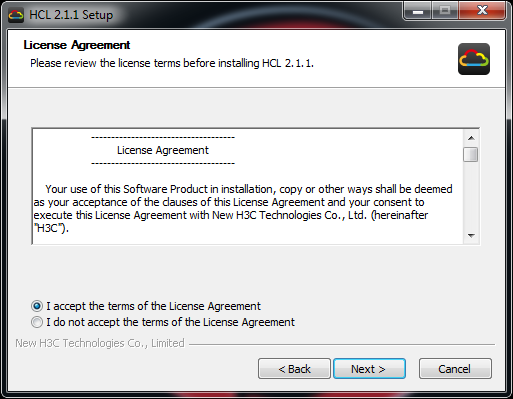](images/02.png)**3** - Selecione o local de instalação e clique em **Next**.

[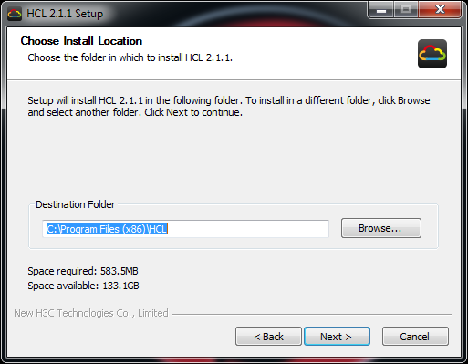](images/03-1.png)**4** - Caso deseje utilizar outra versão do VirtualBox, desmarque a opção do VirtualBox, mas como falei anteriormente, sugiro utilizar a versão homologada, clique em **Install**.

[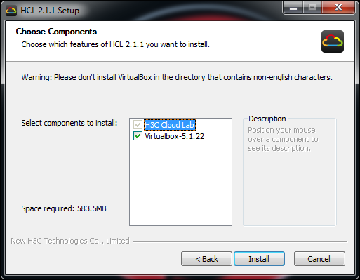](images/04-1.png)**5** - Se você deixou a opção de instalação do Virtualbox, após instalar o HCL será aberta automaticamente a instalação do VirtualBox, clique em **Next**.

[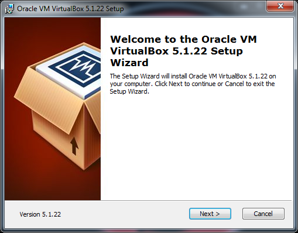](images/05-1.png)

**6** - Deixe no padrão e clique em **Next**.

[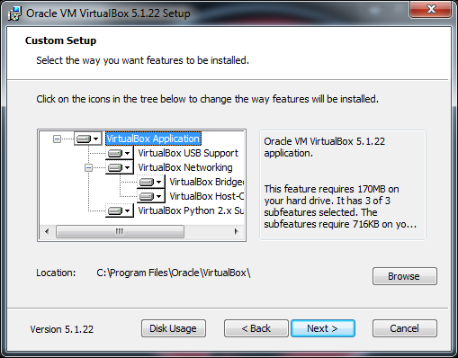](images/06-1.png)

**7** - Deixe tudo marcado e clique em **Next**.

[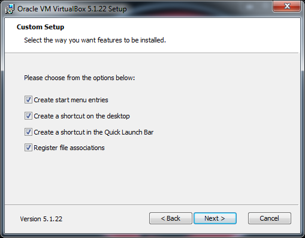](images/07-1.png)**8** - Clique em **Yes** para confirmar a instalação das Interfaces do VirtualBox.

[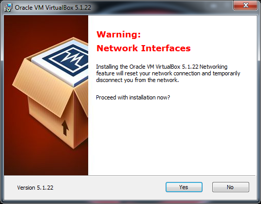](images/08-1.png)**9** - Clique em **Install**.

[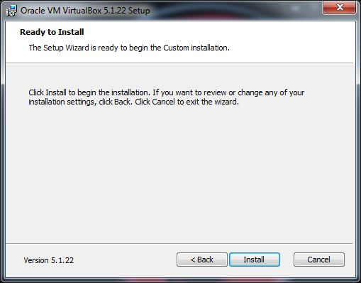](images/09.png)**10** - Marque **Sempre confiar...** e clique em **Instalar**.

[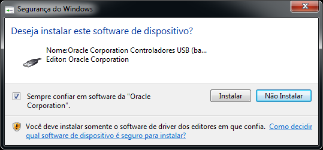](images/10.png)**11** - Clique em **Finish**.

[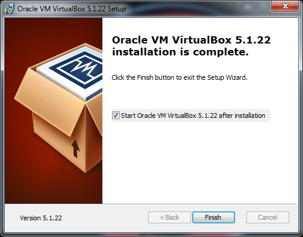](images/11.png)

**12** - Clique em **Finish**.

[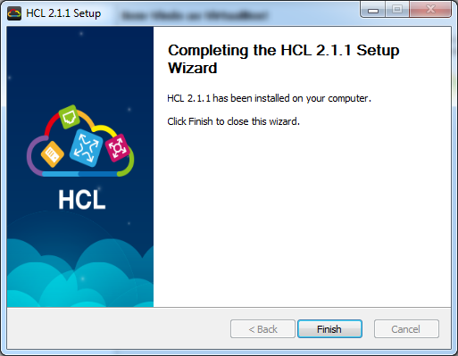](images/12.png)**13** - Agora vamos instalar o **HCL\_device\_B59\_V2.1.1\_Setup**, clique em **Next**.

[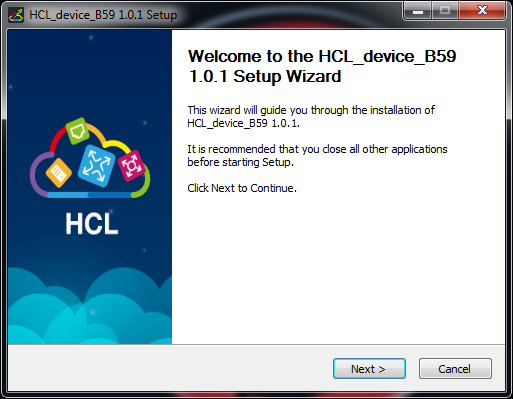](images/13.png)**14** - Aceite os termos e clique em **Next**.

[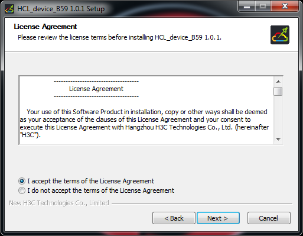](images/14.png)**15** - Selecione o local de instalação e clique em **Next**.

[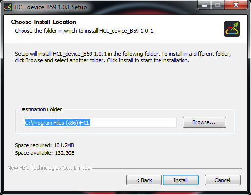](images/15.png)**16** - Clique em **Finish**.

[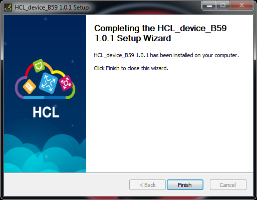](images/16.png)**17** - Instalação Realizada com sucesso :D

[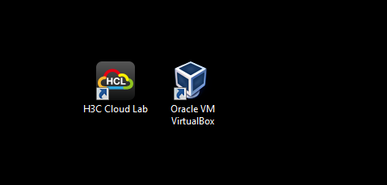](images/17.png)Quando vamos tentar executar ele a primeira vez, pode ser que ele apresente o seguinte erro abaixo:

[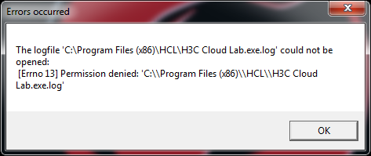](images/18.png)Para corrigir esse erro, clique com o botão direito do mouse no ícone e depois em propriedades.

[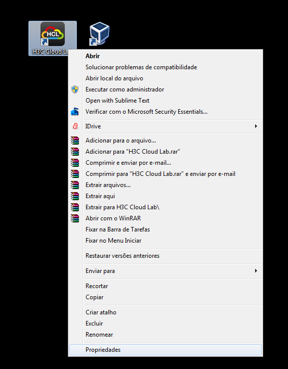](images/19.png)

Agora marque a opção **Executar este programa como adimistrador** e clique em **OK**.

[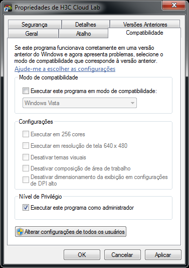](images/20.png)Pronto, agora deve funcionar perfeitamente.

[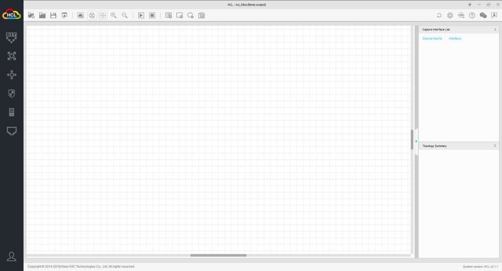](images/22.png)No próximo post sobre o HCL vou mostrar como usar o simulador.

**OBS:** Para executar no Windows 10, precisei instalar a versão **5.1.36** do **VirtualBox** e coloquei em modo de compatibilidade como **Windows 8**.

Até a próxima :D
