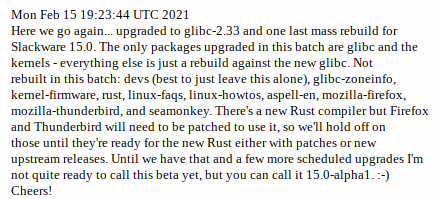

Salve Salve Pessoal!

Passando só para poder falar que o **Slackware 15.0** está próximo!

No último **changelog** tivemos essa boa notícia.

O último lançamento do **Slackware** foi a versão **14.2** em **julho de 2016**, ou seja, a quase 5 anos.

Essa é uma ótima notícia para todos os usuários do Slackware!

Para quem deseja pode se manter atualizado seguindo o **changelog** da distro na **url** abaixo:

[http://www.slackware.com/changelog/](http://www.slackware.com/changelog/)

Até o próximo post!

:D
