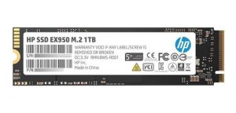
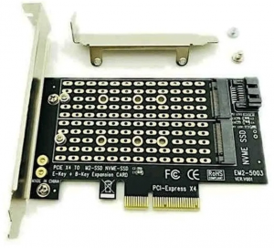
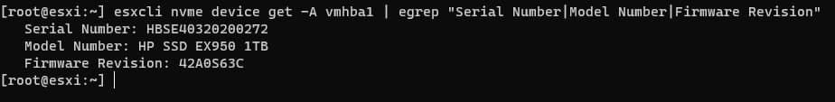
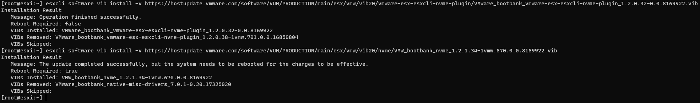
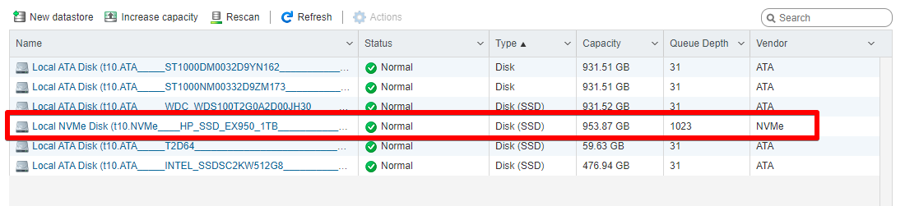

Salve Salve Pessoal!

Recentemente comprei um novo disco para meu homelab, um **SSD HP EX950 NVMe M.2 1TB**, porém meu servidor é um **HP ML30 Gen9** e o mesmo não tem entradas para o disco diretamente na placa mãe, então tive que comprar um apadtador para ele, comprei um **Dual SSD NVME M.2**, vai que eu compre outro disco no futuro. ;)

**Imagem do Disco**

[](images/ssd.jpg)

**Imagem do Adaptador**

[](images/adaptador.png)

Coloquei no meu homelab e formatei com a versão mais nova do **ESXi**, no caso o **7.0.1**.

Até ai tudo bem porque o disco que utilizo para instalação do sistema operacional é um disco SSD Sata mais antigo, então não tive problemas com a reinstalação do sistema operacional.

O problema veio quando fui tentar formatar o disco novo, o ESXi não identificava o disco via interface web, então vamos para linha de comando.

[](images/ssd-esxi.jpg)

Via linha de comando ele identificava o disco, tentei fazer a formatação do disco via linha de comando, porém apesar de exibir a mensagem de que o disco foi formatado ainda dava erro na atualização dos atributos de namespace.

**OBS:** Não entendo da tecnologia que está por trás do NVME, então não sei explicar o porque desse erro de namespace.

Segue o comando digitado para formatação do disco e a mensagem de sucesso e falha.

```
# esxcli nvme device namespace format -A vmhba1 -f 0 -n 1 -m 0 -p 0 -l 0 -s 0
```

**Format successfully, but failed to update namespace attributes after format. Offline namespace.**

Fiz o downgrade do **ESXi** para a versão **6.7u3** para tentar resolver o problema, porém o problema era exatamente o mesmo.

Então vi a dica de fazer o downgrade de versão dos drivers, e foi exatamente o que fiz.

Executei os seguintes comandos:

```
# esxcli software vib install -v https://hostupdate.vmware.com/software/VUM/PRODUCTION/main/esx/vmw/vib20/vmware-esx-esxcli-nvme-plugin/VMware_bootbank_vmware-esx-esxcli-nvme-plugin_1.2.0.32-0.0.8169922.vib
```

```
# esxcli software vib install -v https://hostupdate.vmware.com/software/VUM/PRODUCTION/main/esx/vmw/vib20/nvme/VMW_bootbank_nvme_1.2.1.34-1vmw.670.0.0.8169922.vib
```

[](images/OpenSSH-SSH-client-2021-01-16-00.03.00.png)

Reiniciei o servidor e lá estava ele, o ESXi reconheceu o disco direitinho.

[](images/esxi-VMware-ESXi-Google-Chrome-2021-01-15-23.3.png)

Nesse momento eu estava executando o **ESXi 6.7u3**, então decide fazer o mesmo procedimento com o **ESXi 7.0.1**.

Formatei o servidor novamente com o **ESXi 7.0.1**, executei os comandos de downgrade dos drivers e reiniciei o servidor.

Então um novo problema! :(

Por algum motivo que não sei explicar o ESXi deixou de reconhecer minhas interfaces de rede e não tive acesso via rede ao servidor,  poderia ter acessado o ESXi diretamente pela **DCUI** mas não quis perder meu tempo procurando uma solução.

Formatei o servidor com o **ESXi 6.7u3** e fiz todo o procedimento novamente, servidor reconheceu o disco e está funcionando perfeitamente.

Até o próximo post!

:D

Referências:

[https://www.virtuallyghetto.com/2019/05/quick-tip-crucial-nvme-ssd-not-recognized-by-esxi-6-7.html](https://www.virtuallyghetto.com/2019/05/quick-tip-crucial-nvme-ssd-not-recognized-by-esxi-6-7.html)

[https://www.reddit.com/r/vmware/comments/a80r3y/issue\_with\_hp\_nvme\_drive\_in\_esxi/](https://www.reddit.com/r/vmware/comments/a80r3y/issue_with_hp_nvme_drive_in_esxi/)

[https://vm.knutsson.it/2019/02/vsan-downgrading-nvme-driver-in-esxi-6-7-update-1/](https://vm.knutsson.it/2019/02/vsan-downgrading-nvme-driver-in-esxi-6-7-update-1/)
