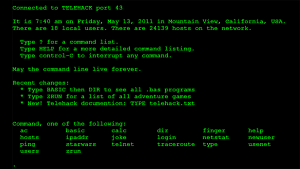

Salve Salve Galera!

Vindo aqui só para mostrar o jogo telehack. É um jogo para quem gosta de Linux e principalmente trabalhar com linhas de comando, também é muito interessante para quem esta aprendendo Linux, pois devido a quase todos os comandos serem da plataforma, segue abaixo um link de um pequeno tutorial sobre o jogo:

[http://www.tecmundo.com.br/jogos/22577-prepare-se-os-jogos-hacker-estao-comecando.htm](http://www.tecmundo.com.br/jogos/22577-prepare-se-os-jogos-hacker-estao-comecando.htm)
