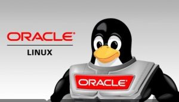

Salve Salve Pessoal!

A Oracle disponibilizou um treinamento gratuito em Cloud Native.

É uma serie de vídeos gratuitos para ajudar quem está começando nesse mundo ainda pouco explorado por alguns.

O treinamento aborda o seguintes temas:

- Kubernetes
- Kata
- Docker
- Helm
- Prometheus

Logicamente que o ambiente do treinamento é baseado em Oracle Linux, está é uma ótima oportunidade para quem quer aprender mais sobre Cloud Native e de quebra Oracle Linux.

Para maiores detalhes e acesso aos vídeos acessem o link abaixo:

[https://blogs.oracle.com/linux/oracle-linux-cloud-native-environment-training](https://blogs.oracle.com/linux/oracle-linux-cloud-native-environment-training "https://blogs.oracle.com/linux/oracle-linux-cloud-native-environment-training")

De quebra siga o blog de Osmar Leão, que tem muito assunto sobre Oracle Linux Cloud Native.

[https://osmarrleao.wordpress.com/](https://osmarrleao.wordpress.com/)

Até o próximo post!

:D
