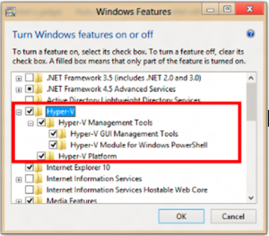

Salve Salve Galera!

Vou mostrar pra vocês três maneira de ativar o Hyper-V no windows 8.

São elas:

**1º Prompt de Comando**

**2º Power Shell**

**3º Modo Gráfico**

 

Na primeira opção você deve executar o prompt de comando como administrador, ou seja, botão direito do mouse em cima do ícone e executar como administrador, com o prompt de comando aberto basta executar a seguinte linha de comando:

**Dism /online /enable-feature /featurename:Microsoft-Hyper-V –All**

 

Na segunda opção que é o power shell, você também deve executar o programa como administrador e executar a seguinte linha de comando:

**enable-WindowsOptionalFeature -Online -FeatureName Microsoft-Hyper-V -All**

 

A terceira e ultima opção é o modo gráfico, para ativar o hyper-v você deve ir na seguinte ordem:

**Iniciar > Painel de Controle > Programas e Recursos > Ativar ou desativar recursos do windows**

Feito isso procure a opção do Hyper-V marque para habilitar e click em ok, como mostra a imagem abaixo:

Pronto! Hyper-V instalado no seu windows 8, segue abaixo um link que fala um pouco mais sobre o Hyper-V.

[http://technet.microsoft.com/en-us/library/hh831531.aspx](http://technet.microsoft.com/en-us/library/hh831531.aspx)
