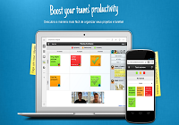

Salve Salve Pessoal!

Esse final de semana estava atras de uma ferramenta online para poder usar independente de SO e onde pudesse gerenciar melhor a minha produtividade. Foi quando pensei nos plugins do google chrome e acabei descobrindo o Symphonical.

É uma ferramenta online onde você pode gerenciar de forma simples e bem elaborada o seu dia-a-dia.

Abaixo segue algumas das funcionalidades:

Lista de Tarefas

SCRUM

Plano Semanal

SWOT

Lista de Prioridades

Visão do Mês

Reunião Executiva

Pauta de Reunião

Você pode se conectar  através da sua conta do google, facebook ou cirando uma conta através do e-mail.

O que mais gostei dessa ferramenta é a possibilidade de edição das suas funcionalidade, na minha humilde opinião, é uma ferramenta incrível, e o melhor de tudo é free e não necessita de nada além da internet.

Não testei o Hangout mas pelo que vejo deve rodar muito bem. :P

Segue abaixo o vídeo explicativo da ferramenta e o site da mesma:

https://www.symphonical.com

<iframe src="//www.youtube.com/embed/evvkWnSjE4g" height="315" width="560" allowfullscreen frameborder="0"></iframe>

Até a próxima!
