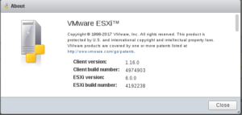

Salve Salve Pessoal!

Mais uma nova versão do **ESXi Embedded Host Client** a **versão 1.16.0.**

A forma de atualização pode ser feita via interface web, como mostrei em outro post, clique [AQUI](http://rodrigolira.eti.br/update-esxi-embedded-host-client-v1-9-1/) para acessar e ver como atualizar.

Podemos notar através do changelog, que a cada nova atualização, novos recursos são adicionados, imagino que seja devido a descontinuação do cliente de gerenciamento para windows.

Maiores informações sobre a versão, acesse o link abaixo:

[https://labs.vmware.com/flings/esxi-embedded-host-client#changelog](https://labs.vmware.com/flings/esxi-embedded-host-client#changelog)

Até a próxima ?
