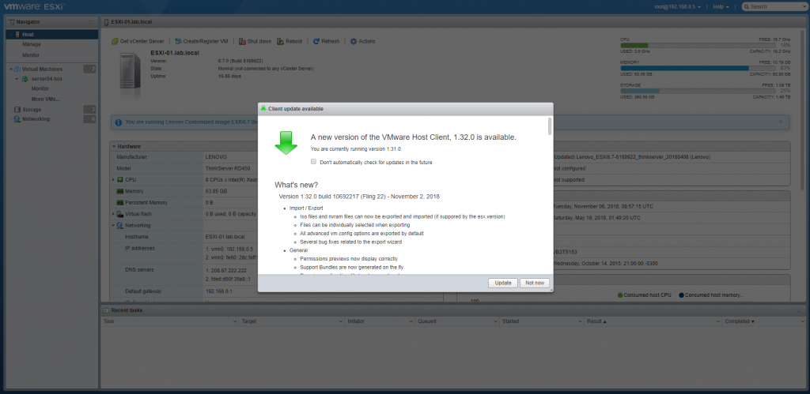
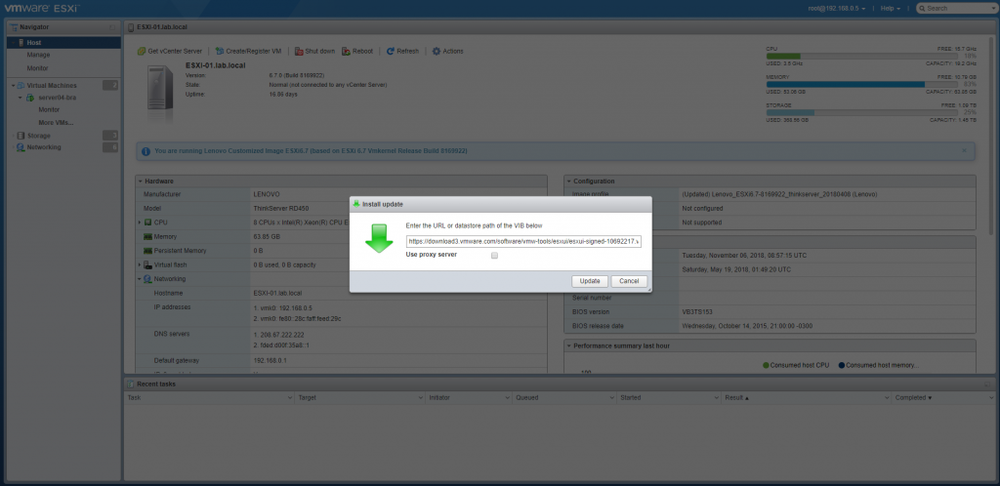
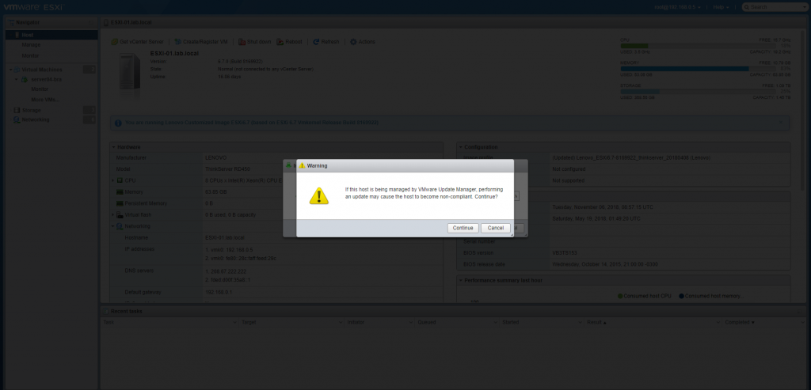
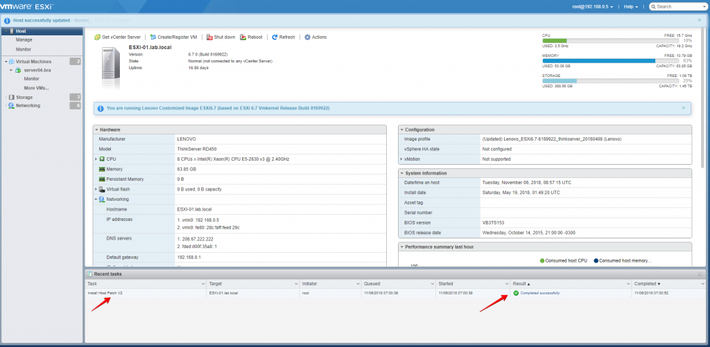

Salve Salve Pessoal!

Nova versão do **ESXi Embedded Host Client,** **versão 1.32.0**.

Se você está com a versão **1.31.0**, logo que logar no ambiente será exibida uma tela informando sobre a nova versão, basta clicar em **Update.**

Se você estiver usando versões anteriores, verifique os posts anteriores sobre o **ESXi Embedded Host Client** para verificarem as formas de atualização.

A URL com o endereço do **.vib** é preenchida automaticamente.

Clique em continue.

Atualização realizada com sucesso.

Agora só sair do sistema e logar novamente.

Até a próxima!

:D
