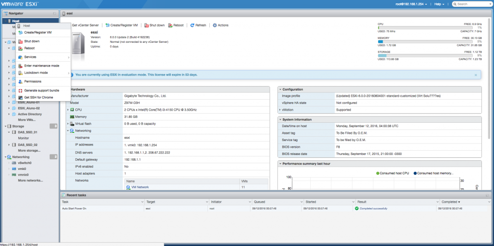
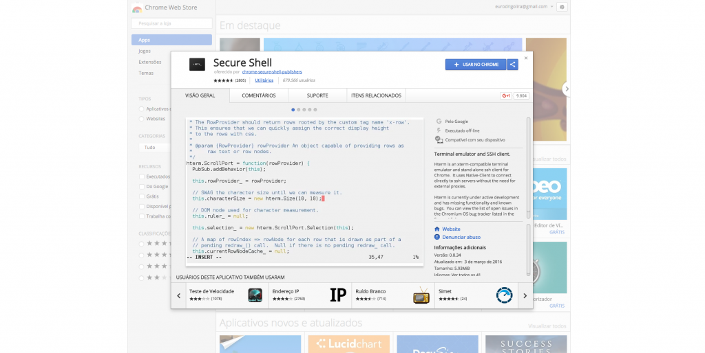
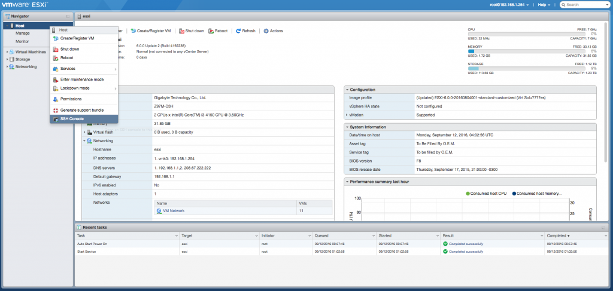
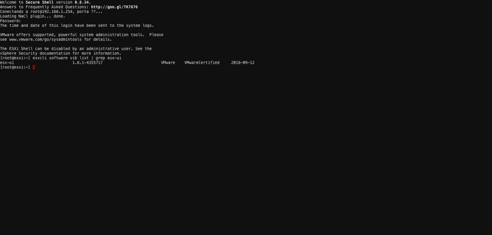

Salve Salve Pessoal!

Na última sexta-feira(09/09/2016) saiu uma atualização para o **ESXi Embedded Host Client**, é uma interface web para gerenciamento do host com ESXi, já falei sobre ele em outro post, clique [AQUI](http://rodrigolira.eti.br/vsphere-web-client-sem-vcenter/) para ler.

As novas imagens de instalação do **ESXi (6.0.0 Update2)** já estão vindo com o **ESXi Embedded Host Client** por padrão, porém com uma versão mais antiga, a **1.4.0**.

[](http://rodrigolira.eti.br/wp-content/uploads/2016/09/Captura-de-Tela-2016-09-11-a?s-19.44.38.png)

A nova versão do ESXi Embedded Host Client está com uma nova funcionalidade bastante legal, nós podemos acessar o host via ssh direto pelo navegador, nessa parte ainda somos limitados a utilizar o google chrome, já que é necessário ter a extensão Secure Shell, também foi implementado varias melhorias e correção de bugs.

Então para podermos utilizar as novas funcionalidades, precisamos fazer a atualização do **ESXi Embedded Host Client.**

Sua atualização é bastante simples. Acesse o host via ssh.

1 - Verifique a versão atual apenas para desencargo de consciência:

```
# esxcli software vib list | grep esx-ui
```

2 - Atualize o pacote:

```
# esxcli software vib update -v http://download3.vmware.com/software/vmw-tools/esxui/esxui-signed-4355717.vib
```

3 - Verifique novamente a versão:

```
# esxcli software vib list | grep esx-ui
```

Se tudo ocorreu dentro do esperado, a versão 1.8.1 estará instalada.

[](http://rodrigolira.eti.br/wp-content/uploads/2016/09/Captura-de-Tela-2016-09-11-a?s-19.51.18-2.png)

4 - Reinicie o host:

```
# reboot
```

Após o sistema iniciar, acesse ele via navegador, em cima do ícone do host clique com o botão direito do mouse, se abrira um menu com diversas opções, observe que no final tem a opção Get SSH for Chrome, clique em cima e uma nova guia do navegador abrirá com a extensão:

[](http://rodrigolira.eti.br/wp-content/uploads/2016/09/01.png)

Instale a extensão no chrome clicando no **USAR NO CHROME**:

[](http://rodrigolira.eti.br/wp-content/uploads/2016/09/02.png)

Agora acesse o ESXi novamente e clique com o botão direito do mouse no host, observe que agora estará aparecendo apenas o nome **SSH Console**, clique em cima dele:

[](http://rodrigolira.eti.br/wp-content/uploads/2016/09/04.png)

Uma nova guia do navegador é aberta com o acesso via SSH:

[](http://rodrigolira.eti.br/wp-content/uploads/2016/09/05.png)

Pronto, acesso via SSH pelo navegador e ESXi Embedded Host Client atualizado.

Espero que tenham gostado e até a próxima :D

Referências:

[https://labs.vmware.com/flings/esxi-embedded-host-client](https://labs.vmware.com/flings/esxi-embedded-host-client)
