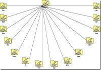

[](http://rodrigolira.eti.br/wp-content/uploads/2013/12/arvore.jpg)Salve Salve Pessoal!

Hoje precisei fazer um levantamento de diretórios e sub-diretórios em alguns servidores linux no meu trabalho, para não ter que entrar dentro de diretório por diretório resolvi procurar uma receita de bolo na internet, como previsto achei o que estava procurando, então para não esquecer de como é resolvi postar aqui no blog.

Segue a saída do comando abaixo:<!--more-->

```
|-application
   |---configs
   |---controllers
   |---models
   |---views
   |-----helpers
   |-----scripts
   |-------error
   |-------index
   |-docs
   |-library
   |-public
   |-tests
   |---application
   |---library
```

O comando utilizado para gerar essa saída:

```
ls -R | grep ":$" | sed -e 's/:$//' -e 's/[^-][^/]*//--/g' -e 's/^/   /' -e 's/-/|/'
```

E caso queriam colocar como um alias basta executar o comando abaixo:

```
 alias lt='ls -R | grep ":$" | sed -e '"'"'s/:$//'"'"' -e '"'"'s/[^-][^/]*//--/g'"'"' -e '"'"'s/^/   /'"'"' -e '"'"'s/-/|    /'"'"''
```

Segue o link com o artigo original:

[http://www.molecularsciences.org/linux/using\_ls\_to\_display\_a\_file\_tree](http://www.molecularsciences.org/linux/using_ls_to_display_a_file_tree)

Fui :P
