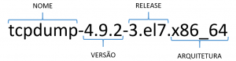
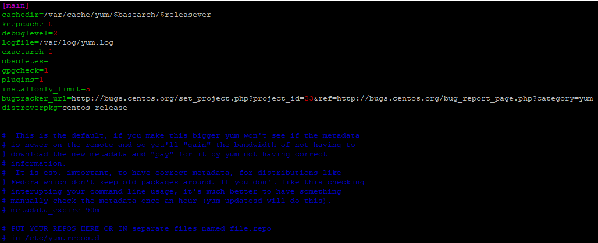
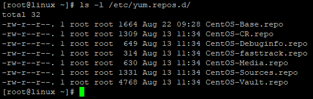
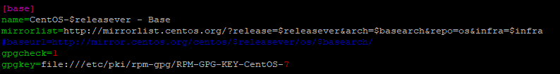
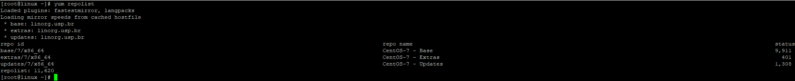
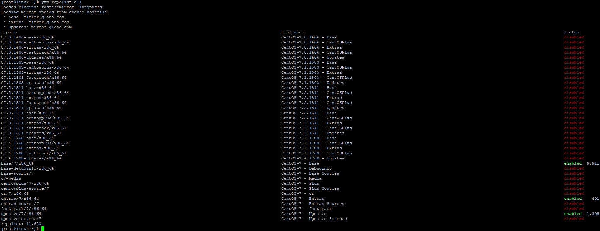
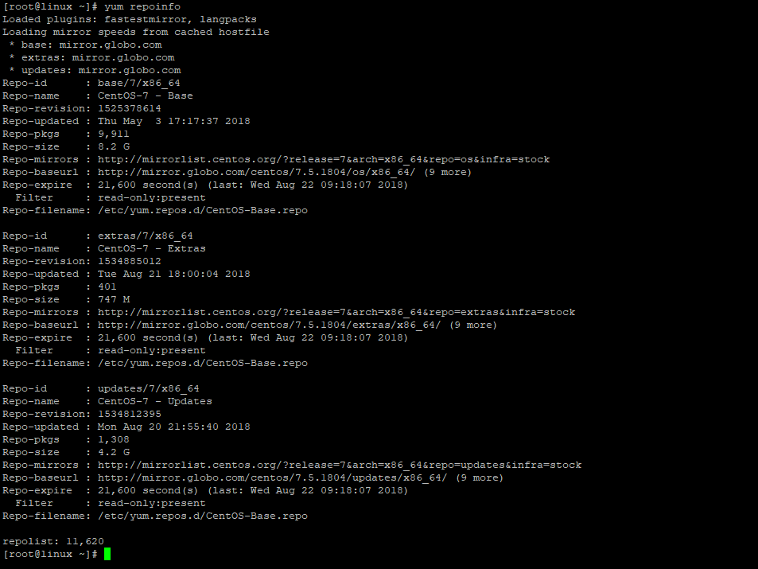
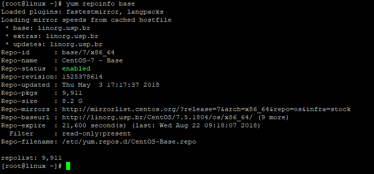
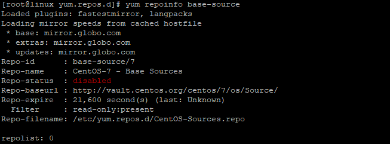
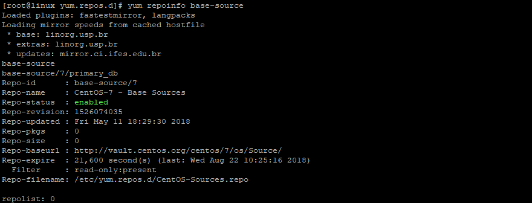

[](images/yum.jpg)

Salve Salve Pessoal!

Resolvi fazer uma serie de posts sobre como utilizar **YUM**.

Muitas pessoas utilizam está ferramenta diariamente para instalação ou remoção de pacotes, mas não sabem de várias coisas que podemos fazer com ela.

**YUM** (Yellowdog Updater Modified) é o gerenciador de pacotes dos sistemas operacionais **Red Hat** / **CentOS** / **Oracle Linux** e derivados, normalmente consulta as informações sobre esses pacotes nos repositórios habilitados no sistema, faz a instalação ou remoção dos pacotes, além de poder atualizar o sistema inteiro para uma versão mais nova, a resolução de dependências é automática, portanto, é capaz de instalar automaticamente todos os pacotes dependentes disponíveis.

Também podemos configurar repositórios adicionais e plugins que aprimoram e estendem seus recursos.

Para começar, vamos entender um pouco a arquitetura dos pacotes RPM, os diretórios e arquivos de configuração do yum.

O yum faz a instalação de pacotes .rpm, que são os pacotes suportados pelo **Red Hat** / **CentOS** / **Oracle Linux** e derivados, ele tem o seguinte formato.

[](images/arch.png)**NOME** - nome do pacote

**VERSÃO** - normalmente sempre será mostrado a versão mais recente, porém podemos instalar versões especificas.

**RELEASE** - release atual do pacote.

**ARQUITETURA** - vária de acordo com a arquitetura do seu processados.

O arquivo de configuração padrão do **yum** é o **/etc/yum.conf**, nele podemos definir qual o diretório de cache dos pacotes, diretório para repositórios adicionais, se as chaves gpg devem ser checadas, arquivo de log e etc.

[](images/root@linux__var_cache_yum_x86_64_7-2018-08-22-09.42.57.png)

O diretório padrão dos repositórios é o **/etc/yum.repo.d/** ,nele podemos listar todos os repositórios que estão disponíveis em nosso sistema.

Cada arquivo **.repo** pode conter um ou mais repositórios configurados dentro dele.

[](images/root@linux_-2018-08-22-09.44.18.png)

**OBS**: O fato do repositório estar dentro do diretório **/etc/yum.repo.d/**, não quer dizer que o mesmo esteja ativo para uso em nosso sistema.

Um arquivo de repositório normalmente tem o seguinte formato.

[](images/root@linux_-2018-08-22-09.44.47.png)

**\[base\]** - é o ID do repositório.

**name=** - nome do repositório

**mirrorlist=** - espelho de rede para os pacotes

**#baseurl=** - mesmo que o mirrorlist

**gpgcheck=** - se deve checar ou não a chave gpg

**enable=** - se **\=1** está habilitado, se **\=0** está desabilitado, se não tiver está opção, significa que está habilitado por padrão.

**gpgkey=** - caminho para chave gpg

Agora que já conhecemos um pouco sobre o yum, vamos começar a utiliza-lo.

Vamos começar gerenciando os nossos repositórios.

Para listar todos os repositórios em nosso sistema, execute o comando:

```
# yum repolist
```

[](images/root@linux_-2018-08-22-09.47.22.png)

Como podemos ver, temos três repositórios habilitados, mas se verificarmos o diretório **/etc/yum.repo.d** veremos bem mais repositórios disponíveis, e o comando não listou, isso acontece porque o comando **yum repolist** só lista os repositórios habilitados, execute o mesmo comando passando um **all** no final que ele retornará todos os repositórios habilitados e desabilitados.

```
# yum repolist all
```

[](images/root@linux_-2018-08-22-09.51.53.png)Saída do comando é bem mais amigável também ;)

Podemos obtermos detalhes sobre os repositórios, basta executar o comando:

```
# yum repoinfo
```

[](images/root@linux_-2018-08-22-10.04.57.png)Se quiser detalhes de apenas um repositório especifico, basta passar o ID do mesmo:

```
# yum repolist base
```

[](images/root@linux_-2018-08-22-10.06.22.png)Também podemos habilitar repositórios utilizando o yum, sabendo o ID do repositório que desejamos habilitar, por exemplo, o repositório base-source é desabilitado por padrão em uma instalação básica do CentOS 7, como podemos ver na imagem abaixo.

[](images/root@linux__etc_yum.repos_.d-2018-08-22-10.28.06.png)Para habilitarmos basta executar o seguinte comando.

```
# yum-config-manager --enable base-source
```

[](images/root@linux__etc_yum.repos_.d-2018-08-22-10.30.13.png)Como podemos ver, o repositório foi habilitado.

Também podemos trabalhar com repositórios específicos, por exemplo, podemos listar todos os pacotes de um determinado repositórios.

```
# yum repo-pkgs base list
```

Também podemos instalar um pacote indicando um repositório de instalação.

```
# yum repo-pkgs base install PACOTE
```

E podemos remover um pacote específico também.

```
# yum repo-pkgs base remove PACOTE
```

Fora os repositórios que vem junto com a instalação do sistema operacional, podemos realizar a instalação de repositórios adicionais.

Mas esse tópico de instalação ficará para um próximo post.

Por enquanto é isso pessoal, temos bastante coisas para falar sobre o yum nos próximos posts dessa serie.

Até a próxima! :D
