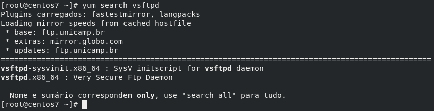
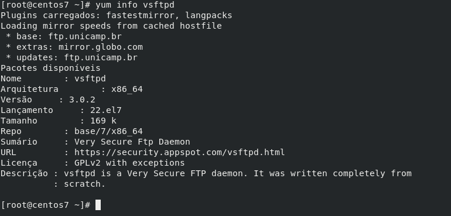
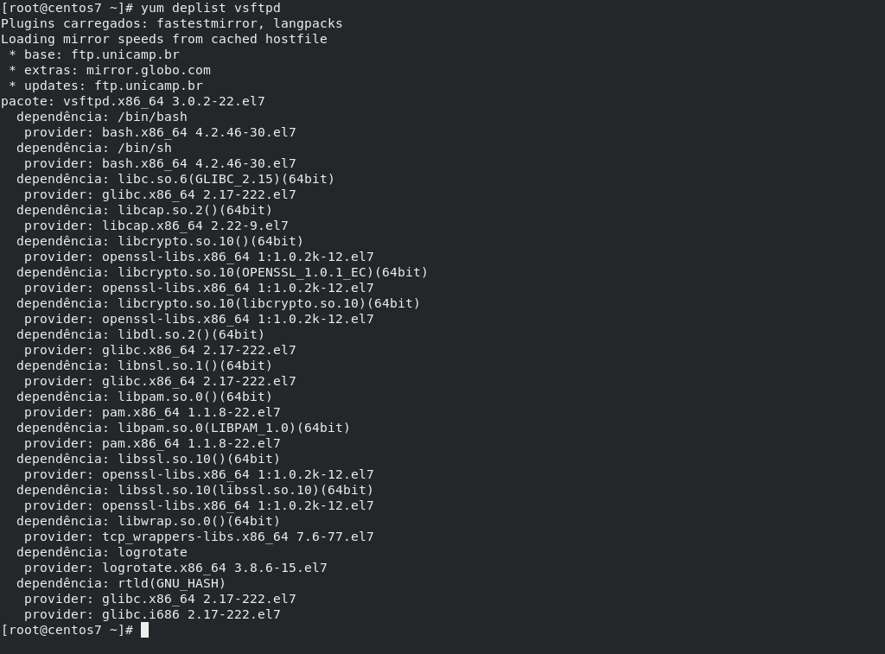
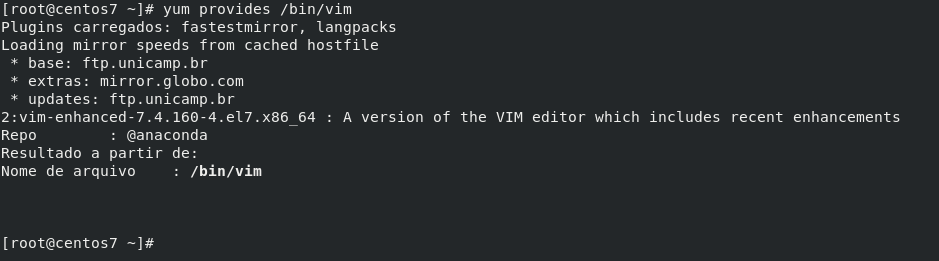
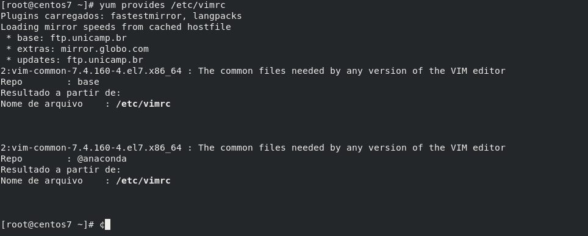
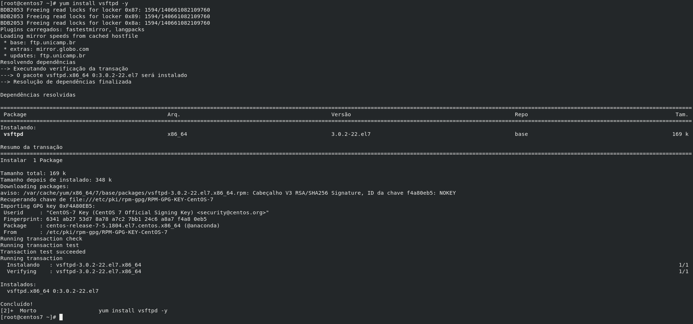
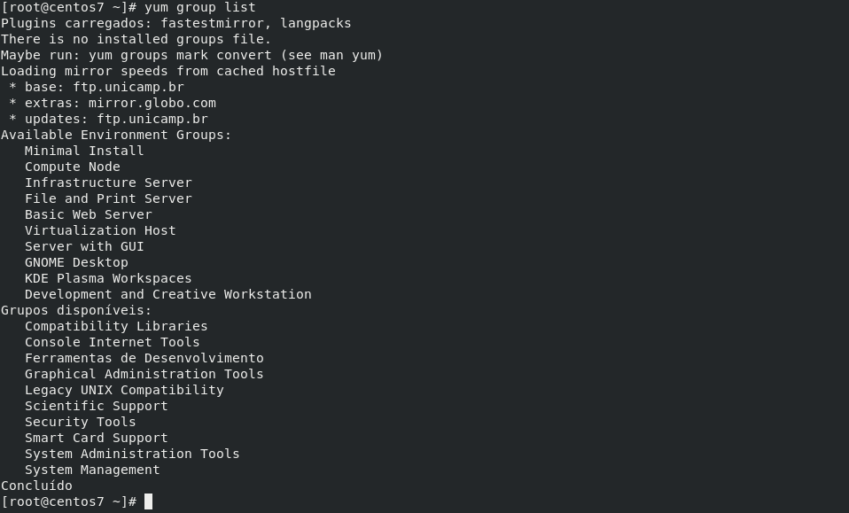
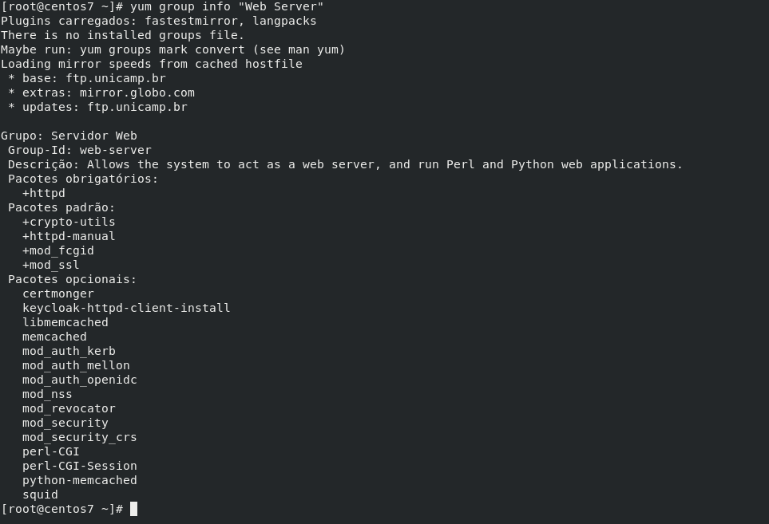

Salve Salve Pessoal!

Dando continuidade a nossa serie de posts sobre o YUM, vamos ver nesse post como podemos fazer pesquisa e obter informações sobre pacotes disponíveis e instalados em nosso sistema, vamos ver também como podemos instalar, remover e atualizar um ou vários pacotes do nosso sistema.

Se você não leu o primeiro post da serie, aconselho que leia, segue o link abaixo:

https://rodrigolira.eti.br/utilizando-o-yum-parte-01/

Vamos ao que interessa :D

Para pesquisar sobre um determinado pacote, executamos o seguinte comando:

```
# yum search vsftpd (vsftpd é o pacote pesquisado)
```

[](images/2018-10-20_23-48.png)

O resultado da pesquisa mostra todos os pacotes que façam referência ao vsftpd.

Podemos obter maiores informações sobre um determinado pacote com o seguinte comando:

```
# yum info vsftpd
```

[](images/2018-10-20_23-51.png)

Para listar todas as dependências de um pacote, executamos o seguinte comando:

```
# yum deplist vsftpd
```

[](images/2018-10-20_23-57.png)

Para obter informações sobre um determinado comando ou arquivo de configuração de um comando, podemos executar o seguinte comando:

```
# yum provides /bin/vim
```

[](images/2018-10-21_00-01.png)

```
# yum provides /etc/vimrc
```

[](images/2018-10-21_00-02.png)

Para listar todos os pacotes instalados no sistema, executamos o seguinte comando:

```
# yum list installed
```

Para listar todos os pacotes disponíveis para instalação, executamos o seguinte comando:

```
# yum list available
```

Para listar todos os pacotes, instalados ou disponíveis, executamos o seguinte comando:

```
# yum list all
```

Para listar todos os kernel, instalados ou disponíveis, executamos o seguinte comando:

```
# yum list kernel
```

Para realizar a instalação de um pacote, executamos o seguinte comando:

```
# yum install vsftpd
```

[](images/2018-10-21_00-07.png)Passando o **\-y** você confirma automaticamente a instalação do pacote.

Para remover o pacote e limpar todas as dependências, basta executar o comando:

```
# yum erase vsftpd
```

ou

```
# yum remove vsftpd
```

Para reinstalar um pacote, basta executar o comando:

```
# yum reinstall vsftpd
```

Também podemos realizar a instalação de grupos de pacotes, por exemplo, instalando o Grupo Web Server, instalamos de uma só vez o httpd httpd-manual mod\_ssl e etc.

Para listar todos os grupos disponíveis, execute o comando:

```
# yum group list
```

[](images/2018-10-21_00-16.png)Para obter informações do grupo, execute:

```
# yum group info "Web Server" (Web Server é o nome do grupo)
```

[](images/2018-10-21_00-18.png)Para instalar um grupo, basta executar o comando:

```
# yum group install "Web Server"
```

Para atualizar todos os pacotes do sistema, basta executar o seguinte comando:

```
# yum update
```

Para atualizar um pacote especifico, basta executar o seguinte comando:

```
# yum update vsftpd (vsftpd é o pacote a ser atualizado caso haja atualização)
```

Podemos fazer atualizações selecionando o tipo de atualização, se a mesma vai resolver apenas problemas de bug, de segurança e etc.

Para atualizar os pacotes com problemas de segurança, basta executar o comando:

```
# yum update --security
```

Existe várias outras possibilidade de uso do YUM quando se trata de instalação ou atualização de pacotes, as mais usadas normalmente foram as que falei nesse post, mas recomendo que você leia o man do yum para obter mais informações sobre as possibilidades de uso dele.

Espero que tenha gostado e até a próxima! :D
