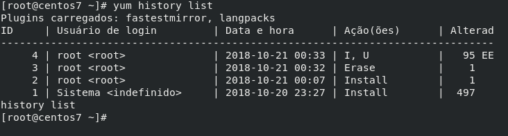
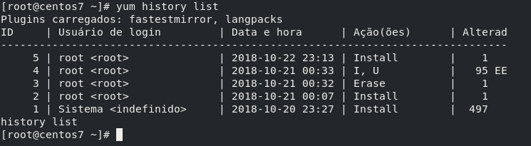
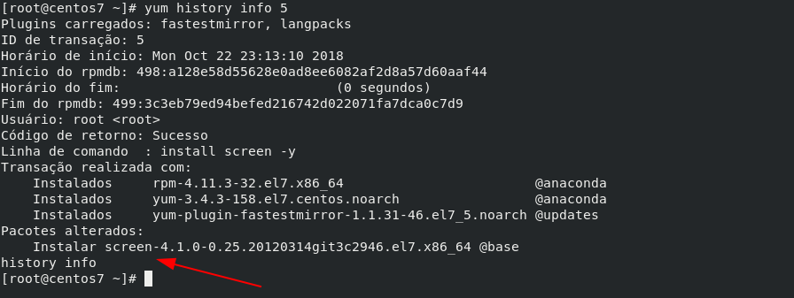
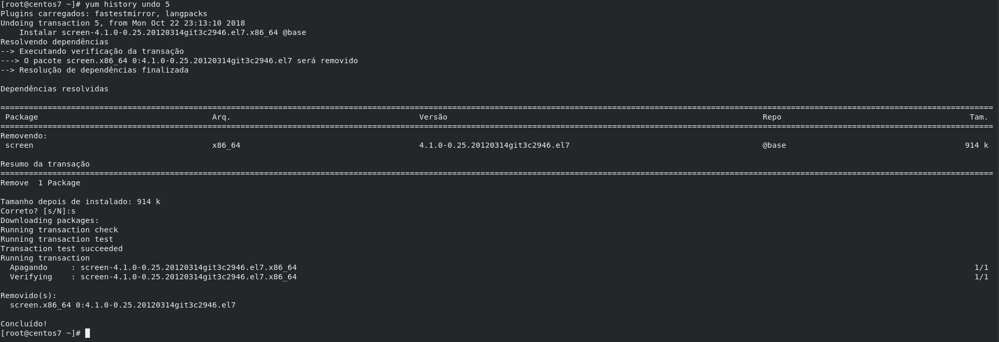
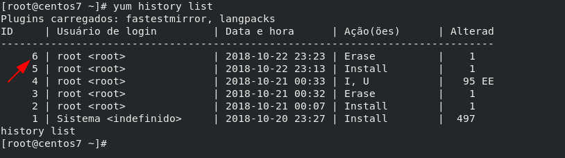
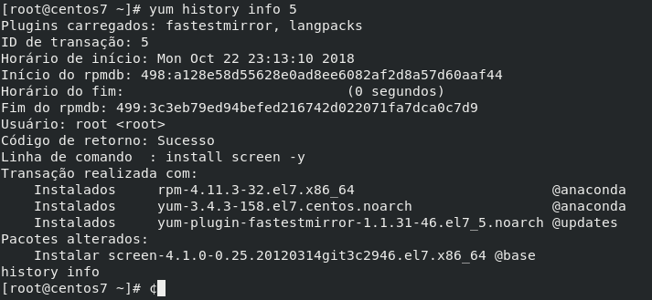
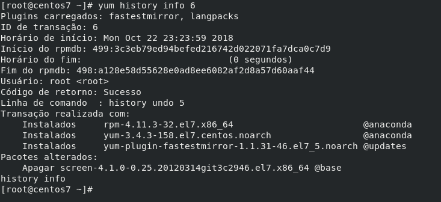
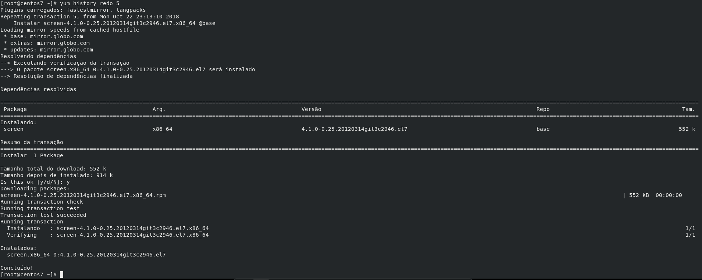

Salve Salve Pessoal!

Dando continuidade a nossa serie de posts sobre o **YUM**, hoje vamos falar sobre o **yum** **history**.

Para quem não leu os outros posts, aconselho que façam isso, vocês podem ler os outros posts nos links abaixo:

https://rodrigolira.eti.br/utilizando-o-yum-parte-01/

https://rodrigolira.eti.br/utilizando-o-yum-parte-02/

Normalmente as pessoas não sabem que o **yum** é capaz de mostrar com detalhes todo o histórico de pacotes que foram instalados ou removidos do sistema.

Essa funcionalidade é muito importante, quando mais de uma pessoa utiliza o sistema, pois assim ficamos sabendo o que cada um dos administradores instalaram ou removeram do sistema.

Para começar vamos executar o comando abaixo, ele irá listar tudo que foi realizado pelo **yum**:

```
# yum history list
```

[](images/2018-10-22_22-52.png)Vamos entender um pouco mais a saída desse comando, coluna por coluna.

**ID** - Identificador de uso, ou seja, toda vez que usamos o yum,  e o sistema é alterado de alguma forma, o yum gera um ID.

**Usuário de login** - Usuário que executou o comando.

**Data e Hora** - Data e hora que foi executado o comando.

**Ação(ões)** - O que foi feito no sistema, exemplo:

O **ID 1** faz referência a instalação do sistema.

O **ID 2** faz referência a instalação de um único pacote.

O **ID 3** faz referência a desinstalação de um único pacote.

O **ID 4** faz referência a instalação (**I**) e atualização (**U**) dos pacotes.

**Alterad** - Pacotes que foram alterados de alguma forma, atualizados, instalados ou removidos.

Agora que já sabemos um pouco mais sobre a saída do comando, vamos ver o que podemos fazer.

Suponhamos que o estagiário tenha realizado a instalação de um pacote e você não sabe o que ele instalou, então você executa o **yum history list**, feito isso você tem a seguinte saída.

[](images/2018-10-22_23-17.png)Sabemos que a ultima modificação está com o **ID 5**, como já sabemos qual o ID da modificação, basta executarmos o comando com a opção **info ID** que será mostrado tudo o que foi realizado:

```
# yum history info 5
```

[](images/2018-10-22_23-20.png)Como podemos ver na imagem acima, o pacote que foi instalado foi o **screen**.

Agora que já sabemos o que foi realizado no sistema, podemos desfazer o que foi realizado apenas passando a opção **undo ID**.

```
# yum history undo 5
```

[](images/2018-10-22_23-24.png)Pronto, o pacote é removido do nosso sistema.

Nesse momento você deve estar falando, mas isso eu faria com um "**yum remove** ou **erase**", correto, porém quando tratamos de um ou dois pacotes, quando sabemos o que foi instalado e o que queremos remover, mas quando são instalados **N** pacotes a coisa muda de historia.

Se executarmos mais uma vez o "**yum history list**", veremos que temos mais um **ID (6)**, que foi gerado devido ao nosso último comando.

[](images/2018-10-22_23-29.png)Também podemos reexecutar o comando realizado baseado no ID, por exemplo, no **ID 5** eu fiz a instalação do **screen**, como mostra a imagem abaixo:

[](images/2018-10-22_23-48.png)

No **ID 6** eu desinstalei o **screen**, como mostra a imagem abaixo:

[](images/2018-10-22_23-49.png)Agora vamos dizer que eu quisesse realizar a instalação novamente do screen, para isso bastava eu realizar o comando passando a opção **redo ID**, onde o **ID** é a ação que desejo realizar, em nosso caso a instalação do **screen**.

```
# yum history redo 5
```

[](images/2018-10-22_23-51.png)Pronto, o **screen** foi instalado novamente baseado na ação do **yum** com **ID 5**.

No exemplo mostrei apenas com pequenos pacotes, vendo dessa forma você pode pensar que não é tão útil essa função no yum, mas quando pensamos em muitos pacotes, esse pensamento muda.

Bem é isso ai, espero que tenham gostado e até o próximo post!

:D
