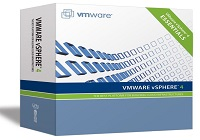

Salve Salve Pessoal!

Depois de um tempinho sem postar nada to eu aqui de volta.

Hoje vim apenas deixar uma dica de um site onde você aprende tudo sobre VMware vSphere, e o melhor de tudo isso que é de graça e ministrado por especialistas da própria vmware, a unica dificuldade é que é tudo em inglês.

Pois bem segue abaixo o link, e bons estudos!

[http://www.vmware.com/br/products/vsphere/resources.html](http://www.vmware.com/br/products/vsphere/resources.html)
