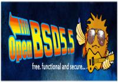

Salve Salve Pessoal!

Segue um vídeo sensacional sobre a instalação e primeiras configurações do OpenBSD, esse é a sua porta de entrada para quem está pensando em utilizar esse sistema operacional fantástico, esse será o primeiro de uma serie de vídeos, fiquem a vontade assistam e compartilhem o mesmo com toda a comunidade, abraços!<!--more-->

<iframe src="//www.youtube.com/embed/JTe3dJW7csQ" width="560" height="315" frameborder="0" allowfullscreen="allowfullscreen"></iframe>
